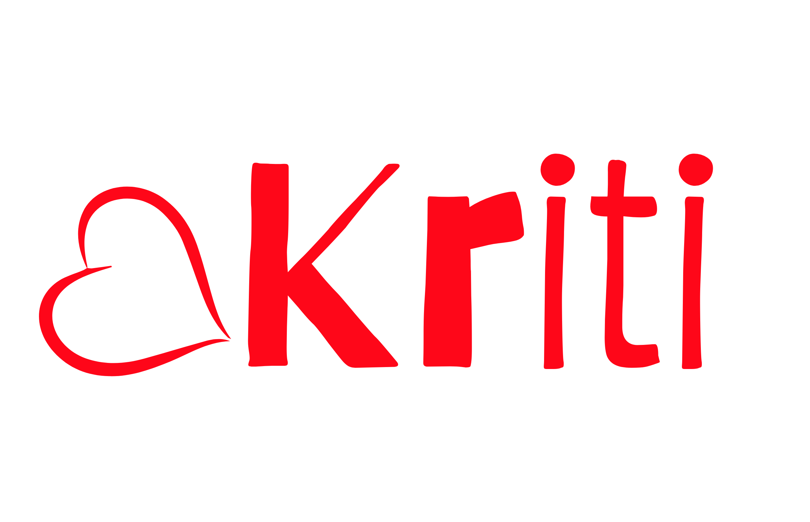

# aKriti

<div align="center">
  
  <p>Grounded document intelligence with verifiable extraction and coordinated review</p>

  [](https://github.com/varshneydevansh/aKriti)
  
  
  

</div>

## Overview

aKriti is an open-standard VLM repository for document intelligence.

Core focus:

- Grounded block extraction via `aKritiDoc`
- Confidence-aware verification workflows
- Multi-file document parsing pipeline
- Coordinated read UI with click-to-highlight block/image grounding
- Export-ready outputs (JSON, HTML, Markdown) and API-first design

This repo is intentionally kept as the VLM foundation layer; domain products such as `Vinti` can consume it as a downstream system.

## Repository layout

```text
aKriti/
├── core/
│   ├── akriti_doc/          # aKritiDoc schema, validators, migrations
│   └── ...
├── verification/            # 5-agent harness, voting, confidence, RL/RLVR signals
├── workbench/               # UI (split-pane + blocks list + glow + chat panel)
├── data/                    # synthetic generators, public data loaders, tokenization assets
├── evaluation/              # benchmarks, unit tests, regression artifacts
├── specs/                   # architecture specs, API contracts, roadmap, commit strategy
├── docs/                    # user/project documentation and design notes
├── .github/workflows/       # CI/quality gates (CI, lint, tests, smoke checks)
├── images/                  # project branding and screenshots
├── requirements.txt
├── .gitignore
└── README.md
```

> `LOCAL_DOCS/` is ignored by default (private/local reference materials).

## Standards for v1

1. **aKritiDoc as single source of truth**
2. **Canonical grounded structure**
   - normalized bounding boxes
   - page metadata + scale transforms
   - confidence + provenance
   - reading order + history
3. **Async parse flow**
   - submit job
   - poll status
   - return parse artifacts + quality metadata
4. **Grounded UI first**
   - left: document + overlays
   - right: synchronized blocks list
   - low-confidence glow + verify queue
   - follow-up: translate / modify / ask

## Long-term intent of aKriti

- Build a robust document understanding stack for mixed scripts and degraded scans.
- Keep extraction grounded with block-level coordinates, reading order, and provenance.
- Make uncertainty explicit through low-confidence signals and review workflows.
- Keep APIs and schema stable so aKriti can power multiple downstream products.
- Add verification and learning loops from human corrections.
- Scale from general documents toward specialized deployments in later phases.

## aKriti Ownership Policy

- Repo-facing docs intentionally avoid naming external systems. External research is inspiration-only; the only external artifact allowed into model lineage is open weights with manifest provenance. Detailed named research notes stay outside the project repo.

## Research Reference Index

- [aKriti research reference index](docs/akriti-research-reference-index.md): numbered paper references `[1]`, `[2]`, etc. mapped to the relevant `akriti-*.md` docs. References are for aKriti-owned implementation only; they are not product dependencies.
