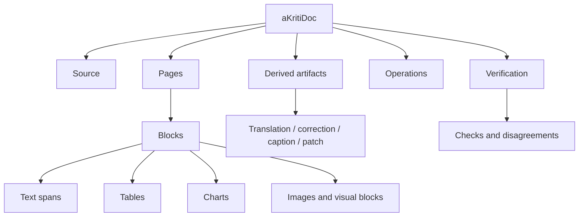

# aKritiDoc Schema v0

**Status:** Draft implementation spec  
**Date:** 2026-05-20  
**Purpose:** Define the canonical document representation that every aKriti parser, verifier, UI, runtime, and exporter must use.

## 1. Core rule

`aKritiDoc` is the single truth boundary.

```text
input file / page / image
        |
        v
parser or module output
        |
        v
aKritiDoc
        |
        +--> UI overlays
        +--> search index
        +--> model context
        +--> LibreOffice edits
        +--> PDF/DOCX/ODS export
        +--> evaluation harness
```

No module should return unstructured free text as its final artifact. Free text may be a derived field inside a typed `aKritiDoc` object.

## 2. Top-level object

```json
{
  "schema_version": "akritidoc.v0",
  "document_id": "doc_...",
  "source": {},
  "pages": [],
  "global_entities": [],
  "global_tables": [],
  "global_charts": [],
  "derived_artifacts": [],
  "operations": [],
  "verification": {},
  "metadata": {}
}
```

## 3. Source object

```json
{
  "source_id": "src_...",
  "kind": "pdf | docx | image | spreadsheet | presentation | webpage | video_frame",
  "path_or_uri": "...",
  "sha256": "...",
  "created_at": "2026-05-20T00:00:00Z",
  "mime_type": "application/pdf",
  "page_count": 10,
  "language_hints": ["hi", "en"],
  "is_born_digital": true,
  "is_scanned": false
}
```

## 4. Page object

```json
{
  "page_id": "page_0001",
  "page_index": 0,
  "width": 2480,
  "height": 3508,
  "unit": "px",
  "rotation": 0,
  "render_artifact_id": "artifact_page_0001_png",
  "blocks": [],
  "reading_order": [],
  "quality": {},
  "verification": {}
}
```

Coordinate policy:
- use normalized coordinates for model/routing work.
- preserve pixel coordinates for rendering/edit overlays.
- every bbox must declare its coordinate space.

## 5. Block object

All page content is represented as blocks.

```json
{
  "block_id": "blk_...",
  "type": "text | title | list | table | chart | image | figure | formula | signature | stamp | form_field | footer | header | unknown",
  "bbox": {},
  "spans": [],
  "children": [],
  "source_refs": [],
  "derived_refs": [],
  "confidence": {},
  "provenance": {},
  "metadata": {}
}
```

Block type policy:
- `unknown` is allowed and preferable to hallucinated certainty.
- image-like regions are first-class blocks, not discarded decoration.
- generated descriptions belong in `derived_refs`, not in source text.

## 6. Bbox object

```json
{
  "x": 0.12,
  "y": 0.24,
  "w": 0.40,
  "h": 0.08,
  "space": "normalized | pixel | pdf_point",
  "page_id": "page_0001"
}
```

Validation:
- `x`, `y`, `w`, `h` must be non-negative.
- normalized values must remain within `[0, 1]` unless explicitly marked as clipped.
- every bbox must point to a valid page.

## 7. Text span object

```json
{
  "span_id": "span_...",
  "text": "original visible text",
  "language": "hi | en | mixed | unknown",
  "script": "Devanagari | Latin | Bengali | Tamil | unknown",
  "bbox": {},
  "style": {
    "font_size": null,
    "bold": false,
    "italic": false,
    "underline": false
  },
  "confidence": {
    "text": 0.91,
    "language": 0.80
  },
  "provenance": {}
}
```

Text policy:
- source text is what is visible or deterministic from the file.
- corrected text is a derived artifact.
- translated text is a derived artifact.
- rewritten text is a derived artifact.

## 8. Table object

```json
{
  "table_id": "tbl_...",
  "block_id": "blk_...",
  "bbox": {},
  "rows": 12,
  "cols": 5,
  "cells": [],
  "exports": {
    "csv_artifact_id": null,
    "html_artifact_id": null,
    "ods_artifact_id": null
  },
  "confidence": {}
}
```

Cell object:

```json
{
  "cell_id": "cell_...",
  "row": 0,
  "col": 0,
  "row_span": 1,
  "col_span": 1,
  "bbox": {},
  "text": "",
  "spans": [],
  "confidence": {}
}
```

## 9. Chart object

```json
{
  "chart_id": "chart_...",
  "block_id": "blk_...",
  "chart_type": "bar | line | scatter | pie | area | unknown",
  "bbox": {},
  "title": null,
  "axes": [],
  "legends": [],
  "series": [],
  "data_table_artifact_id": null,
  "confidence": {}
}
```

Charts must keep the original visual region linked even when data is reconstructed.

## 10. Image and visual artifact object

```json
{
  "artifact_id": "artifact_...",
  "kind": "page_render | crop | restored_image | figure_crop | chart_crop | signature_crop | thumbnail",
  "source_refs": [],
  "path": "...",
  "sha256": "...",
  "bbox": {},
  "derived_from": [],
  "operation_id": null,
  "metadata": {}
}
```

Segmentation models can help propose visual regions, but the accepted result must still be represented as typed blocks with provenance.

## 11. Derived artifact object

```json
{
  "artifact_id": "derived_...",
  "kind": "translation | correction | summary | caption | restored_text | rewritten_text | extracted_data | edit_patch",
  "source_refs": [],
  "content": {},
  "created_by": {
    "module": "aKriti Translation Module",
    "model": "akriti-small-...",
    "version": "..."
  },
  "confidence": {},
  "requires_user_approval": true
}
```

Derived artifact policy:
- never overwrite source text silently.
- never merge restored/corrected text into original text without a trace.
- user-visible UI must distinguish source from derived content.

## 12. Provenance object

```json
{
  "source_id": "src_...",
  "page_id": "page_0001",
  "block_id": "blk_...",
  "bbox": {},
  "method": "deterministic_pdf | vlm_parse | restoration_reread | user_correction | verifier",
  "module": "aKriti Text Reader",
  "model": "akriti-core-...",
  "timestamp": "2026-05-20T00:00:00Z"
}
```

## 13. Verification object

```json
{
  "status": "pass | warn | fail | unknown",
  "checks": [],
  "disagreements": [],
  "requires_review": false,
  "review_reasons": []
}
```

Check object:

```json
{
  "check_id": "chk_...",
  "kind": "schema | provenance | text_consistency | table_structure | chart_data | restoration_delta | citation",
  "status": "pass | warn | fail",
  "message": "...",
  "source_refs": []
}
```

## 14. Operation object

Every transformation is an operation.

```json
{
  "operation_id": "op_...",
  "kind": "parse | restore | translate | rewrite | extract_table | extract_chart | verify | apply_edit",
  "inputs": [],
  "outputs": [],
  "parameters": {},
  "status": "queued | running | complete | failed | cancelled",
  "created_at": "2026-05-20T00:00:00Z"
}
```

## 15. Structured generation rule

For local models that support constrained generation, target typed schemas:

```text
model output -> constrained JSON / schema object -> aKritiDoc validator -> accepted artifact
```

Use constrained generation for:
- table extraction JSON.
- chart object JSON.
- edit patches.
- verification reports.
- action/tool calls.

Do not rely on prompt-only formatting for high-stakes outputs.

## 16. ASCII schema map

```text
aKritiDoc
  |
  +-- source
  +-- pages
  |     |
  |     +-- blocks
  |     |     |
  |     |     +-- spans
  |     |     +-- tables
  |     |     +-- charts
  |     |     +-- visual artifacts
  |     |
  |     +-- reading_order
  |     +-- quality
  |
  +-- derived_artifacts
  +-- operations
  +-- verification
```

## 17. Mermaid schema map




## 18. Executable schema handoff

See `docs/akriti-contract-schema-implementation-spec.md` for the JSON Schema package layout, shared schema definitions, validation modes, invariant checks, valid/invalid examples, and implementation order for turning this `aKritiDoc` prose spec into executable contracts.

## Research References

This doc is connected to the numbered research bibliography in `docs/akriti-research-reference-index.md`. Those references are engineering anchors for aKriti-owned implementation; they are not product dependencies. Only open weights may enter model lineage, and only with manifest provenance.
