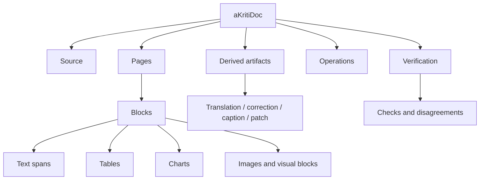

# aKritiDoc Schema v0

**Status:** Draft implementation spec  
**Date:** 2026-05-20  
**Purpose:** Define the canonical document representation that every aKriti parser, verifier, UI, runtime, and exporter must use.

## 1. Core rule

`aKritiDoc` is the single truth boundary.

```text
input file / page / image
        |
        v
parser or module output
        |
        v
aKritiDoc
        |
        +--> UI overlays
        +--> search index
        +--> model context
        +--> LibreOffice edits
        +--> PDF/DOCX/ODS export
        +--> evaluation harness
```

No module should return unstructured free text as its final artifact. Free text may be a derived field inside a typed `aKritiDoc` object.

## 2. Top-level object

```json
{
  "schema_version": "akritidoc.v0",
  "document_id": "doc_...",
  "source": {},
  "pages": [],
  "global_entities": [],
  "global_tables": [],
  "global_charts": [],
  "derived_artifacts": [],
  "operations": [],
  "verification": {},
  "metadata": {}
}
```

## 3. Source object

```json
{
  "source_id": "src_...",
  "kind": "pdf | docx | image | spreadsheet | presentation | webpage | video_frame",
  "path_or_uri": "...",
  "sha256": "...",
  "created_at": "2026-05-20T00:00:00Z",
  "mime_type": "application/pdf",
  "page_count": 10,
  "language_hints": ["hi", "en"],
  "is_born_digital": true,
  "is_scanned": false
}
```

## 4. Page object

```json
{
  "page_id": "page_0001",
  "page_index": 0,
  "width": 2480,
  "height": 3508,
  "unit": "px",
  "rotation": 0,
  "render_artifact_id": "artifact_page_0001_png",
  "blocks": [],
  "reading_order": [],
  "quality": {},
  "verification": {}
}
```

Coordinate policy:
- use normalized coordinates for model/routing work.
- preserve pixel coordinates for rendering/edit overlays.
- every bbox must declare its coordinate space.

## 5. Block object

All page content is represented as blocks.

```json
{
  "block_id": "blk_...",
  "type": "text | title | list | table | chart | image | figure | formula | signature | stamp | form_field | footer | header | unknown",
  "bbox": {},
  "spans": [],
  "children": [],
  "source_refs": [],
  "derived_refs": [],
  "confidence": {},
  "provenance": {},
  "metadata": {}
}
```

Block type policy:
- `unknown` is allowed and preferable to hallucinated certainty.
- image-like regions are first-class blocks, not discarded decoration.
- generated descriptions belong in `derived_refs`, not in source text.

## 6. Bbox object

```json
{
  "x": 0.12,
  "y": 0.24,
  "w": 0.40,
  "h": 0.08,
  "space": "normalized | pixel | pdf_point",
  "page_id": "page_0001"
}
```

Validation:
- `x`, `y`, `w`, `h` must be non-negative.
- normalized values must remain within `[0, 1]` unless explicitly marked as clipped.
- every bbox must point to a valid page.

## 7. Text span object

```json
{
  "span_id": "span_...",
  "text": "original visible text",
  "language": "hi | en | mixed | unknown",
  "script": "Devanagari | Latin | Bengali | Tamil | unknown",
  "bbox": {},
  "style": {
    "font_size": null,
    "bold": false,
    "italic": false,
    "underline": false
  },
  "confidence": {
    "text": 0.91,
    "language": 0.80
  },
  "provenance": {}
}
```

Text policy:
- source text is what is visible or deterministic from the file.
- corrected text is a derived artifact.
- translated text is a derived artifact.
- rewritten text is a derived artifact.

## 8. Table object

```json
{
  "table_id": "tbl_...",
  "block_id": "blk_...",
  "bbox": {},
  "rows": 12,
  "cols": 5,
  "cells": [],
  "exports": {
    "csv_artifact_id": null,
    "html_artifact_id": null,
    "ods_artifact_id": null
  },
  "confidence": {}
}
```

Cell object:

```json
{
  "cell_id": "cell_...",
  "row": 0,
  "col": 0,
  "row_span": 1,
  "col_span": 1,
  "bbox": {},
  "text": "",
  "spans": [],
  "confidence": {}
}
```

## 9. Chart object

```json
{
  "chart_id": "chart_...",
  "block_id": "blk_...",
  "chart_type": "bar | line | scatter | pie | area | unknown",
  "bbox": {},
  "title": null,
  "axes": [],
  "legends": [],
  "series": [],
  "data_table_artifact_id": null,
  "confidence": {}
}
```

Charts must keep the original visual region linked even when data is reconstructed.

## 10. Image and visual artifact object

```json
{
  "artifact_id": "artifact_...",
  "kind": "page_render | crop | restored_image | figure_crop | chart_crop | signature_crop | thumbnail",
  "source_refs": [],
  "path": "...",
  "sha256": "...",
  "bbox": {},
  "derived_from": [],
  "operation_id": null,
  "metadata": {}
}
```

Segmentation models can help propose visual regions, but the accepted result must still be represented as typed blocks with provenance.

## 11. Derived artifact object

```json
{
  "artifact_id": "derived_...",
  "kind": "translation | correction | summary | caption | restored_text | rewritten_text | extracted_data | edit_patch",
  "source_refs": [],
  "content": {},
  "created_by": {
    "module": "aKriti Translation Module",
    "model": "akriti-small-...",
    "version": "..."
  },
  "confidence": {},
  "requires_user_approval": true
}
```

Derived artifact policy:
- never overwrite source text silently.
- never merge restored/corrected text into original text without a trace.
- user-visible UI must distinguish source from derived content.

## 12. Provenance object

```json
{
  "source_id": "src_...",
  "page_id": "page_0001",
  "block_id": "blk_...",
  "bbox": {},
  "method": "deterministic_pdf | vlm_parse | restoration_reread | user_correction | verifier",
  "module": "aKriti Text Reader",
  "model": "akriti-core-...",
  "timestamp": "2026-05-20T00:00:00Z"
}
```

## 13. Verification object

```json
{
  "status": "pass | warn | fail | unknown",
  "checks": [],
  "disagreements": [],
  "requires_review": false,
  "review_reasons": []
}
```

Check object:

```json
{
  "check_id": "chk_...",
  "kind": "schema | provenance | text_consistency | table_structure | chart_data | restoration_delta | citation",
  "status": "pass | warn | fail",
  "message": "...",
  "source_refs": []
}
```

## 14. Operation object

Every transformation is an operation.

```json
{
  "operation_id": "op_...",
  "kind": "parse | restore | translate | rewrite | extract_table | extract_chart | verify | apply_edit",
  "inputs": [],
  "outputs": [],
  "parameters": {},
  "status": "queued | running | complete | failed | cancelled",
  "created_at": "2026-05-20T00:00:00Z"
}
```

## 15. Structured generation rule

For local models that support constrained generation, target typed schemas:

```text
model output -> constrained JSON / schema object -> aKritiDoc validator -> accepted artifact
```

Use constrained generation for:
- table extraction JSON.
- chart object JSON.
- edit patches.
- verification reports.
- action/tool calls.

Do not rely on prompt-only formatting for high-stakes outputs.

## 16. ASCII schema map

```text
aKritiDoc
  |
  +-- source
  +-- pages
  |     |
  |     +-- blocks
  |     |     |
  |     |     +-- spans
  |     |     +-- tables
  |     |     +-- charts
  |     |     +-- visual artifacts
  |     |
  |     +-- reading_order
  |     +-- quality
  |
  +-- derived_artifacts
  +-- operations
  +-- verification
```

## 17. Mermaid schema map




## 18. Executable schema handoff

See `docs/akriti-contract-schema-implementation-spec.md` for the JSON Schema package layout, shared schema definitions, validation modes, invariant checks, valid/invalid examples, and implementation order for turning this `aKritiDoc` prose spec into executable contracts.

## Research References

This doc is connected to the numbered research bibliography in `docs/akriti-research-reference-index.md`. Those references are engineering anchors for aKriti-owned implementation; they are not product dependencies. Only open weights may enter model lineage, and only with manifest provenance.

## Math, LaTeX, and Schema-Guided Extraction Extensions

Reference anchors: [26], [27].

`aKritiDoc` must support structured extraction and formula intelligence as first-class artifacts.

### Extraction schema artifact

```json
{
  "artifact_id": "derived_extract_schema_...",
  "kind": "extraction_schema",
  "schema_name": "case_metadata | invoice_fields | equations | custom",
  "fields": [
    {
      "field_id": "field_...",
      "name": "case_number",
      "type": "verbatim_text | normalized_text | number | date | money | entity | citation | table | chart_series | latex | mathml | formula_object | image_region | stamp | signature | unknown",
      "required": true,
      "allow_multiple": false,
      "normalization_policy": "none | preserve_original | normalize_with_original | derived_only",
      "review_policy": "auto | review_if_low_confidence | always_review"
    }
  ],
  "created_from": "user_schema | natural_language_request | template",
  "source_refs": [],
  "provenance": {}
}
```

### Extracted field object

```json
{
  "field_id": "field_...",
  "name": "total_amount",
  "type": "money",
  "verbatim_value": "Rs. 1,25,000/-",
  "normalized_value": {
    "amount": 125000,
    "currency": "INR"
  },
  "source_refs": [],
  "confidence": {},
  "review_required": false,
  "warnings": []
}
```

### Formula object

```json
{
  "formula_id": "formula_...",
  "block_id": "blk_...",
  "bbox": {},
  "source_kind": "scanned | born_digital | generated | converted",
  "latex": "E = mc^2",
  "mathml": null,
  "libreoffice_formula": null,
  "symbol_confidence": [
    {
      "symbol": "c",
      "bbox": {},
      "confidence": 0.93,
      "alternatives": ["C", "e"]
    }
  ],
  "source_refs": [],
  "provenance": {},
  "review_required": false
}
```

Rules:

- LaTeX, MathML, and LibreOffice formula strings are derived artifacts unless they came from a born-digital source.
- Scanned formula conversion must keep the original image region as source evidence.
- Ambiguous symbols must be exposed with alternatives.
- Formula insertion into LibreOffice requires preview unless it is a user-authored direct conversion.
- Verbatim and normalized values must never be collapsed into one field.

## Grounding and precision-stability extensions

Reference anchors: [30], [31], [32].

`aKritiDoc` must support query-to-region grounding as a first-class verification object. A Vinti or LibreOffice claim is not trusted just because text was generated; it must identify the page/region that supports it.

### Grounded region object

```json
{
  "grounding_id": "ground_...",
  "query": "court seal | signature | case number | party names | paragraph supporting this claim | low confidence text | custom",
  "target_kind": "text_span | block | table | formula | stamp | seal | signature | handwriting | image_region | unknown",
  "page_id": "page_...",
  "block_id": "block_...",
  "bbox": {
    "x0": 0.12,
    "y0": 0.30,
    "x1": 0.52,
    "y1": 0.42,
    "unit": "normalized"
  },
  "polygon": [],
  "point": null,
  "source_crop_hash": "sha256:...",
  "confidence": {
    "score": 0.87,
    "label": "high | medium | low | needs_review"
  },
  "ambiguity": {
    "has_competing_regions": false,
    "competing_grounding_ids": []
  },
  "provenance": {
    "engine": "akriti",
    "model_version": "akriti-ground-...",
    "runtime_precision": "fp32 | fp16 | bf16 | int8 | int4 | unknown"
  },
  "review_required": false
}
```

### Precision stability report

```json
{
  "precision_report_id": "prec_...",
  "target_ref": {},
  "runtime_variants": ["fp32", "fp16", "bf16", "int4"],
  "json_validity": {
    "fp32": true,
    "fp16": true,
    "bf16": false,
    "int4": true
  },
  "bbox_drift": [
    {
      "grounding_id": "ground_...",
      "max_iou_delta": 0.18,
      "requires_review": true
    }
  ],
  "text_drift": [],
  "loop_detected": false,
  "triage_drift": false,
  "decision": "stable | unstable_requires_retry | unstable_requires_human_review"
}
```

Rules:

- Grounding output is evidence selection, not final legal truth.
- Invalid bboxes must be rejected or marked for review.
- Claims used in Vinti triage must link to grounded regions.
- Low-precision output is not trusted until it passes stability checks for the target lane.
- If OCR text is stable but grounding is unstable, the UI must show `needs_region_review`.

## Language support and layered document-state extensions

Reference anchors: [33], [34], [35].

Language support is not a boolean. Every language/script claim must state the support level and the document object it applies to.

### Language support levels

| Level | Meaning |
|---|---|
| `L0_script_detection` | script can be detected at page/block/span level |
| `L1_ocr_text_reading` | text can be read with measured CER/WER or equivalent |
| `L2_layout_reading_order` | layout-aware reading order works for that script/language |
| `L3_entity_terminology_preservation` | names, dates, amounts, citations, sections, and domain terms are preserved |
| `L4_translation_transliteration` | translation/transliteration exists as derived artifacts with source refs |
| `L5_structured_extraction_reasoning` | schema extraction and document reasoning work with evidence |
| `L6_vinti_grade` | high-stakes court/legal triage claims are allowed only with grounding, review, and safety gates |

### Required language metadata on document objects

Blocks, spans, table cells, chart labels, entities, formulas, captions, and extracted fields should support:

```json
{
  "language": "hi | en | mr | ta | unknown",
  "script": "Devanagari | Latin | Tamil | Common | unknown",
  "unicode_normalization": "NFC | NFD | NFKC | source_preserved | unknown",
  "grapheme_offsets": [],
  "confidence": {
    "language": 0.94,
    "script": 0.98,
    "text": 0.91
  },
  "ambiguous_tokens": [],
  "source_crop_refs": [],
  "review_state": "accepted | needs_text_review | needs_region_review | needs_language_review | unresolved"
}
```

### Layered document state

`aKritiDoc` must allow UIs and APIs to filter by layer:

```text
source
born_digital_text
scanned_image
layout
text
tables
charts
images
stamps
signatures
handwriting
groundings
translations
restorations
summaries
actions
exports
review_items
analyzer_votes
downstream_triage
ledger_state
```

Rules:

- Translation, transliteration, restoration, rewritten text, summaries, captions, and generated actions are derived artifacts.
- Derived artifacts must never overwrite source text or source images without explicit user approval.
- No high-stakes triage claim can be high confidence if its supporting page/block/span has unresolved language, script, region, or precision ambiguity.

## Feedback, correction, and harness-version extensions

Reference anchor: [37].

Human corrections and analyzer failures are first-class artifacts because they become eval cases and possible training data only after consent and review.

### Feedback event object

```json
{
  "feedback_id": "fb_...",
  "case_id_hash": "sha256:...",
  "document_id_hash": "sha256:...",
  "page_id": "p014",
  "target_refs": ["p014_b032"],
  "error_type": "ocr_error | indic_glyph_ambiguity | layout_error | grounding_error | entity_error | triage_error | action_error | translation_error | restoration_drift | unknown",
  "model_output": {},
  "human_correction": {},
  "visual_crop_hash": "sha256:...",
  "analyzers_involved": [],
  "model_version": "akriti-core-...",
  "harness_version": "vinti-harness-...",
  "schema_version": "akritiDoc-...",
  "human_verified": true,
  "consent_for_training": false,
  "ledger_anchor_eligible": false,
  "created_at": "..."
}
```

### Harness trace object

```json
{
  "harness_trace_id": "htrace_...",
  "model_version": "akriti-vinti-...",
  "harness_version": "vinti-harness-...",
  "schema_version": "akritiDoc-...",
  "analyzer_versions": {
    "complexity": "0.1.2",
    "readiness": "0.1.4",
    "language_ambiguity": "0.1.1"
  },
  "thresholds": {},
  "retry_policy": {},
  "review_policy": {},
  "release_status": "experimental | evaluated | approved | deprecated | rollback"
}
```

Rules:

- Feedback events are not automatically training data.
- Training eligibility requires consent, privacy review, and dataset manifest inclusion.
- Vinti ledger/audit events must record model version, harness version, schema version, and analyzer versions.
- Harness changes are new versions, not silent edits.

## Deterministic parse trace and grid projection extensions

Reference anchor: [39].

Born-digital PDFs often provide text fragments with coordinates but no reliable reading order. `aKritiDoc` must preserve both the source coordinates and the deterministic reconstruction decisions.

### Parse trace object

```json
{
  "parse_trace_id": "ptrace_...",
  "page_id": "p001",
  "parser": "akriti_parse_grid",
  "input_kind": "pdf_text_layer",
  "median_text_height": 9.8,
  "median_char_width": 4.9,
  "line_grouping_tolerance": 5.0,
  "anchors": {
    "left": [40.0, 180.0],
    "right": [520.0],
    "center": [300.0]
  },
  "items": [
    {
      "source_item_id": "pdf_item_...",
      "text": "Revenue",
      "source_bbox": {},
      "line_id": "line_005",
      "snap_class": "left | right | center | floating | flowing_text",
      "target_grid_col": 10,
      "final_grid_col": 10,
      "binding_constraint": "target | line_max | forward_anchor | paragraph_bypass",
      "forward_anchor_used": false
    }
  ],
  "post_processing": {
    "sparse_block_compression": true,
    "margin_trim": true
  },
  "warnings": []
}
```

Rules:

- Deterministic grid output is a derived text representation, not a replacement for source coordinates.
- Flowing paragraphs should bypass grid projection when alignment would hurt readability.
- Tables/schedules should preserve column alignment and original source refs.
- If anchor/snap decisions are unstable, mark the page/block for review or OCR/VLM reread.
