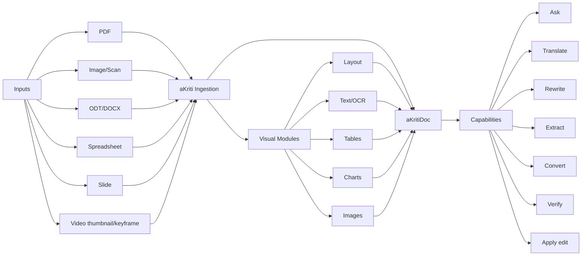
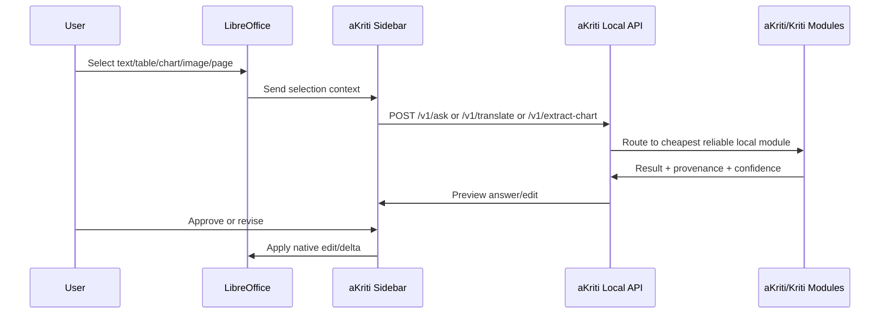
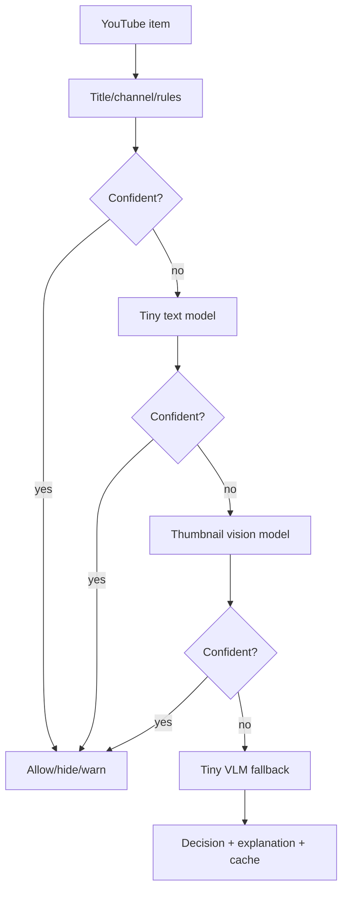

# aKriti API and Capability Map

**Status:** Locked planning spec  
**Date:** 2026-05-19

## 1. Capability overview

```text
                              aKriti VLM / Kriti
                                      |
  +-------------+-------------+-------+-------+-------------+-------------+
  |             |             |               |             |             |
  v             v             v               v             v             v
OCR/Text     Layout       Tables/Charts    Images        Translation   Actions
reading      parsing      extraction       reasoning     rewriting     editing
  |             |             |               |             |             |
  +-------------+-------------+-------+-------+-------------+-------------+
                                      |
                                      v
                           aKritiDoc + provenance
                                      |
                 +--------------------+--------------------+
                 |                    |                    |
                 v                    v                    v
          Workbench UI          LibreOffice UI       FilterTube/Vinti/API
```

## 2. User-facing feature map

| Feature | Input | Output | Core modules |
|---|---|---|---|
| OCR/text extraction | scan, PDF, image, page crop | text spans with bboxes/confidence | Layout Reader, Text Reader |
| Layout analysis | PDF/image/page | blocks, reading order, coordinates | Layout Reader |
| Table extraction | table region, PDF, sheet | cell graph, CSV/HTML/Calc table | Table Reader |
| Chart understanding | chart image/object | chart type, data, trend, recreation plan | Chart Reader |
| Image description | image/figure/screenshot | caption, alt-text, visual answer | Image Reader |
| Translation | selection/document | translated aKritiDoc deltas | Translation Module |
| Rewrite/edit | text/block/document | edit proposal and diff | Kriti Action Module |
| File conversion | PDF/image/DOCX/ODT | ODT/DOCX/MD/HTML/JSON | aKritiDoc exporters |
| Ask document | document/selection | grounded answer with citations | Retrieval, Kriti |
| Verify block | block/span/table/chart | evidence, confidence, review status | Validators, reread passes |
| Restore crop/page | degraded image | derived restoration artifact | Restoration Module |
| Semantic filtering | video metadata/thumbnail | allow/hide/blur/warn/explain | Tiny text/vision models |

## 3. ASCII end-to-end flow

```text
[file or selection]
       |
       v
[ingestion]
       |
       +--> born digital? ---- yes ---> [deterministic extract]
       |                                  |
       |                                  v
       |                              [aKritiDoc]
       |
       +---- no / mixed ----------------> [visual parse]
                                           |
                                           v
                 +------------------[layout reader]------------------+
                 |                         |                         |
                 v                         v                         v
            [text reader]             [table reader]            [chart/image]
                 |                         |                         |
                 +-------------------------+-------------------------+
                                           |
                                           v
                                      [aKritiDoc]
                                           |
                                           v
                 [exact search + layout search + vector search]
                                           |
                                           v
                             [Kriti action/reasoning]
                                           |
                                           v
                           [validators + provenance]
                                           |
                                           v
                         [UI/API/export/native edit]
```

## 4. Mermaid capability graph



## 5. API surface

### `POST /v1/parse`

Submit a document or image for parsing into aKritiDoc.

Inputs:
- file artifact or path reference
- parse mode: `fast`, `balanced`, `accurate`
- targets: `text`, `layout`, `tables`, `charts`, `images`, `all`
- language hints
- page range
- local runtime preference

Outputs:
- `job_id`
- accepted parse settings
- estimated capability route

### `GET /v1/parse/{job_id}`

Return parse status and artifacts.

Outputs:
- `status`
- `akriti_doc`
- `exports`
- `warnings`
- `parse_quality_score`
- `latency_ms`
- `provenance`

### `POST /v1/ask`

Ask a grounded question over document, selection, page, table, chart, or image.

Outputs:
- answer
- evidence blocks
- citations/provenance
- confidence
- suggested follow-up actions

### `POST /v1/search`

Hybrid search over aKritiDoc.

Search modes:
- exact text
- regex
- entity/date/amount
- page/block/table/chart metadata
- vector semantic
- mixed strategy

### `POST /v1/translate`

Translate selection or document while preserving structure.

Inputs:
- source block/page/table/span ids
- target language/script
- preserve formatting flag
- transliteration mode

Outputs:
- translated delta
- uncertain terms
- glossary hits
- preview artifacts

### `POST /v1/rewrite`

Rewrite text/document with constraints.

Modes:
- plain language
- formal
- legal/admin
- concise
- grammar repair
- tone-preserving

### `POST /v1/extract-table`

Extract table structure.

Outputs:
- cell graph
- merged cells
- headers
- CSV/HTML/Calc-compatible output
- uncertain cells

### `POST /v1/extract-chart`

Extract chart semantics and data.

Outputs:
- chart type
- axes
- legend
- data series
- reconstruction spec
- explanation

### `POST /v1/describe-image`

Describe or answer about an image/figure/screenshot.

Outputs:
- caption
- alt text
- detected objects/regions
- provenance

### `POST /v1/restore`

Create a derived restoration artifact.

Restoration modes:
- deblur
- denoise
- dewarp
- super-resolution
- character restoration

Output must mark artifact as derived and non-evidentiary until verified.

### `POST /v1/verify`

Verify block/span/table/chart/image output.

Outputs:
- reread evidence
- validator results
- disagreements
- recommended user action

### `POST /v1/apply-edit`

Apply approved delta to a target integration.

Targets:
- aKritiDoc
- LibreOffice Writer
- LibreOffice Calc
- LibreOffice Impress
- exported ODT/DOCX/HTML/Markdown

### `GET /v1/models`

List installed model tiers and runtimes.

### `GET /v1/capabilities`

Return available features for current hardware/runtime.

## 6. LibreOffice interaction flow



## 7. FilterTube interaction flow



## 8. Validation rules

Every endpoint that produces document changes must return:
- source artifact references
- page/block/span/table/chart ids
- confidence
- warnings
- edit preview
- rollback/delta metadata

Every model output must pass at least one of:
- schema validator
- exact provenance match
- deterministic consistency check
- confidence threshold
- user approval

## 9. Capability-to-model tier mapping

| Capability | Tiny | Small | Core | Pro |
|---|---:|---:|---:|---:|
| thumbnail semantic filtering | yes | yes | optional | no |
| page triage | yes | yes | yes | no |
| OCR assist | limited | yes | yes | yes |
| table extraction | no | limited | yes | yes |
| chart understanding | no | limited | yes | yes |
| full document Q&A | no | limited | yes | yes |
| translation | limited | yes | yes | yes |
| legal/court reasoning | no | no | guarded | yes |
| teacher/verifier | no | no | partial | yes |
