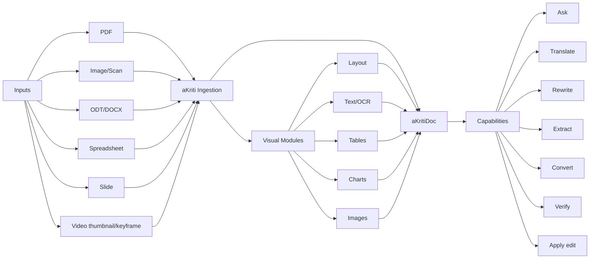
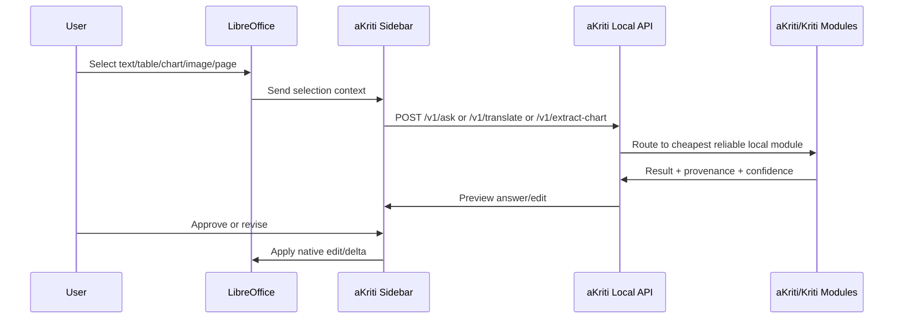
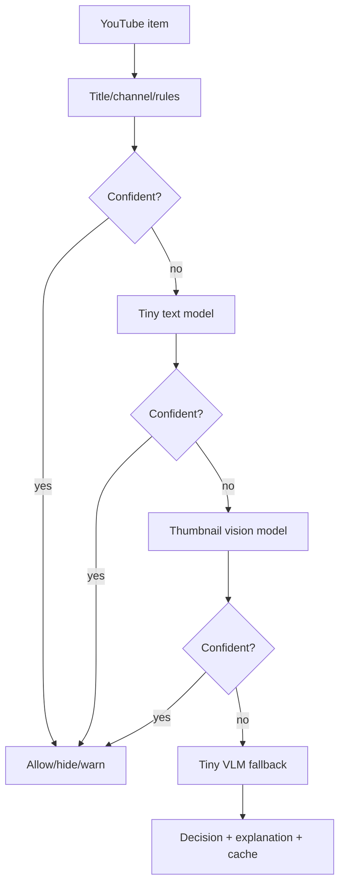

# aKriti API and Capability Map

**Status:** Locked planning spec  
**Date:** 2026-05-19

## 1. Capability overview

```text
                              aKriti VLM / Kriti
                                      |
  +-------------+-------------+-------+-------+-------------+-------------+
  |             |             |               |             |             |
  v             v             v               v             v             v
OCR/Text     Layout       Tables/Charts    Images        Translation   Actions
reading      parsing      extraction       reasoning     rewriting     editing
  |             |             |               |             |             |
  +-------------+-------------+-------+-------+-------------+-------------+
                                      |
                                      v
                           aKritiDoc + provenance
                                      |
                 +--------------------+--------------------+
                 |                    |                    |
                 v                    v                    v
          Workbench UI          LibreOffice UI       FilterTube/Vinti/API
```

## 2. User-facing feature map

| Feature | Input | Output | Core modules |
|---|---|---|---|
| OCR/text extraction | scan, PDF, image, page crop | text spans with bboxes/confidence | Layout Reader, Text Reader |
| Layout analysis | PDF/image/page | blocks, reading order, coordinates | Layout Reader |
| Table extraction | table region, PDF, sheet | cell graph, CSV/HTML/Calc table | Table Reader |
| Chart understanding | chart image/object | chart type, data, trend, recreation plan | Chart Reader |
| Image description | image/figure/screenshot | caption, alt-text, visual answer | Image Reader |
| Translation | selection/document | translated aKritiDoc deltas | Translation Module |
| Rewrite/edit | text/block/document | edit proposal and diff | Kriti Action Module |
| File conversion | PDF/image/DOCX/ODT | ODT/DOCX/MD/HTML/JSON | aKritiDoc exporters |
| Ask document | document/selection | grounded answer with citations | Retrieval, Kriti |
| Verify block | block/span/table/chart | evidence, confidence, review status | Validators, reread passes |
| Restore crop/page | degraded image | derived restoration artifact | Restoration Module |
| Semantic filtering | video metadata/thumbnail | allow/hide/blur/warn/explain | Tiny text/vision models |

## 3. ASCII end-to-end flow

```text
[file or selection]
       |
       v
[ingestion]
       |
       +--> born digital? ---- yes ---> [deterministic extract]
       |                                  |
       |                                  v
       |                              [aKritiDoc]
       |
       +---- no / mixed ----------------> [visual parse]
                                           |
                                           v
                 +------------------[layout reader]------------------+
                 |                         |                         |
                 v                         v                         v
            [text reader]             [table reader]            [chart/image]
                 |                         |                         |
                 +-------------------------+-------------------------+
                                           |
                                           v
                                      [aKritiDoc]
                                           |
                                           v
                 [exact search + layout search + vector search]
                                           |
                                           v
                             [Kriti action/reasoning]
                                           |
                                           v
                           [validators + provenance]
                                           |
                                           v
                         [UI/API/export/native edit]
```

## 4. Mermaid capability graph



## 5. API surface

### `POST /v1/parse`

Submit a document or image for parsing into aKritiDoc.

Inputs:
- file artifact or path reference
- parse mode: `fast`, `balanced`, `accurate`
- targets: `text`, `layout`, `tables`, `charts`, `images`, `all`
- language hints
- page range
- local runtime preference

Outputs:
- `job_id`
- accepted parse settings
- estimated capability route

### `GET /v1/parse/{job_id}`

Return parse status and artifacts.

Outputs:
- `status`
- `akriti_doc`
- `exports`
- `warnings`
- `parse_quality_score`
- `latency_ms`
- `provenance`

### `POST /v1/ask`

Ask a grounded question over document, selection, page, table, chart, or image.

Outputs:
- answer
- evidence blocks
- citations/provenance
- confidence
- suggested follow-up actions

### `POST /v1/search`

Hybrid search over aKritiDoc.

Search modes:
- exact text
- regex
- entity/date/amount
- page/block/table/chart metadata
- vector semantic
- mixed strategy

### `POST /v1/translate`

Translate selection or document while preserving structure.

Inputs:
- source block/page/table/span ids
- target language/script
- preserve formatting flag
- transliteration mode

Outputs:
- translated delta
- uncertain terms
- glossary hits
- preview artifacts

### `POST /v1/rewrite`

Rewrite text/document with constraints.

Modes:
- plain language
- formal
- legal/admin
- concise
- grammar repair
- tone-preserving

### `POST /v1/extract-table`

Extract table structure.

Outputs:
- cell graph
- merged cells
- headers
- CSV/HTML/Calc-compatible output
- uncertain cells

### `POST /v1/extract-chart`

Extract chart semantics and data.

Outputs:
- chart type
- axes
- legend
- data series
- reconstruction spec
- explanation

### `POST /v1/describe-image`

Describe or answer about an image/figure/screenshot.

Outputs:
- caption
- alt text
- detected objects/regions
- provenance

### `POST /v1/restore`

Create a derived restoration artifact.

Restoration modes:
- deblur
- denoise
- dewarp
- super-resolution
- character restoration

Output must mark artifact as derived and non-evidentiary until verified.

### `POST /v1/verify`

Verify block/span/table/chart/image output.

Outputs:
- reread evidence
- validator results
- disagreements
- recommended user action

### `POST /v1/apply-edit`

Apply approved delta to a target integration.

Targets:
- aKritiDoc
- LibreOffice Writer
- LibreOffice Calc
- LibreOffice Impress
- exported ODT/DOCX/HTML/Markdown

### `GET /v1/models`

List installed model tiers and runtimes.

### `GET /v1/capabilities`

Return available features for current hardware/runtime.

## 6. LibreOffice interaction flow



## 7. FilterTube interaction flow



## 8. Validation rules

Every endpoint that produces document changes must return:
- source artifact references
- page/block/span/table/chart ids
- confidence
- warnings
- edit preview
- rollback/delta metadata

Every model output must pass at least one of:
- schema validator
- exact provenance match
- deterministic consistency check
- confidence threshold
- user approval

## 9. Capability-to-model tier mapping

| Capability | Tiny | Small | Core | Pro |
|---|---:|---:|---:|---:|
| thumbnail semantic filtering | yes | yes | optional | no |
| page triage | yes | yes | yes | no |
| OCR assist | limited | yes | yes | yes |
| table extraction | no | limited | yes | yes |
| chart understanding | no | limited | yes | yes |
| full document Q&A | no | limited | yes | yes |
| translation | limited | yes | yes | yes |
| legal/court reasoning | no | no | guarded | yes |
| teacher/verifier | no | no | partial | yes |

## Research References

This doc is connected to the numbered research bibliography in `docs/akriti-research-reference-index.md`. Those references are engineering anchors for aKriti-owned implementation; they are not product dependencies. Only open weights may enter model lineage, and only with manifest provenance.

## Schema-Guided Extraction and Math/LaTeX Lane

Reference anchors: [26], [27].

Add two first-class API capability groups:

```text
aKritiExtract: structured extraction from document/page/region/selection
aKritiMath: formula, LaTeX, MathML, and LibreOffice formula intelligence
```

### User-facing capabilities

| Capability | Input | Output | Review behavior |
|---|---|---|---|
| Generate extraction schema | natural language request + document context | typed extraction schema | preview schema before extraction |
| Extract structured data | document/page/region/selection + schema | JSON with field evidence/confidence | low-confidence fields go to review |
| Extract verbatim fields | source text region | exact text with bbox/source refs | never normalize silently |
| Extract normalized fields | source evidence + target type | date/number/money/entity/citation/etc. | keep original value beside normalized value |
| Extract formulas | scan/PDF/selection/formula object | LaTeX, MathML, formula object candidate | symbol-level uncertainty visible |
| Write formulas | user prompt or LaTeX/MathML | LibreOffice formula object or rendered preview | preview before insertion |
| Convert formulas | LaTeX/MathML/LibreOffice formula/scanned equation | target formula representation | preserve source and conversion warnings |

### `POST /v1/extract`

Inputs:

```json
{
  "source_ref": "document | page | region | selection",
  "schema": {},
  "mode": "fast | balanced | reasoning | voting",
  "output_format": "json | markdown | html | calc_table | writer_fields",
  "evidence_required": true
}
```

Outputs:

```json
{
  "extraction_id": "extract_...",
  "values": {},
  "field_evidence": [],
  "confidence": {},
  "review_items": [],
  "exports": []
}
```

### `POST /v1/math/convert`

Inputs:

```json
{
  "source_ref": "region | selection | formula_object | text",
  "source_format": "image | latex | mathml | libreoffice_formula | plain_text",
  "target_format": "latex | mathml | libreoffice_formula | rendered_preview",
  "evidence_required": true
}
```

Outputs:

```json
{
  "math_id": "math_...",
  "latex": "...",
  "mathml": "...",
  "formula_object_patch": {},
  "symbol_confidence": [],
  "source_refs": [],
  "review_items": []
}
```

### Routing rule

Use fast extraction when the schema is simple and evidence is clear. Use Kriti voting when fields are ambiguous, mathematical, legal, financial, citation-bearing, or destructive edits are requested.

## Layered document-state API additions

Reference anchors: [33], [35].

aKriti APIs should expose layered, filterable document state instead of one text blob.

### Input modalities

Supported input classes:

```text
text prompt
image/page
file/document bundle
region/bbox
selection from host app
structured schema
```

Future optional input:

```text
voice/audio via a separate Shruti lane
```

Voice should become a separate project/module only if it is useful enough to own:

```text
Shruti ASR/TTS/voice-command artifacts -> aKriti API calls -> aKritiDoc/actions
```

### Shruti audio bridge APIs

Reference anchor: [40].

Shruti is a separate audio lane that can call aKriti APIs.

```http
POST /v1/shruti/transcribe
```

Input:

```json
{
  "audio_ref": "file | stream | host_app_audio",
  "language_hint": "auto | hi | en | ...",
  "mode": "transcribe | translate",
  "target_language": "en",
  "evidence_required": true
}
```

Output:

```json
{
  "shruti_artifact_id": "shruti_...",
  "kind": "transcription | speech_translation",
  "text": "...",
  "segments": [],
  "confidence": {},
  "review_items": []
}
```

```http
POST /v1/shruti/speak
```

Input:

```json
{
  "source_ref": "text | block | selection | document",
  "voice_profile": "default",
  "language": "auto | hi | en | ...",
  "preserve_citations": true
}
```

Output:

```json
{
  "shruti_artifact_id": "shruti_...",
  "kind": "speech_audio",
  "audio_ref": "...",
  "source_refs": [],
  "warnings": []
}
```

```http
POST /v1/shruti/command
```

Input:

```json
{
  "audio_ref": "file | stream | host_app_audio",
  "host_context": {},
  "allowed_actions": ["translate", "summarize", "extract", "read_aloud", "comment", "action_preview"]
}
```

Output:

```json
{
  "command_text": "...",
  "akriti_action_request": {},
  "requires_confirmation": true,
  "confidence": {},
  "review_items": []
}
```

Voice commands must produce preview-first aKriti action requests. No voice command should directly apply a destructive edit.

### `GET /v1/documents/{document_id}/layers`

Query parameters:

```text
include=source,layout,text,tables,charts,images,groundings,translations,restorations,votes,review,triage,ledger
language=hi
script=Devanagari
block_type=stamp,signature,paragraph
confidence_lt=0.85
review_state=open
```

Returns:

```json
{
  "document_id": "doc_...",
  "layers": {},
  "filters_applied": {},
  "review_items": [],
  "warnings": []
}
```

### `GET /v1/documents/{document_id}/blocks`

Filterable block query for Workbench, LibreOffice, and downstream products:

```text
type=paragraph | table | chart | stamp | signature | handwriting | formula | unknown
language=...
script=...
review_state=...
confidence_lt=...
has_votes=true
has_grounding=true
```

### `POST /v1/documents/{document_id}/actions/preview`

All actions are preview-first:

```json
{
  "source_ref": "document | page | region | selection | block | span",
  "action": "translate | rewrite | correct | insert_formula | export_table | recreate_chart | comment | custom",
  "constraints": {},
  "require_user_approval": true
}
```

Outputs:

```json
{
  "action_id": "act_...",
  "patch": {},
  "source_refs": [],
  "derived_artifacts": [],
  "risk_level": "low | medium | high",
  "review_items": []
}
```
