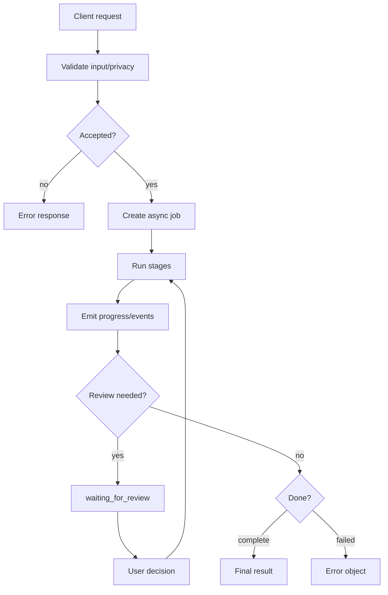

# aKriti API Job Lifecycle and Errors

**Status:** Draft implementation spec  
**Date:** 2026-05-20  
**Purpose:** Define async jobs, progress events, error shapes, cancellation, retries, and API behavior shared by Workbench, LibreOffice, FilterTube, Vinti, and third-party apps.

## 1. Core principle

Long document intelligence work is asynchronous by default.

```text
request
  -> accepted job
  -> progress events
  -> partial artifacts
  -> final aKritiDoc/result
  -> review/export/apply
```

The API should expose progress and partial results instead of making users wait behind a silent blocking call.

## 2. Job object

```json
{
  "job_id": "job_...",
  "kind": "parse | restore | translate | rewrite | extract_table | extract_chart | verify | export | apply_edit",
  "status": "queued | running | waiting_for_review | complete | failed | cancelled",
  "created_at": "2026-05-20T00:00:00Z",
  "updated_at": "2026-05-20T00:00:00Z",
  "document_id": "doc_...",
  "request": {},
  "progress": {
    "stage": "rendering_pages",
    "completed_units": 3,
    "total_units": 10,
    "message": "Rendering page 3 of 10"
  },
  "artifacts": [],
  "review_items": [],
  "result": null,
  "errors": []
}
```

## 3. Status semantics

| Status | Meaning |
|---|---|
| `queued` | accepted but not started |
| `running` | actively processing |
| `waiting_for_review` | blocked on low-confidence/high-risk user decision |
| `complete` | finished and result is available |
| `failed` | cannot finish without a new request or fix |
| `cancelled` | user/system cancelled safely |

## 4. Progress stages

Common parse stages:

```text
accepted
input_validation
source_fingerprinting
page_rendering
deterministic_extraction
layout_reading
text_reading
table_reading
chart_reading
image_reading
restoration_if_needed
verification
indexing
finalization
```

Progress must be meaningful enough for Workbench and LibreOffice to show status.

## 5. Event stream

Use Server-Sent Events, WebSocket, or local IPC depending on host.

Event object:

```json
{
  "event_id": "evt_...",
  "job_id": "job_...",
  "type": "progress | artifact | warning | review_item | partial_result | complete | failed",
  "timestamp": "2026-05-20T00:00:00Z",
  "payload": {}
}
```

Important events:
- page rendered.
- page parse complete.
- low-confidence region found.
- review item created.
- restored artifact created.
- partial `aKritiDoc` available.
- export available.

## 6. Error object

```json
{
  "error_id": "err_...",
  "code": "AKRITI_INPUT_UNSUPPORTED",
  "message": "Unsupported input file type.",
  "severity": "warning | recoverable | fatal",
  "target_ref": {},
  "retryable": false,
  "user_action": "Upload PDF, DOCX, image, or supported file.",
  "debug": {
    "module": "ingest",
    "trace_id": "trace_..."
  }
}
```

## 7. Error code families

| Family | Examples |
|---|---|
| input | unsupported file, encrypted PDF, corrupted file |
| privacy | remote disabled, consent missing |
| runtime | no compatible model, OOM, backend unavailable |
| schema | invalid module output, invalid patch |
| confidence | low confidence, conflicting votes |
| restoration | hallucination risk, entity drift |
| export | unsupported conversion, layout overflow |
| edit | unsafe patch, stale document version |

## 8. Retry policy

Retry automatically only for:
- transient runtime backend failure.
- temporary file lock.
- recoverable page-level error.
- cancelled remote/local worker if job can resume safely.

Do not auto-retry:
- high-confidence hallucination.
- unsupported file.
- privacy denial.
- destructive edit failure.
- schema-invalid model output without changing strategy.

## 9. Cancellation policy

Cancellation must:
- stop future work.
- preserve completed partial artifacts if useful.
- not leave half-applied edits.
- never cancel after native document edit has partially applied without rollback/undo record.

## 10. Partial results

For long PDFs, partial page results should be available.

```text
page 1 parsed -> visible in Workbench
page 2 parsed -> visible in Workbench
...
full document indexing completes later
```

Partial results must be marked:

```json
{
  "partial": true,
  "complete_pages": ["page_0001", "page_0002"],
  "pending_pages": ["page_0003"]
}
```

## 11. Idempotency

Write APIs should accept an idempotency key:

```json
{
  "idempotency_key": "client_generated_uuid"
}
```

Use it for:
- upload.
- parse job creation.
- export.
- apply edit.

This prevents duplicate jobs/edits after client retries.

## 12. Version and stale edit handling

Every edit patch must target a document version.

```json
{
  "target_document_version": "v12"
}
```

If the document changed:
- reject patch as stale.
- rebase if safe.
- otherwise ask user to regenerate.

## 13. API response envelope

```json
{
  "ok": true,
  "request_id": "req_...",
  "job_id": "job_...",
  "data": {},
  "warnings": [],
  "errors": []
}
```

Failures:

```json
{
  "ok": false,
  "request_id": "req_...",
  "errors": []
}
```

## 14. ASCII lifecycle

```text
client request
    |
    v
validate + privacy check
    |
    v
create job
    |
    v
emit progress / partial artifacts
    |
    +--> review needed -> waiting_for_review
    |
    +--> complete -> result
    |
    +--> failed -> error object
```

## 15. Mermaid lifecycle




## 16. Executable schema handoff

See `docs/akriti-contract-schema-implementation-spec.md` for the concrete API request envelope, response envelope, job, progress-event, error, and privacy schema responsibilities.

## Research References

This doc is connected to the numbered research bibliography in `docs/akriti-research-reference-index.md`. Those references are engineering anchors for aKriti-owned implementation; they are not product dependencies. Only open weights may enter model lineage, and only with manifest provenance.
