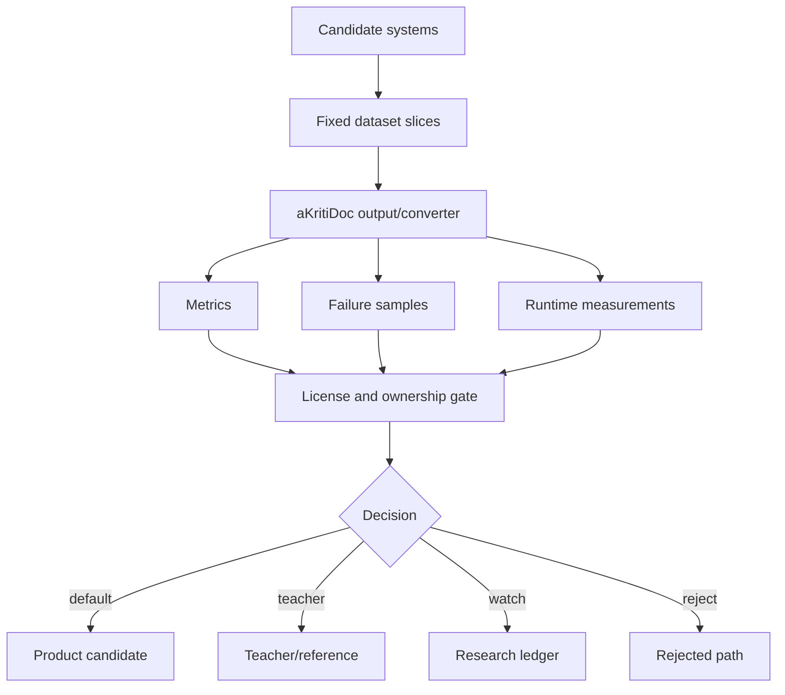

# aKriti Baseline Bake-off Protocol

**Status:** Draft implementation spec  
**Date:** 2026-05-20  
**Purpose:** Define how aKriti compares open-weight VLM/LLM bases, reference OCR/document systems, deterministic extractors, adapters, and owned modules without drifting into hype or wrapper architecture.

## 1. Core principle

Every candidate must compete against the same `aKritiDoc` contract.

```text
candidate model/system
        |
        v
same input documents
        |
        v
same aKritiDoc target/eval
        |
        v
same promotion gates
```

Do not compare raw demos. Compare evidence, structured output, failure modes, and runtime.

## 2. Candidate classes

| Class | Examples | Role |
|---|---|---|
| open VLM/LLM base | open-weight base-family candidate-family, other open multimodal bases | possible aKriti Core/Pro base |
| document/OCR reference | external OCR specialist, external OCR specialist, external OCR specialist, external OCR/layout toolkit, external document-layout reference-style systems | research reference, engineering reference, benchmark opponent |
| deterministic extractor | PDF text layer, table extraction, metadata readers | born-digital fast path and ground truth helper |
| adapter candidate | LoRA/QLoRA/DoRA/adaptive low-rank training reference-style adapters | fast capability improvement |
| owned module | aKriti Layout/Text/Table/Chart/Image/etc. | final product direction |
| runtime package | GGUF/MLX/ONNX/LiteRT/WebGPU/vLLM/TensorRT | deployment-specific package |

## 3. Non-negotiable scoring dimensions

| Dimension | Why |
|---|---|
| `aKritiDoc` validity | schema compatibility is mandatory |
| source provenance | outputs must cite file/page/bbox/cell/chart |
| OCR/text fidelity | core document reading |
| layout/reading order | required for real documents |
| table/chart fidelity | differentiates document intelligence from plain OCR |
| multilingual/Indic quality | core product requirement |
| confidence/review quality | uncertainty must be visible |
| hallucination rate | critical for legal/user documents |
| runtime/package behavior | local-first product constraint |
| license/ownership posture | prevents wrapper/product dependency drift |

## 4. Bake-off dataset slices

Use small fixed slices first:

```text
slice-ocr-basic
  clean born-digital and scanned text pages

slice-indic
  Hindi/Devanagari + Hinglish/code-mixed pages

slice-layout
  multi-column, headers/footers, lists, footnotes

slice-table
  dense tables, merged cells, numeric cells

slice-chart
  plots, axes, legends, chart-to-data tasks

slice-restoration
  blurred/degraded/low-contrast scans

slice-legal
  court-like pages, names, dates, amounts, sections

slice-filtertube
  thumbnail/title semantic filtering samples
```

## 5. Required outputs

Each candidate must produce:

```json
{
  "candidate_id": "...",
  "dataset_slice": "...",
  "akritidoc_output": "...",
  "metrics": {},
  "runtime": {},
  "failures": [],
  "review_items": [],
  "notes": ""
}
```

If a candidate cannot produce `aKritiDoc` directly, write a converter. If the converter is fragile, score that fragility.

## 6. Comparison policy

Use three result categories:

```text
best default
  strongest candidate for product path

best teacher/reference
  useful for distillation or verification, not product dependency

park/watch
  promising but blocked by quality, runtime, license, or integration
```

Do not make a candidate default just because it wins one slice.

## 7. License and ownership gate

For each candidate:

```text
license known?
commercial/product usage allowed?
weights open?
can run locally?
can output structured/provenance data?
can be distilled from legally/ethically?
```

If license is unclear, candidate cannot be default.

## 8. Runtime gate

Every candidate should be mapped to:
- RTX 2060 feasibility.
- Mac M4 feasibility.
- CPU-only fallback.
- browser/WebGPU feasibility.
- cloud/teacher role.

Do not call a model “local-first” if it only works acceptably on cloud GPUs.

## 9. Failure sample log

Every bake-off run must save failures:

```markdown
## Failure {id}

- Candidate:
- Slice:
- Page/region:
- Expected:
- Actual:
- Failure type:
- Screenshot/crop:
- Severity:
- Possible fix:
```

Failure samples are more useful than leaderboard numbers early on.

## 10. Initial bake-off matrix

| Candidate type | Slices |
|---|---|
| open-weight base-family candidate-family VLM base | all except maybe FilterTube tiny first |
| OCR/document references | OCR, Indic, layout, table, restoration, legal |
| deterministic PDF path | OCR-basic, layout, table born-digital |
| aKriti Tiny prototype | FilterTube, routing, page quality |
| aKriti Small prototype | OCR, restoration, thumbnail/image understanding |
| aKriti Core adapter | full document slices |

## 11. Decision rule

```text
default path = best quality under ownership + provenance + runtime constraints
teacher path = strong quality but unsuitable as product dependency
research path = promising but not yet useful
reject path = violates constraints or fails core evals
```

## 12. ASCII bake-off flow

```text
candidate list
    |
    v
fixed dataset slices
    |
    v
aKritiDoc conversion
    |
    v
metrics + failure samples + runtime
    |
    v
license/ownership gate
    |
    v
default / teacher / watch / reject
```

## 13. Mermaid bake-off flow




## Research References

This doc is connected to the numbered research bibliography in `docs/akriti-research-reference-index.md`. Those references are engineering anchors for aKriti-owned implementation; they are not product dependencies. Only open weights may enter model lineage, and only with manifest provenance.
