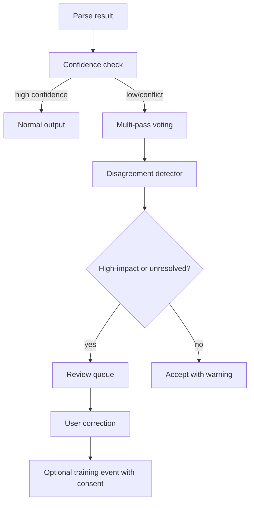

# aKriti Confidence, Voting, and Human Review

**Status:** Draft implementation spec  
**Date:** 2026-05-20  
**Purpose:** Define how aKriti handles uncertain/confusing regions through confidence scoring, multi-pass voting, disagreement detection, and user-visible review.

## 1. Core principle

aKriti should not hide uncertainty.

```text
if the system is unsure
  show where
  show why
  show alternatives
  ask for review when needed
```

Low confidence is not a bug by itself. Silent confidence is the bug.

## 2. Where confidence exists

Confidence should be attached at multiple levels:

| Level | Examples |
|---|---|
| page | scan quality, rotation, language/script certainty |
| block | block type, bbox, reading order |
| span | OCR/text certainty, language/script certainty |
| table | table detection, cell structure, merged cells |
| chart | chart type, axes, legend, series extraction |
| image/figure | region type, caption reliability |
| translation | entity preservation, terminology, layout fit |
| restoration | hallucination risk, entity drift |
| answer | citation support, unsupported claims |
| edit patch | destructive risk, target certainty |

## 3. aKritiDoc confidence object

```json
{
  "confidence": {
    "overall": 0.74,
    "text": 0.91,
    "layout": 0.68,
    "reading_order": 0.72,
    "language": 0.83,
    "script": 0.95,
    "source_grounding": 0.88,
    "review_required": true,
    "review_reasons": [
      "layout_disagreement",
      "low_table_structure_confidence"
    ]
  }
}
```

Confidence is not a replacement for provenance. It is a triage signal.

## 4. Voting / multi-pass reading

Voting is used for confusing or high-impact regions.

Candidate voters:
- primary VLM parse.
- deterministic PDF extraction for born-digital documents.
- restored-image reread.
- table-specific reader.
- chart-specific reader.
- text/OCR specialist baseline used as reference.
- smaller verifier model.
- user correction.

Voting output:

```json
{
  "vote_id": "vote_...",
  "target_ref": {
    "page_id": "page_0002",
    "block_id": "blk_..."
  },
  "candidates": [
    {
      "source": "primary_vlm",
      "value": "Rs. 1,50,000",
      "confidence": 0.66
    },
    {
      "source": "restored_reread",
      "value": "Rs. 1,50,000",
      "confidence": 0.81
    },
    {
      "source": "deterministic_pdf",
      "value": "Rs. 1,60,000",
      "confidence": 0.70
    }
  ],
  "decision": "accept | review | reject | abstain",
  "selected_candidate": null,
  "reason": "conflicting_amounts"
}
```

## 5. Voting policy

Use voting when:
- confidence is below threshold.
- multiple parsers disagree.
- source is degraded or restored.
- legal/financial/identity entities are involved.
- table/chart data is extracted.
- an edit patch targets uncertain content.

Do not use voting as blind majority rule.

Decision priority:

```text
source evidence
  >
deterministic extraction when valid
  >
verified multi-pass agreement
  >
model confidence
  >
majority count
```

If voters disagree on a high-impact entity, mark for review instead of forcing a winner.

## 6. Disagreement types

| Type | Example |
|---|---|
| text disagreement | `150000` vs `160000` |
| bbox disagreement | different region selected |
| block type disagreement | table vs paragraph |
| reading order disagreement | multi-column order mismatch |
| language/script disagreement | Hindi vs Marathi, Devanagari vs Latin |
| restoration drift | restored page introduces new token |
| chart disagreement | line chart vs scatter, axis value mismatch |
| table disagreement | split/merged cell mismatch |

## 7. User-visible low-confidence UI

Workbench/LibreOffice must show:
- highlighted low-confidence regions.
- confidence reason.
- alternatives if available.
- source/original view.
- restored/derived view if used.
- accept/reject/correct actions.

UI labels should be plain:

```text
Low confidence: possible table structure issue
Conflicting reads: "1,50,000" vs "1,60,000"
Needs review: restored image changed visible amount
```

Do not show only numeric scores without explanation.

## 8. Review queue item

```json
{
  "review_id": "rev_...",
  "severity": "low | medium | high",
  "reason": "conflicting_amounts",
  "target_ref": {},
  "source_view": {},
  "candidates": [],
  "recommended_action": "user_review",
  "allowed_actions": [
    "accept_candidate",
    "correct_value",
    "mark_unknown",
    "rerun_with_restoration",
    "ignore"
  ]
}
```

## 9. Thresholds

Start conservative:

| Area | Review threshold |
|---|---:|
| OCR text | `< 0.80` |
| table structure | `< 0.85` |
| chart reconstruction | `< 0.85` |
| legal/financial entities | `< 0.95` or any disagreement |
| restoration output | any entity drift |
| edit patch target | `< 0.90` |
| answer citation support | no direct citation |

Thresholds should become learned/calibrated later.

## 10. Training value

User corrections in review queues are high-value data.

With consent, they can become:
- OCR correction examples.
- layout correction examples.
- table/chart labels.
- verifier training data.
- preference pairs.
- hallucination/red-team samples.

## 11. ASCII flow

```text
parse result
    |
    v
confidence check
    |
    +--> high confidence -> normal output
    |
    +--> low/conflict -> multi-pass voting
                          |
                          v
                    disagreement detector
                          |
                          v
                    review queue / abstain
                          |
                          v
                    user correction if needed
```

## 12. Mermaid flow




## Research References

This doc is connected to the numbered research bibliography in `docs/akriti-research-reference-index.md`. Those references are engineering anchors for aKriti-owned implementation; they are not product dependencies. Only open weights may enter model lineage, and only with manifest provenance.
