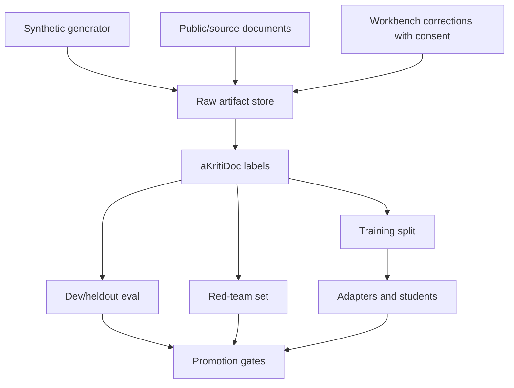

# aKriti Data Engine and Synthetic Documents

**Status:** Draft implementation spec  
**Date:** 2026-05-20  
**Purpose:** Define how aKriti should generate, collect, verify, and version document data for training and evaluation.

## 1. Data principle

aKriti needs document-native data, not generic chat data.

```text
source document
    |
    v
aKritiDoc target
    |
    +--> train
    +--> evaluate
    +--> distill
    +--> verify
```

Every training target should either be:
- deterministic from source.
- human corrected.
- teacher generated and verified.
- synthetic with known ground truth.

## 2. Data sources

| Source | Use | Risk |
|---|---|---|
| born-digital PDFs | deterministic text/layout targets | PDF extraction quirks |
| scanned public-domain docs | OCR/layout training | noisy labels |
| synthetic documents | exact ground truth | distribution gap |
| Workbench corrections | high-value supervision | privacy and consent |
| generated teacher outputs | distillation | teacher hallucination |
| LibreOffice-generated docs | edit/export tasks | template bias |
| court/legal public docs | Vinti later | privacy/license/ethics |

## 3. Synthetic document generator

Synthetic docs should create both rendered pages and ground-truth `aKritiDoc`.

Document families:
- reports.
- invoices.
- forms.
- tables.
- charts.
- letters.
- court-like filings.
- bilingual/Indic documents.
- degraded scans.
- spreadsheets and exported PDFs.
- presentation slides.

Each synthetic sample should include:

```json
{
  "sample_id": "syn_...",
  "source_files": [],
  "rendered_pages": [],
  "ground_truth_akritidoc": "...",
  "generation_recipe": {},
  "license": "synthetic",
  "split": "train | dev | heldout | redteam"
}
```

## 4. Synthetic variation axes

Vary:
- language and script.
- font and typography.
- page size and orientation.
- tables with merged cells.
- charts with noisy axes.
- signatures/stamps.
- low contrast.
- blur.
- skew.
- compression.
- camera shadows.
- headers/footers.
- footnotes.
- multi-column layout.
- form fields.
- mixed Hindi/English/Hinglish.

## 5. Ground truth layers

Ground truth should be layered:

```text
text truth
layout truth
table truth
chart truth
visual-block truth
translation truth
edit/action truth
retrieval/citation truth
```

Do not flatten everything into plain text.

## 6. Data versioning

Every dataset release should have:
- dataset id.
- schema version.
- generation script version.
- source provenance.
- license posture.
- split assignment.
- checksum manifest.
- known limitations.

Dataset naming:

```text
akriti-docsynth-v0
akriti-ocr-indic-v0
akriti-tablechart-v0
akriti-libreoffice-actions-v0
akriti-filtertube-thumbnail-v0
```

## 7. Privacy policy

User documents are not training data by default.

Allowed only with explicit consent:
- storing corrections.
- using documents for model improvement.
- sending to remote teacher models.

Default:

```text
local parse
local artifacts
no training reuse
no cloud upload
```

## 8. Teacher data policy

Teacher-generated data must be verified.

Allowed teacher roles:
- propose `aKritiDoc` labels.
- propose captions.
- propose table/chart reconstructions.
- propose translations.
- propose edit patches.

Verification:
- schema validation.
- deterministic checks.
- source citation check.
- human review for high-stakes data.

## 9. Red-team data

Red-team set should include:
- blurred legal scans.
- low-resource Indic scripts.
- adversarial tables.
- wrong chart labels.
- stamps/signatures near text.
- misleading headings.
- repeated entities.
- contradictory clauses.
- handwritten notes.
- OCR traps where restoration can hallucinate.

Do not train directly on red-team labels unless creating a new held-out red-team set.

## 10. Dataset-to-model mapping

| Dataset | Model/module |
|---|---|
| `akriti-docsynth-v0` | Layout/Text/Table/Chart readers |
| `akriti-ocr-indic-v0` | Text Reader and tokenizer experiments |
| `akriti-tablechart-v0` | Table Reader and Chart Reader |
| `akriti-restoration-v0` | Restoration Module |
| `akriti-libreoffice-actions-v0` | Kriti action/edit layer |
| `akriti-filtertube-thumbnail-v0` | aKriti Tiny visual/semantic classifier |

## 11. ASCII data flow

```text
synthetic generator / source docs / corrections
             |
             v
        raw artifact store
             |
             v
       aKritiDoc labels
             |
    +--------+--------+
    |        |        |
    v        v        v
  train     eval    distill
    |        |        |
    +--------+--------+
             |
             v
      release decision
```

## 12. Mermaid data flow




## 13. Fixture corpus handoff

See `docs/akriti-fixture-corpus-and-experiment-cards.md` for the first concrete fixture bundle layout, manifest schema, dataset cards, and experiment-specific fixture requirements.

## Research References

This doc is connected to the numbered research bibliography in `docs/akriti-research-reference-index.md`. Those references are engineering anchors for aKriti-owned implementation; they are not product dependencies. Only open weights may enter model lineage, and only with manifest provenance.
