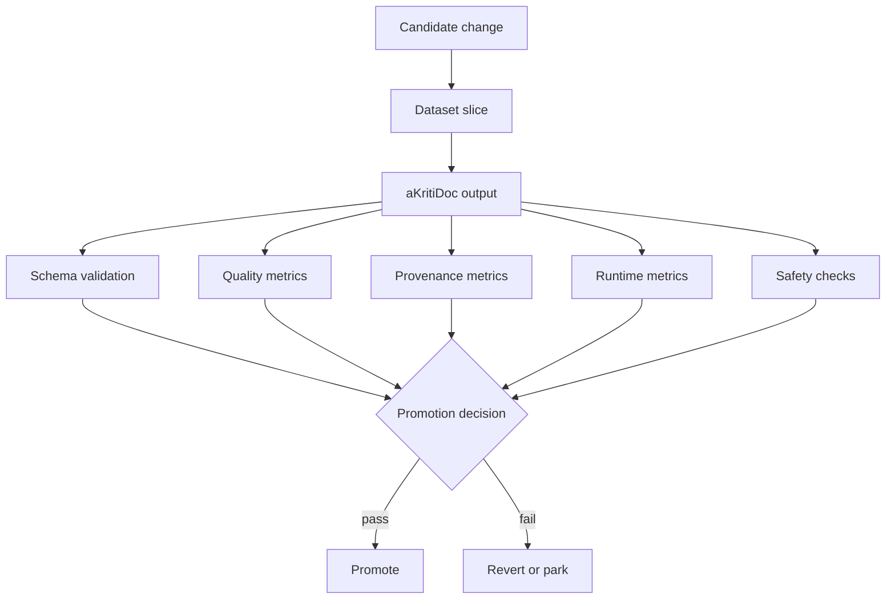

# aKriti Evaluation Harness

**Status:** Draft lock for implementation planning  
**Date:** 2026-05-20  
**Purpose:** Define the metrics and evaluation gates that decide whether aKriti changes are real improvements.

## 1. Evaluation principle

aKriti needs document-native evals, not only LLM academic benchmarks.

Academic benchmarks such as MMLU or GSM8K may be useful for checking general reasoning, but aKriti promotion decisions must be based on document intelligence tasks.

```text
document pixels/files -> aKritiDoc -> grounded answer/edit/export -> metric + human review where needed
```

## 2. Required benchmark families

| Family | Measures |
|---|---|
| OCR/text | CER, WER, Indic CER, code-mixed text fidelity, formula/footnote handling |
| layout | block detection, bbox IoU, reading order, section hierarchy |
| tables | cell F1, row/column structure, merged cells, CSV/HTML reconstruction |
| charts | chart type, axis/legend extraction, data-series reconstruction, chart QA |
| images/figures | artifact detection, caption usefulness, source/derived separation |
| translation | chrF/BLEU/COMET-style checks, terminology consistency, layout preservation |
| retrieval/QA | exact citation recall, region grounding, false-positive rate |
| editing | patch correctness, reversibility, user-approval safety, LibreOffice edit fidelity |
| runtime | latency, RAM/VRAM, package size, tokens/sec, pages/sec, CPU/GPU load |
| safety | hallucination rate, unsupported-claim rate, destructive edit prevention |

## 3. Promotion gates

No model, adapter, runtime, or parser becomes default unless it passes:

```text
quality gate
provenance gate
runtime gate
regression gate
safety gate
```

Gate details:
- quality gate: improves target metric on held-out samples.
- provenance gate: outputs can be traced to file/page/bbox/cell/chart.
- runtime gate: fits the intended device tier.
- regression gate: does not damage unrelated document tasks.
- safety gate: does not increase hallucinated or unsupported claims.

## 4. aKritiDoc validation

Every parse output must validate:

```text
document id
pages
blocks
spans
tables
charts
images
coordinates
source provenance
confidence
derived artifacts
version
```

Invalid `aKritiDoc` output is an automatic failure, even if the visible answer looks good.

## 5. Exact search plus semantic search eval

Retrieval must be split:

```text
exact retrieval
  dates, names, citations, amounts, sections, clauses, table cells

semantic retrieval
  paraphrase, topic search, similarity, conceptual grouping
```

Metrics:
- exact hit rate.
- citation page accuracy.
- bbox/region accuracy.
- semantic recall.
- false-positive rate.
- answer abstention accuracy.

## 6. OCR and visual text eval

Core text metrics:
- CER for full page.
- CER per script.
- CER after restoration.
- WER for prose.
- token order accuracy.
- line/paragraph grouping accuracy.

Special cases:
- Hindi and other Indic scripts.
- Hinglish/code-mixed text.
- forms and government documents.
- tables with dense numbers.
- stamps, signatures, watermarks.
- low-resolution scans.

## 7. Table eval

Table output should be judged at multiple layers:

```text
detect table -> detect cells -> recover structure -> extract text -> export CSV/HTML/ODS -> answer questions
```

Metrics:
- table detection F1.
- cell bbox IoU.
- row/column adjacency accuracy.
- merged-cell correctness.
- text CER inside cells.
- CSV/HTML round-trip fidelity.
- downstream table QA accuracy.

## 8. Chart eval

Chart output should be judged as both visual understanding and data reconstruction.

Metrics:
- chart type classification.
- axis title extraction.
- legend extraction.
- tick value extraction.
- series name extraction.
- data point reconstruction error.
- chart-to-table conversion accuracy.
- chart QA accuracy.

## 9. Translation eval

Translation must preserve:
- meaning.
- terminology.
- entities.
- formatting.
- source traceability.

Metrics:
- chrF and BLEU as rough automated checks.
- terminology consistency.
- layout preservation score.
- entity preservation.
- human review for legal/high-stakes samples.

## 10. Runtime eval

Runtime measurements must be tied to device profile:

| Device | Required measurements |
|---|---|
| RTX 2060 6GB | VRAM, pages/sec, tokens/sec, failure/OOM rate |
| Mac M4 24GB | external research sourcel/MLX latency, memory pressure, UI responsiveness |
| CPU-only desktop | RAM, latency, usable package size |
| Browser/WebGPU | cold start, model load size, thumbnail latency, tab responsiveness |
| Cloud H100/H200/Blackwell | throughput, cost per page, teacher generation speed |

## 11. Eval split policy

Use at least three splits:

```text
dev
  used for fast iteration

held-out
  used for promotion gates

red-team
  adversarial, noisy, legal, multilingual, weird layout, bad scans
```

Do not optimize directly against the held-out or red-team sets.

## 12. ASCII eval flow

```text
candidate model/runtime/parser
            |
            v
      fixed dataset slice
            |
            v
         aKritiDoc
            |
    +-------+-------+
    |       |       |
    v       v       v
 quality  provenance runtime
    |       |       |
    +-------+-------+
            |
            v
   promote / revert / park
```

## 13. Mermaid eval flow




## 14. Fixture corpus handoff

See `docs/akriti-fixture-corpus-and-experiment-cards.md` for the concrete EXP-001 through EXP-012 fixture cards that bind these evaluation metrics to measurable sample sets.

## Research References

This doc is connected to the numbered research bibliography in `docs/akriti-research-reference-index.md`. Those references are engineering anchors for aKriti-owned implementation; they are not product dependencies. Only open weights may enter model lineage, and only with manifest provenance.
