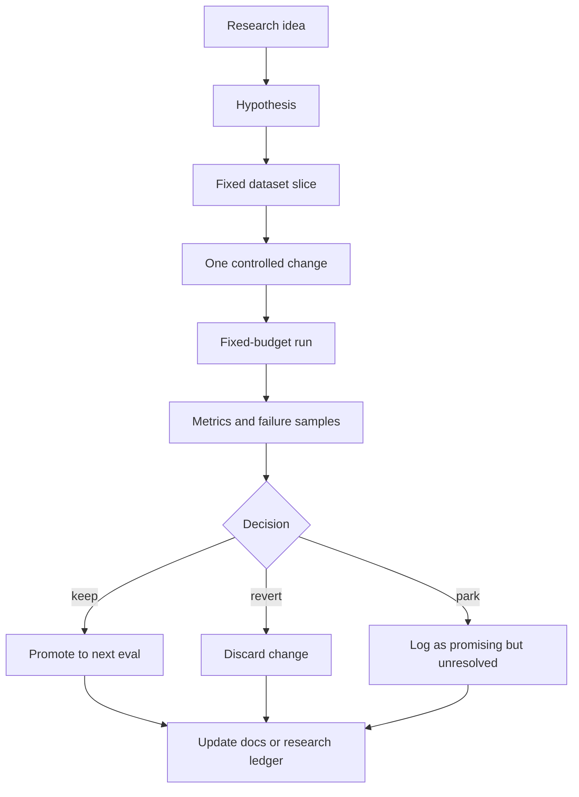

# aKriti Experiment Loop

**Status:** Draft lock for implementation planning  
**Date:** 2026-05-20  
**Purpose:** Define how to use Karpathy-autoresearch-style loops safely for aKriti R&D.

## 1. Core idea

Use `karpathy/autoresearch` as a pattern:

```text
one hypothesis
one controlled change
one fixed budget
one metric family
one decision
one log entry
```

Do not use uncontrolled self-modifying research agents as production infrastructure.

## 2. Experiment template

```markdown
## EXP-{YYYYMMDD}-{slug}

- Hypothesis:
- Baseline:
- Change:
- Dataset slice:
- Budget:
- Hardware:
- Metrics:
- Result:
- Decision: keep | revert | park
- Failure samples:
- Notes:
```

## 3. Fixed-budget experiment classes

| Class | Budget | Use |
|---|---|---|
| `micro` | 5-15 minutes | sanity checks, tiny data slices, prompt/schema experiments |
| `small` | 1-3 hours | adapter trials, quantization checks, OCR/layout ablations |
| `medium` | 6-24 hours | serious LoRA/QLoRA, distillation trials, runtime packaging |
| `large` | approved cloud budget only | teacher generation, broad eval sweep, major checkpoint training |

## 4. Candidate experiment lanes

### OCR/text

Hypotheses:
- restoration improves CER on degraded scans without increasing hallucinated strokes.
- an Indic-specific adapter improves native-script CER.
- grapheme-aware tokenization improves student OCR behavior.

Metrics:
- CER/WER.
- unsupported text insertion rate.
- bbox provenance coverage.

### Layout

Hypotheses:
- region-first page parsing improves reading order.
- layout pretraining improves table/chart localization.

Metrics:
- block IoU.
- reading order accuracy.
- hierarchy accuracy.

### Tables

Hypotheses:
- table-specific adapter improves merged-cell and CSV reconstruction.
- constrained structured generation reduces invalid table JSON.

Metrics:
- cell F1.
- row/column accuracy.
- CSV/HTML round-trip score.

### Charts

Hypotheses:
- chart crop reparse improves axis/legend/data extraction.
- chart-specific QA distillation improves natural-language chart answers.

Metrics:
- chart type accuracy.
- axis/legend extraction.
- series reconstruction error.

### Runtime

Hypotheses:
- GGUF `Q4_K_M` is the best default package for consumer machines.
- importance-matrix calibration on aKriti documents improves low-bit quality.
- WebGPU tiny model is enough for FilterTube thumbnail triage.

Metrics:
- latency.
- RAM/VRAM.
- package size.
- quality delta against FP16/Q8 reference.

## 5. Keep/revert/park policy

```text
keep
  improves target metrics and does not regress provenance/runtime/safety

revert
  worsens target metric or creates unsafe/hallucinated behavior

park
  ambiguous, promising but not enough evidence, or needs better data/eval
```

## 6. Agent loop boundaries

Allowed:
- propose experiment.
- modify isolated experiment branch or config.
- run approved fixed-budget job.
- summarize results.
- write log entry.

Not allowed without explicit approval:
- large model downloads.
- paid cloud jobs.
- overnight training.
- destructive dataset edits.
- changing held-out eval sets.
- silently promoting a model package.

## 7. aKriti experiment queue

Initial queue:

| ID | Experiment | Class | Why |
|---|---|---|---|
| `EXP-OCR-001` | baseline CER on mixed PDF/scanned/Indic pages | micro | establishes text-reading floor |
| `EXP-LAYOUT-001` | compare layout reading order methods | micro | core to `aKritiDoc` correctness |
| `EXP-RUNTIME-001` | GGUF quantization quality ladder | small | local deployment gate |
| `EXP-FILTERTUBE-001` | tiny thumbnail semantic classifier | small | validates browser/local path |
| `EXP-TABLE-001` | table JSON constrained generation | small | tests structured output reliability |
| `EXP-RESTORE-001` | restoration before OCR on degraded scans | small | checks diffusion/restoration value |
| `EXP-TRANSLATE-001` | layout-preserving Indic translation | medium | key product capability |

## 8. ASCII loop

```text
idea or paper
     |
     v
hypothesis
     |
     v
fixed data slice + metric
     |
     v
single change
     |
     v
fixed-budget run
     |
     v
compare to baseline
     |
     v
keep / revert / park
     |
     v
research ledger + decision log if needed
```

## 9. Mermaid loop




## Research References

This doc is connected to the numbered research bibliography in `docs/akriti-research-reference-index.md`. Those references are engineering anchors for aKriti-owned implementation; they are not product dependencies. Only open weights may enter model lineage, and only with manifest provenance.
