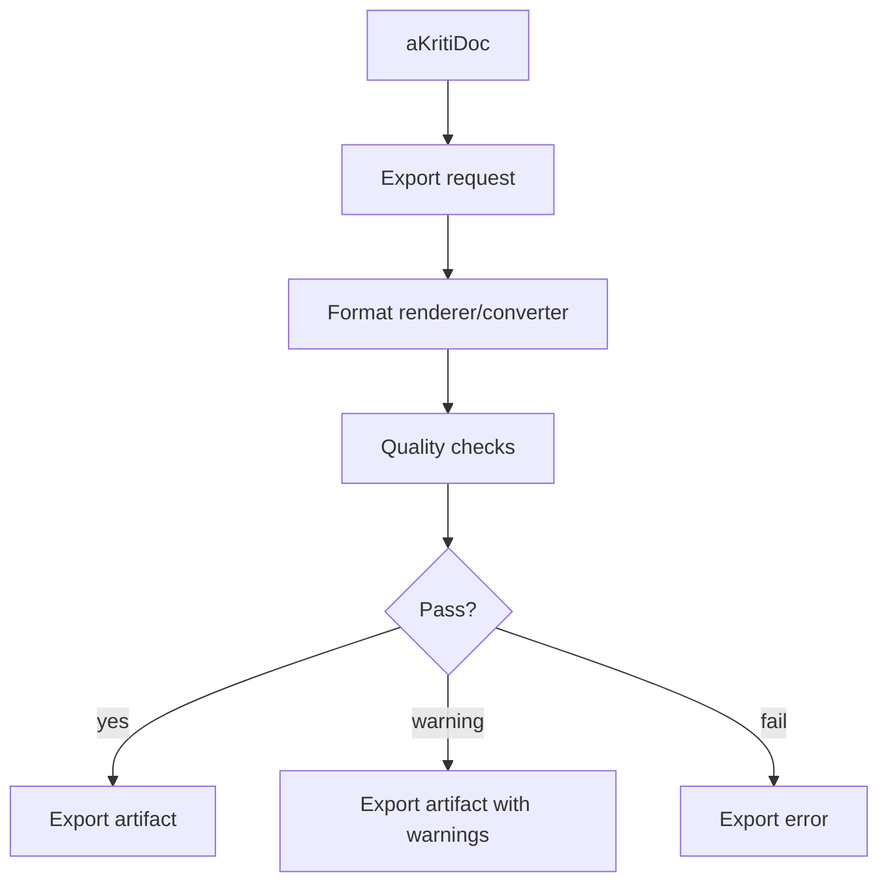

# aKriti Export, Conversion, and Edit Contracts

**Status:** Draft implementation spec  
**Date:** 2026-05-20  
**Purpose:** Define how aKriti converts document intelligence into PDF/DOCX/ODT/ODS/CSV/HTML/JSON exports and safe native edit patches.

## 1. Core principle

Export is a transformation from `aKritiDoc`, not a separate parser output.

```text
aKritiDoc
    |
    v
export plan
    |
    v
format-specific renderer/converter
    |
    v
export artifact with provenance
```

This keeps PDF, DOCX, LibreOffice, and web exports consistent.

## 2. Export request

```json
{
  "export_id": "export_...",
  "document_id": "doc_...",
  "source_version": "v12",
  "target_format": "pdf | docx | odt | ods | csv | html | markdown | json | akritidoc",
  "selection_refs": [],
  "options": {
    "include_citations": true,
    "include_confidence": false,
    "include_visual_artifacts": true,
    "preserve_layout": true,
    "redact_private_fields": false
  }
}
```

## 3. Export artifact

```json
{
  "artifact_id": "export_...",
  "kind": "export",
  "format": "docx",
  "path": "...",
  "sha256": "...",
  "source_document_id": "doc_...",
  "source_version": "v12",
  "created_at": "2026-05-20T00:00:00Z",
  "warnings": [],
  "provenance": {}
}
```

## 4. Format behavior

| Format | Primary use |
|---|---|
| `akritidoc` | canonical structured representation |
| `json` | API/debug/integration export |
| `markdown` | summaries, notes, readable extracted text |
| `html` | reviewable structured document view |
| `csv` | single table export |
| `ods` | spreadsheet/table export for LibreOffice Calc |
| `docx`/`odt` | translated/reconstructed document |
| `pdf` | final shareable/exported output |

## 5. Source vs derived export policy

Exports must clearly distinguish:
- original source text.
- corrected/restored text.
- translated text.
- model-generated summaries.
- reconstructed tables/charts.

For high-stakes/legal exports:
- include citations or appendix if requested.
- mark derived content.
- preserve source references.

## 6. Table export

Table exports should support:
- CSV.
- HTML table.
- ODS sheet.
- DOCX/ODT table.
- provenance map from cell to source bbox.

CSV warning:
- CSV cannot represent merged cells, style, provenance, or confidence directly.
- include sidecar JSON when provenance matters.

## 7. Chart export

Chart exports should support:
- reconstructed data table.
- chart image crop.
- chart description.
- optional recreated chart in spreadsheet/presentation.

Never present reconstructed chart data as source truth without provenance and confidence.

## 8. Edit patch contract

Edit patches are separate from exports.

```json
{
  "patch_id": "patch_...",
  "target": {
    "host": "workbench | libreoffice | api",
    "app": "writer | calc | impress | generic",
    "document_id": "doc_...",
    "document_version": "v12"
  },
  "operations": [],
  "risk": "low | medium | high",
  "preview_required": true,
  "provenance": {}
}
```

## 9. Edit operations

```json
{
  "op_id": "op_...",
  "kind": "replace_text | insert_text | delete_text | insert_table | update_cell | create_chart | add_comment | highlight_region",
  "target_ref": {},
  "value": {},
  "style_policy": "preserve | adapt | explicit",
  "source_refs": [],
  "requires_review": true
}
```

## 10. LibreOffice mapping

| aKriti patch op | LibreOffice mapping |
|---|---|
| `replace_text` | Writer range replace |
| `insert_text` | Writer insertion |
| `add_comment` | Writer/Calc/Impress comment |
| `update_cell` | Calc cell update |
| `insert_table` | Writer table or Calc range |
| `create_chart` | Calc/Impress chart object |
| `highlight_region` | UI overlay/comment, not destructive edit |

## 11. Safe edit rules

- high-risk edits require preview.
- stale document version rejects patch.
- source evidence cannot be deleted silently.
- derived translations/rewrite must be marked in provenance.
- undo/redo must be supported by host.
- comments/suggestions are preferred for legal/high-stakes documents.

## 12. Conversion quality checks

Run checks before marking export complete:
- schema valid.
- source refs still valid.
- no missing pages/blocks.
- tables preserved or warnings emitted.
- visual artifacts included or warnings emitted.
- layout overflow checked.
- output file hash recorded.

## 13. Export warnings

Warning examples:

```json
{
  "code": "AKRITI_EXPORT_LAYOUT_OVERFLOW",
  "message": "Translated paragraph may overflow its original bounding box.",
  "target_ref": {},
  "severity": "warning"
}
```

## 14. ASCII export flow

```text
aKritiDoc
    |
    v
export request
    |
    v
format renderer
    |
    v
quality checks
    |
    v
export artifact + warnings
```

## 15. Mermaid export flow




## 16. Executable schema handoff

See `docs/akriti-contract-schema-implementation-spec.md` for the concrete export request, export artifact, conversion warning, edit patch, edit operation, and high-risk preview validation rules.

## Research References

This doc is connected to the numbered research bibliography in `docs/akriti-research-reference-index.md`. Those references are engineering anchors for aKriti-owned implementation; they are not product dependencies. Only open weights may enter model lineage, and only with manifest provenance.
