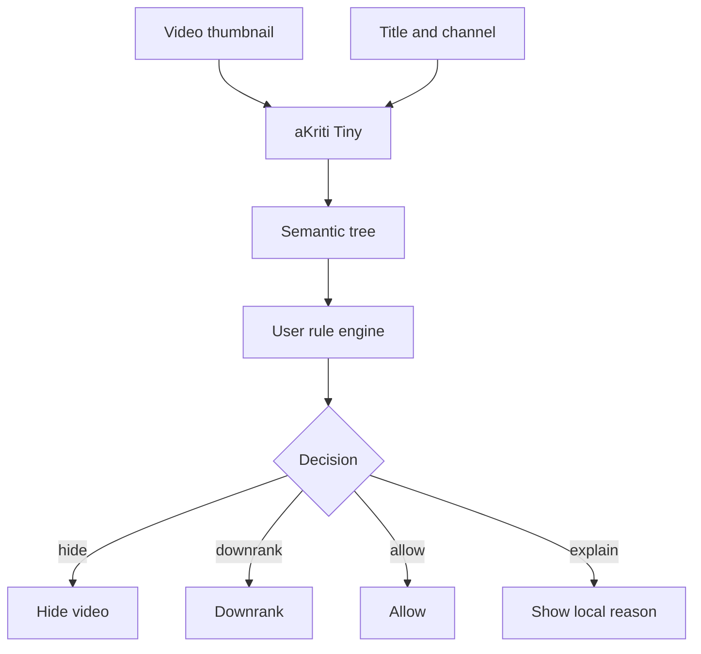

# aKriti for FilterTube Local VLM Plan

**Status:** Draft implementation spec  
**Date:** 2026-05-20  
**Purpose:** Define how aKriti Tiny/Small capabilities can power local semantic filtering and thumbnail/video understanding for FilterTube.

## 1. Product principle

FilterTube should use the smallest local model that solves the user-facing filtering task.

```text
thumbnail/keyframe/audio/text metadata
        |
        v
tiny local semantic model
        |
        v
filter / rank / hide / explain
```

Do not load a 3B model in the browser extension by default.

## 2. Initial capability set

| Capability | Model tier | Runtime |
|---|---|---|
| thumbnail category filter | aKriti Tiny | WebGPU/ONNX/WASM |
| visual embedding search | aKriti Tiny | WebGPU/ONNX |
| title+thumbnail semantic score | aKriti Tiny | WebGPU |
| unsafe/clickbait pattern filter | aKriti Tiny/Small | WebGPU/local app |
| short caption for thumbnail | aKriti Small | local app or optional |
| keyframe semantic tree | aKriti Small/Core | desktop/mobile, not default extension |

## 3. Input signals

Use only what the user permits.

Signals:
- thumbnail image.
- title.
- channel name.
- user-defined block/allow rules.
- optional transcript if already visible/available.
- optional sampled keyframes for local app mode.

Avoid:
- sending thumbnails to cloud by default.
- hidden background analysis without user control.
- full video processing inside browser as the first implementation.

## 4. Semantic tree

FilterTube semantic tree:

```json
{
  "video_id": "...",
  "signals": {
    "title": "...",
    "thumbnail_artifact_id": "...",
    "channel": "..."
  },
  "visual_tags": [],
  "text_tags": [],
  "semantic_categories": [],
  "risk_flags": [],
  "user_rule_matches": [],
  "confidence": {},
  "explanation": "short local explanation"
}
```

## 5. Rule engine

User rules should combine exact and semantic filters:

```text
exact:
  hide titles containing terms
  hide channels
  allow channels

semantic:
  hide thumbnails likely about topic X
  downrank clickbait category Y
  allow educational content on topic Z

visual:
  hide specific visual patterns
  downrank certain thumbnail styles
```

## 6. Tiny model training targets

Datasets should contain:
- thumbnail image.
- title.
- user/category label.
- semantic tags.
- clickbait/sensationalism labels.
- explanation target.
- negative pairs for confusing thumbnails.

Metrics:
- classification F1.
- false positive rate.
- false negative rate.
- latency.
- model load size.
- browser memory.
- user override rate.

## 7. Runtime plan

Phase 1:
- prototype outside extension using Python/ONNX.
- build dataset and labels.
- test tiny image/text embedding and classifier.

Phase 2:
- export to ONNX/WebGPU.
- run thumbnail-only and title+thumbnail scoring.
- add local rule engine.

Phase 3:
- optional local desktop helper for heavier keyframe/video analysis.
- sync only user-approved rule outputs to extension.

## 8. Privacy policy

Default:

```text
all filtering local
no cloud thumbnail analysis
no user watch history upload
no remote model call unless explicitly enabled
```

## 9. Integration with aKriti model family

FilterTube is a good proving ground for `aKriti Tiny`:
- fast visual embedding.
- local semantic category.
- thumbnail understanding.
- browser deployment.
- low-resource constraints.

It should not dictate the full aKriti Core architecture.

## 10. ASCII flow

```text
YouTube page
    |
    v
thumbnail + title
    |
    v
aKriti Tiny local model
    |
    v
semantic tree
    |
    v
user rule engine
    |
    v
hide / downrank / allow / explain
```

## 11. Mermaid flow




## Research References

This doc is connected to the numbered research bibliography in `docs/akriti-research-reference-index.md`. Those references are engineering anchors for aKriti-owned implementation; they are not product dependencies. Only open weights may enter model lineage, and only with manifest provenance.
