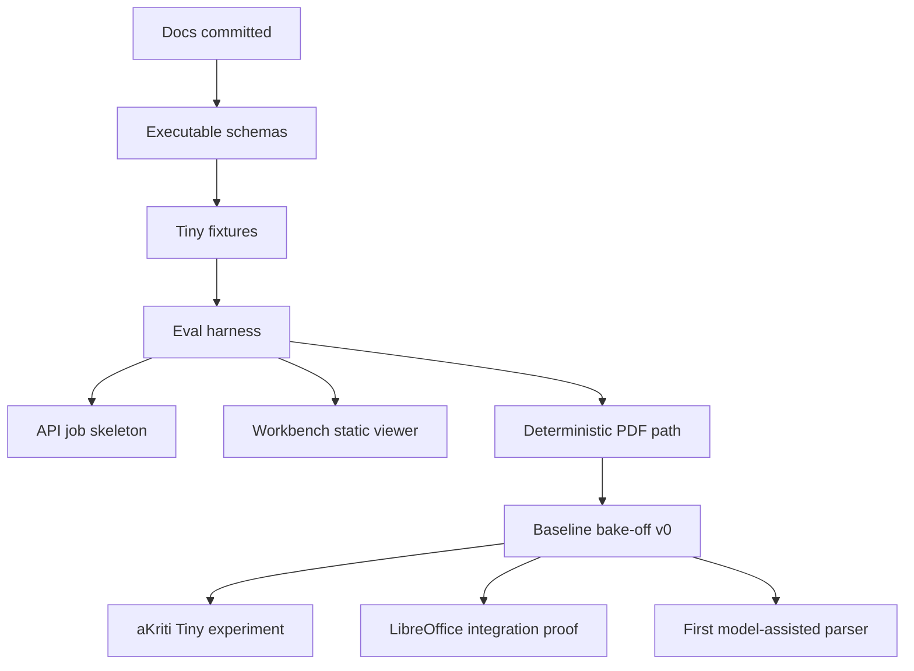

# aKriti First Milestone Roadmap

**Status:** Draft execution roadmap  
**Date:** 2026-05-20  
**Purpose:** Convert the expanded documentation set into the first implementation milestones.

## 1. Milestone principle

Do not start by training the model.

Start by making the product contract executable:

```text
aKritiDoc schema
  -> validator
  -> tiny fixture
  -> eval harness
  -> API job lifecycle
  -> viewer/review surface
  -> baseline bake-off
```

This gives every later model experiment a target.

## 2. Milestone 0: lock docs and skills

Goal:
- commit current docs.
- commit `agent-skills/`.
- keep `specs/` deletion intentional.

Deliverables:
- docs committed.
- custom skills source committed.
- README index coherent.

Do before code starts.

## 3. Milestone 1: executable schemas

Goal:
- turn docs into machine-checkable schemas.

Deliverables:
- `aKritiDoc` JSON Schema v0.
- API job schema.
- module request/response schema.
- edit patch schema.
- review item schema.
- model registry schema.

Exit gate:
- sample fixture validates.

## 4. Milestone 2: tiny synthetic fixture set

Goal:
- create tiny but representative fixtures.

Fixtures:
- one clean born-digital page.
- one scanned text page.
- one Hindi/Devanagari page.
- one table page.
- one chart page.
- one degraded/restoration page.
- one FilterTube thumbnail/title sample.

Exit gate:
- each fixture has expected `aKritiDoc` target or partial target.

## 5. Milestone 3: eval harness skeleton

Goal:
- compare outputs against fixtures.

Initial metrics:
- schema valid/invalid.
- text exact match/CER.
- bbox IoU.
- reading order.
- table cell match.
- citation support.
- runtime timing.

Exit gate:
- one command can run fixture eval and write a report.

## 6. Milestone 4: local API job skeleton

Goal:
- make the product API shape real.

Deliverables:
- create parse job.
- poll job status.
- emit progress events.
- return fixture `aKritiDoc`.
- expose errors in standard shape.

Exit gate:
- Workbench or CLI can watch a job progress from queued to complete.

## 7. Milestone 5: Workbench static viewer

Goal:
- visually inspect `aKritiDoc`.

Deliverables:
- page viewer.
- block overlays.
- low-confidence highlight.
- citation panel.
- review queue stub.

Exit gate:
- a fixture `aKritiDoc` can be loaded and inspected.

## 8. Milestone 6: deterministic fast path

Goal:
- parse simple born-digital documents without a model.

Deliverables:
- PDF text extraction hook.
- page render hook.
- deterministic source refs.
- basic `aKritiDoc` output.

Exit gate:
- clean born-digital fixture produces valid `aKritiDoc`.

## 9. Milestone 7: baseline bake-off v0

Goal:
- compare first candidates under same harness.

Candidates:
- deterministic PDF path.
- one open VLM base.
- one OCR/document reference baseline if available locally.
- one tiny local thumbnail/embedding baseline.

Exit gate:
- bake-off report with metrics, runtime, and failure samples.

## 10. Milestone 8: first aKriti Tiny experiment

Goal:
- prove one small local feature.

Recommended first feature:

```text
FilterTube thumbnail/title semantic classifier
```

Why:
- bounded.
- local-first.
- fits RTX/Mac/browser path.
- useful outside document parsing.
- good training/eval practice.

Exit gate:
- tiny model or baseline classifier produces semantic tags with measured latency and error examples.

## 11. Milestone 9: LibreOffice proof of integration

Goal:
- prove native boundary without heavy AI.

Deliverables:
- get current selection/document context.
- send request envelope to local API.
- receive simple derived result.
- preview a comment/patch.

Exit gate:
- no model required; contract proven.

## 12. Milestone 10: first model-assisted parser

Goal:
- run one VLM/OCR/reference candidate through the harness.

Deliverables:
- input page/crop.
- candidate output.
- converter to `aKritiDoc`.
- eval report.
- failure samples.

Exit gate:
- candidate becomes `teacher`, `default candidate`, `watch`, or `reject`.

## 13. Dependency order

```text
schemas
  before API
  before Workbench
  before model bake-off

fixtures
  before evals
  before claims

evals
  before model promotion

privacy mode
  before remote/cloud teacher use

review queue
  before high-stakes workflows
```

## 14. First 10 commits

```text
1. add schemas package and aKritiDoc schema
2. add tiny fixtures
3. add schema validator CLI
4. add eval metric skeleton
5. add API job schema and fake job runner
6. add Workbench static fixture viewer
7. add deterministic PDF extraction prototype
8. add baseline bake-off report format
9. add FilterTube thumbnail fixture and baseline scorer
10. add LibreOffice request/patch schema prototype
```

## 15. ASCII roadmap

```text
docs
  |
  v
schemas
  |
  v
fixtures
  |
  v
eval harness
  |
  +--> API job skeleton
  +--> Workbench viewer
  +--> deterministic PDF path
  |
  v
baseline bake-off
  |
  v
first tiny/local model
```

## 16. Mermaid roadmap




## 17. Scaffold blueprint handoff

See `docs/akriti-repo-scaffold-blueprint.md` for the concrete repository scaffold that should be created before Milestone 1 implementation work begins.

## 18. Scaffold backlog handoff

See `docs/akriti-scaffold-implementation-backlog.md` for the concrete SCAFF-001 through SCAFF-012 implementation tickets that should be executed before model bake-offs or training work.

## Research References

This doc is connected to the numbered research bibliography in `docs/akriti-research-reference-index.md`. Those references are engineering anchors for aKriti-owned implementation; they are not product dependencies. Only open weights may enter model lineage, and only with manifest provenance.
