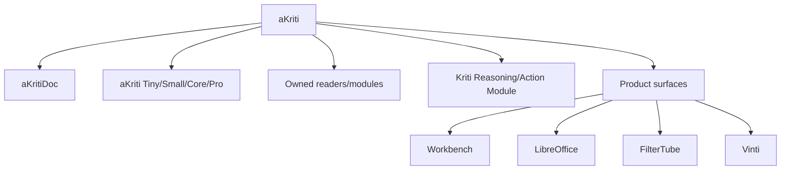

# aKriti Glossary and Naming Standard

**Status:** Draft operating spec  
**Date:** 2026-05-20  
**Purpose:** Keep terminology consistent across docs, code, UI, model cards, papers, and future provider-native code agent harness sessions.

## 1. Core principle

Names should communicate ownership, evidence, and scope precisely.

```text
clear name
  -> correct mental model
  -> safer implementation
  -> fewer roadmap pivots
```

## 2. Canonical product names

| Name | Meaning | Use |
|---|---|---|
| `aKriti` | core document intelligence platform/model family | product/platform/model-family umbrella |
| `aKritiDoc` | canonical structured document representation | schemas, APIs, evals, storage, UI |
| `Kriti` | reasoning/action/document-command module | action planning, edits, tool calls, workflow execution |
| `aKriti Workbench` | full document review and correction UI | upload/review/eval/debug/correction product surface |
| `Vinti` | long-term separate downstream court/legal project based on aKriti | later product/repo/surface, not core aKriti v1 |
| `FilterTube` | separate local semantic filtering product using aKriti Tiny/Small | thumbnail/title/keyframe local inference |

## 3. Canonical module names

Always use:

```text
aKriti Layout Reader
aKriti Text Reader
aKriti Table Reader
aKriti Chart Reader
aKriti Image Reader
aKriti Restoration Module
aKriti Translation Module
Kriti Reasoning/Action Module
aKriti Runtime
```

Avoid:
- “external-specialist mode”
- “Paddle mode”
- “OCR engine product”
- “the open-weight base-family candidate app”
- “the LibreOffice extension” as product identity

## 4. Model tier names

| Name | Meaning |
|---|---|
| `aKriti Tiny` | smallest routing/embedding/thumbnail/page-triage models |
| `aKriti Small` | local OCR assist, lightweight image/page understanding |
| `aKriti Core` | around 3B primary local document VLM/reasoning model target |
| `aKriti Pro` | 8B+ teacher/verifier/workstation/cloud model |
| `Kriti` | reasoning/action behavior layer, not necessarily a separate base model |

Do not use tier names to imply ownership before the model registry proves ownership/provenance.

## 5. Ownership wording

Correct:

```text
open-weight base adapted for aKriti
aKriti-owned schema and runtime
aKriti adapter
aKriti distilled student
aKriti-owned module
reference system
teacher system
baseline system
```

Incorrect unless literally true:

```text
fully our model
trained from scratch
our OCR engine
our VLM weights
state-of-the-art
guaranteed accurate
legal-grade by default
```

Rule:

```text
If base weights start from open weights, say so.
If a module is a wrapper/reference, say so.
If an output is derived, mark it derived.
```

## 6. OCR terminology

Use `OCR` carefully.

| Phrase | Meaning |
|---|---|
| OCR as task | reading text from pixels |
| OCR-first architecture | legacy bottom-up detect/crop/recognize product strategy |
| OCR/document reference system | external system used as baseline/teacher/verifier |
| aKriti Text Reader | owned aKriti module for text reading |

Correct:

```text
aKriti is VLM-first and includes text-reading/OCR capability.
```

Incorrect:

```text
aKriti is just OCR.
aKriti wraps external OCR specialist/external OCR/layout toolkit.
```

## 7. Evidence and artifact terms

| Term | Meaning |
|---|---|
| `source artifact` | original file/page/crop/text from user document |
| `derived artifact` | translation, summary, restored image, correction, caption, patch, export |
| `provenance` | trace to source file/page/bbox/cell/chart/module/model |
| `citation` | user-facing evidence reference |
| `review item` | low-confidence/high-risk item needing user/system review |
| `vote` | multi-pass candidate comparison for confusing regions |
| `abstention` | system refuses to answer/apply because evidence is insufficient |

Rule:
- source artifacts are evidence.
- derived artifacts are interpretations or transformations.
- generated captions are not source text.
- restored pages are not original pages.

## 8. Confidence terms

Use:
- `low confidence`
- `conflicting reads`
- `needs review`
- `unsupported claim`
- `direct support`
- `inferred support`
- `derived support`

Avoid:
- “probably correct” without citation.
- “AI thinks”.
- numeric confidence without reason.
- hiding low confidence behind polished prose.

## 9. Runtime terms

| Term | Meaning |
|---|---|
| `runtime backend` | GGUF, MLX, ONNX, LiteRT, Core ML, WebGPU, vLLM, TensorRT-LLM |
| `model package` | concrete packaged artifact for a runtime/platform |
| `runtime selector` | chooses backend/package based on hardware/privacy/task |
| `local-only` | no remote model call or upload |
| `remote fallback` | explicit user-approved remote processing |

Rule:
- never silently fall back to remote.
- UI must show local vs remote mode.

## 10. Product-surface wording

Workbench:

```text
document review cockpit
evidence overlays
verification queue
grounded chat/actions
```

LibreOffice:

```text
native integration
sidebar/canvas/action pane
preview patch
UNO/native edit
```

FilterTube:

```text
local semantic filtering
thumbnail/title scoring
tiny local model
user rule engine
```

Vinti:

```text
long-term separate downstream court/legal project
based on aKriti
court/legal document assistance
cited summaries
timeline/entity extraction
not legal advice
```

Vinti wording rule:

```text
Vinti is not the core aKriti product.
Vinti should not drive aKriti v1 architecture.
Vinti should consume aKriti APIs/model packages later.
```

## 11. Research status words

Use exactly:

```text
adopt now
prototype
watch
reject
```

Meanings:
- `adopt now`: directly supports locked implementation path.
- `prototype`: promising but needs fixed-budget experiment.
- `watch`: interesting but not actionable.
- `reject`: violates constraints or fails usefulness.

## 12. Claim wording

Prefer:

```text
candidate
baseline
early target
measured improvement
on this slice
under this hardware profile
```

Avoid:

```text
best
solved
guaranteed
universal
state-of-the-art
production-ready
```

Any claim stronger than “candidate” needs eval evidence.

## 13. File naming

Docs:

```text
docs/akriti-{topic}.md
```

Experiments:

```text
EXP-{AREA}-{NNN}
```

Hardware runs:

```text
HW-{DEVICE}-{NNN}
```

Model packages:

```text
akriti-{tier}-{role}-{base-or-owned}-{capability}-{version}
```

## 14. Banned ambiguity

Avoid these ambiguous phrases:
- “our OCR” when using external/open weights.
- “VLM can do everything” without module/eval boundaries.
- “reasoning model” without saying whether it means base weights, post-training behavior, or Kriti action layer.
- “local” when it requires a cloud GPU.
- “private” when remote calls are enabled.
- “accurate” without metric and dataset slice.

## 15. ASCII naming stack

```text
aKriti
  |
  +-- aKritiDoc
  +-- aKriti model tiers
  +-- aKriti owned modules
  +-- Kriti action layer
  +-- Workbench / LibreOffice / FilterTube / Vinti
```

## 16. Mermaid naming stack



## Research References

This doc is connected to the numbered research bibliography in `docs/akriti-research-reference-index.md`. Those references are engineering anchors for aKriti-owned implementation; they are not product dependencies. Only open weights may enter model lineage, and only with manifest provenance.
