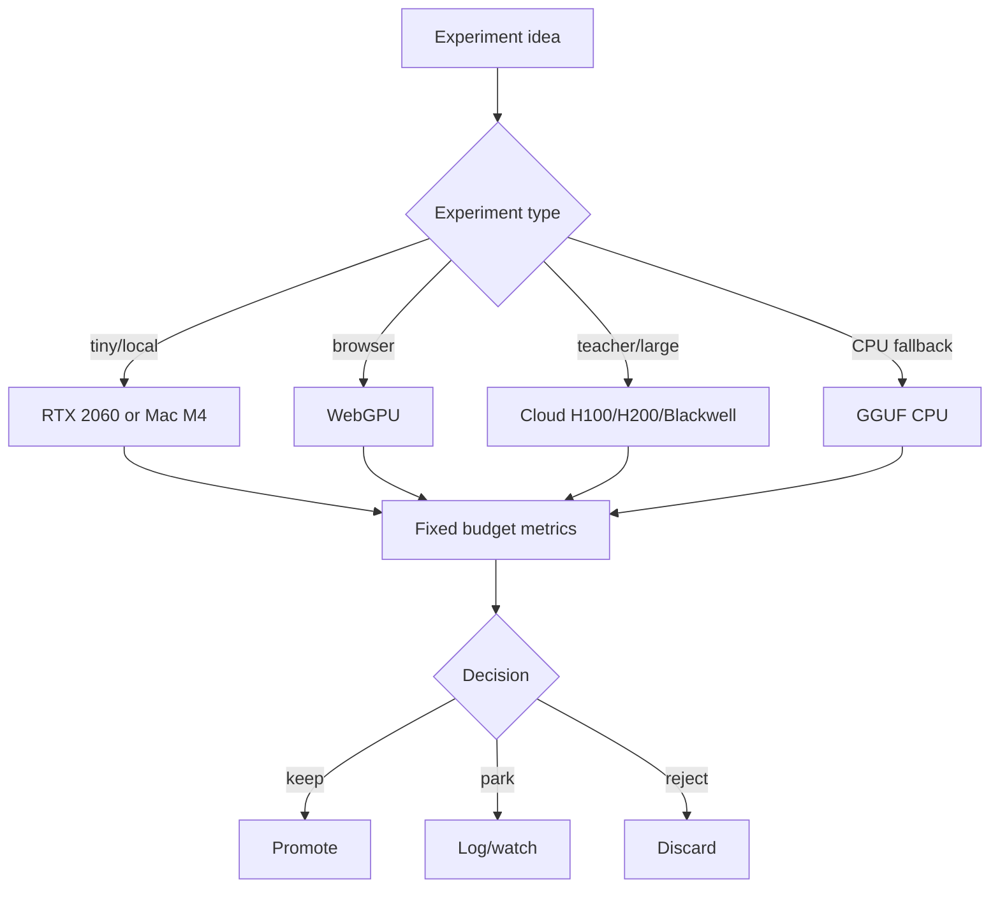

# aKriti Hardware Experiment Plan

**Status:** Draft implementation spec  
**Date:** 2026-05-20  
**Purpose:** Define what to run on RTX 2060 6GB, Mac M4 24GB, browser/WebGPU, and cloud GPUs without confusing training hardware with deployment targets.

## 1. Core principle

Training hardware and product deployment hardware are different questions.

```text
cloud GPUs
  train/teacher/distill/evaluate at scale

local devices
  prove user-facing offline/local features

browser/mobile
  prove tiny model usefulness and privacy-preserving UX
```

Do not force every experiment onto the RTX 2060. Use it where it gives real signal.

## 2. Device roles

| Device | Best role | Avoid |
|---|---|---|
| RTX 2060 6GB | tiny/small inference, QLoRA micro-tests, eval harness, quantized packages | serious 3B+ VLM training |
| Mac M4 24GB | MLX/Core ML/external research sourcel inference, local app UX, aKriti Small/Core package testing | CUDA-specific training assumptions |
| CPU-only desktop | GGUF fallback, deterministic extraction, low-compute user mode | heavy VLM workflows |
| browser/WebGPU | FilterTube thumbnails, tiny embeddings/classifiers | full 3B document parsing by default |
| H100/H200/Blackwell | teacher generation, serious fine-tuning, distillation, large eval sweeps | product-local assumptions |

## 3. RTX 2060 experiment lane

Useful experiments:
- GGUF/quantized local inference checks.
- aKriti Tiny training.
- page quality classifier.
- thumbnail semantic classifier.
- small OCR/layout ablations.
- restoration deterministic vs small learned baseline.
- LoRA/QLoRA smoke tests on very small bases.

Metrics:
- VRAM peak.
- latency.
- OOM rate.
- pages/sec or thumbnails/sec.
- quality delta against reference.

## 4. Mac M4 experiment lane

Useful experiments:
- MLX export and inference.
- GGUF external research sourcel package behavior.
- Workbench local UX.
- LibreOffice local service integration.
- Core/Small model memory pressure.
- battery/thermal practical behavior.

Metrics:
- model load time.
- memory pressure.
- tokens/sec.
- page parse latency.
- UI responsiveness.

## 5. Browser/WebGPU experiment lane

Useful experiments:
- aKriti Tiny image/text embedding.
- thumbnail classifier.
- title+thumbnail semantic scorer.
- local rule engine.
- tiny visual tagger.

Metrics:
- model package size.
- cold start.
- thumbnail latency.
- browser memory.
- false positive/negative filtering.
- user override rate.

## 6. Cloud GPU experiment lane

Useful experiments:
- teacher generation.
- distillation data creation.
- open-weight base-family candidate-family base/adaptor bake-off.
- 3B Core adapters.
- larger Pro verifier.
- big eval sweeps.
- quantization calibration runs.

Use:
- Accelerate for simple scaling.
- DeepSpeed/FSDP when memory requires it.
- vLLM/SGLang for high-throughput teacher/batch inference.
- TensorRT-LLM only when GPU research source production throughput matters.

## 7. Experiment budget classes

| Class | Hardware | Time | Use |
|---|---|---:|---|
| local micro | RTX/Mac/CPU | 5-15 min | sanity, schema, tiny eval |
| local small | RTX/Mac | 1-3 hr | tiny model, quantization, adapter smoke |
| cloud medium | H100/H200 | 6-24 hr | real adapters, teacher generation |
| cloud large | H100/H200/Blackwell | approved only | serious checkpoint/distillation |

## 8. Runtime package targets

| Package | Test hardware |
|---|---|
| GGUF Q4_K_M | CPU desktop, Mac M4, RTX fallback |
| GGUF Q5/Q6 | Mac M4 and quality reference |
| MLX | Mac M4 |
| ONNX | desktop and browser-adjacent prototypes |
| WebGPU | browser/FilterTube |
| LiteRT/Core ML | mobile later |
| vLLM | cloud/server teacher |
| TensorRT-LLM | GPU research source production/server only |

## 9. Hardware report template

```markdown
## HW-{YYYYMMDD}-{slug}

- Model/package:
- Hardware:
- Runtime:
- Quantization:
- Task:
- Input size:
- Latency:
- Throughput:
- RAM/VRAM:
- Quality delta:
- Failure/OOM:
- Decision:
```

## 10. First experiment queue

| ID | Hardware | Experiment |
|---|---|---|
| `HW-RTX-001` | RTX 2060 | run tiny thumbnail classifier baseline |
| `HW-RTX-002` | RTX 2060 | GGUF Q4/Q5 local inference smoke |
| `HW-MAC-001` | Mac M4 | MLX/GGUF local document prompt latency |
| `HW-WEB-001` | Browser/WebGPU | thumbnail embedding model load and latency |
| `HW-CLOUD-001` | H100/H200 | teacher batch generation throughput with vLLM |
| `HW-CLOUD-002` | H100/H200 | open-weight base-family candidate-family document adapter bake-off |

## 11. ASCII hardware routing

```text
experiment idea
    |
    v
classify: train / eval / runtime / UX
    |
    +--> tiny/local -> RTX or Mac
    +--> browser -> WebGPU
    +--> teacher/large -> cloud
    +--> CPU fallback -> GGUF CPU
    |
    v
fixed budget + metrics
    |
    v
keep / park / reject
```

## 12. Mermaid hardware routing




## Research References

This doc is connected to the numbered research bibliography in `docs/akriti-research-reference-index.md`. Those references are engineering anchors for aKriti-owned implementation; they are not product dependencies. Only open weights may enter model lineage, and only with manifest provenance.
