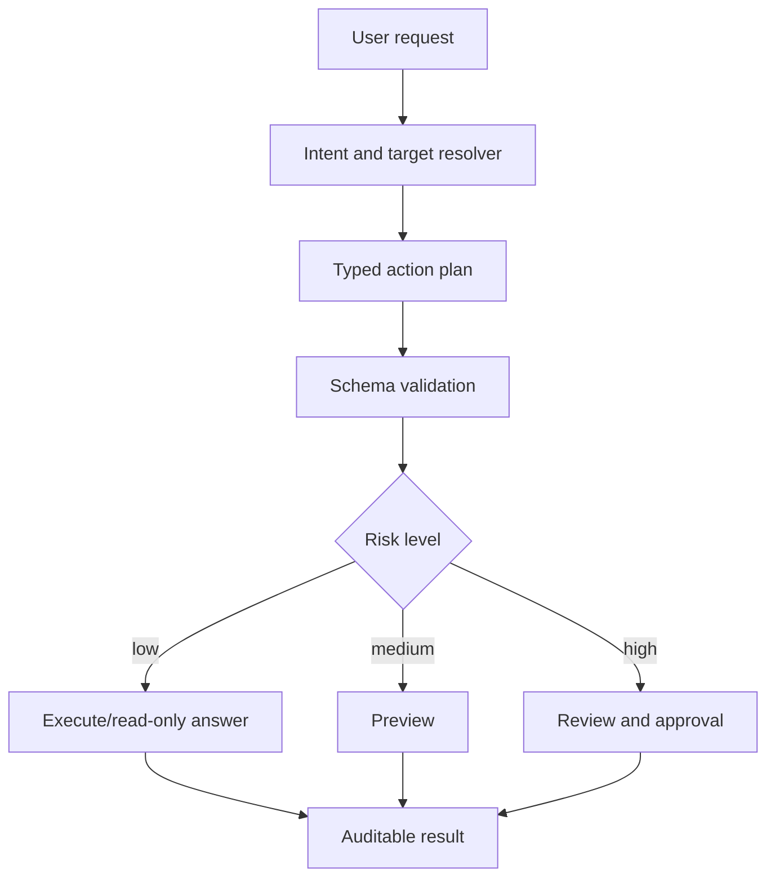

# Kriti Reasoning and Action Module

**Status:** Draft implementation spec  
**Date:** 2026-05-20  
**Purpose:** Define the reasoning/action layer that turns aKriti document understanding into safe, structured actions across Workbench, LibreOffice, FilterTube, and Vinti.

## 1. Core principle

Kriti is not just chat.

Kriti is the action layer:

```text
grounded understanding
        |
        v
typed plan
        |
        v
validated action/tool call
        |
        v
preview or execution
        |
        v
auditable result
```

Every high-impact action must be structured, validated, grounded, and reviewable.

## 2. What Kriti does

| Capability | Example |
|---|---|
| grounded QA | answer with page/block/cell/chart citations |
| document command planning | “translate this section and preserve layout” |
| edit patch generation | Writer paragraph rewrite, Calc cell update, Impress slide note |
| extraction orchestration | table/chart/image/text extraction |
| verification orchestration | re-read, vote, compare, ask for review |
| workflow automation | batch translate, export, compare, summarize |
| local tool calling | call aKriti modules and native app APIs |

## 3. What Kriti must not do

Kriti must not:
- silently apply destructive edits.
- invent evidence.
- use remote models without consent.
- treat vector matches as proof.
- overwrite source text with derived text.
- bypass `aKritiDoc`.

## 4. Action envelope

```json
{
  "action_id": "act_...",
  "kind": "ask | parse | verify | translate | rewrite | extract_table | extract_chart | restore | apply_edit | export",
  "target_refs": [],
  "inputs": {},
  "constraints": {
    "local_only": true,
    "requires_citations": true,
    "requires_preview": true,
    "max_risk": "medium"
  },
  "plan": [],
  "status": "draft | validated | previewed | executed | rejected",
  "provenance": {}
}
```

## 5. Plan step object

```json
{
  "step_id": "step_...",
  "tool": "akriti.parse | akriti.search | akriti.translate | akriti.verify | libreoffice.apply_patch",
  "arguments": {},
  "expected_output_schema": "akritidoc.v0 | edit_patch.v0 | citation_answer.v0",
  "requires_user_approval": false
}
```

## 6. Structured generation policy

Kriti should use constrained/validated generation for:
- action envelopes.
- edit patches.
- table/chart JSON.
- citation answers.
- review queue items.
- model/tool selection.

Allowed techniques:
- JSON schema constrained decoding.
- Pydantic-style validation.
- grammar/regex constraints for IDs, dates, and action enums.
- retry with validation errors.

Do not rely on prompt-only formatting for actions.

## 7. Risk levels

| Risk | Examples | Required handling |
|---|---|---|
| low | explain, summarize, classify, describe | citations preferred |
| medium | translate, rewrite, extract, export | preview required |
| high | apply edit, legal claim, financial value, court filing action | citations + review + approval |
| blocked | delete/overwrite without preview, remote upload without consent | refuse or ask permission |

## 8. Tool registry

Initial internal tools:

```text
akriti.parse
akriti.search_exact
akriti.search_semantic
akriti.extract_table
akriti.extract_chart
akriti.describe_image
akriti.restore
akriti.translate
akriti.rewrite
akriti.verify
akriti.vote
akriti.export
```

Host tools:

```text
libreoffice.get_selection
libreoffice.preview_patch
libreoffice.apply_patch
filtertube.score_thumbnail
workbench.enqueue_review
vinti.create_case_note
```

## 9. LibreOffice action example

```json
{
  "kind": "translate",
  "target_refs": [
    {
      "host": "libreoffice",
      "app": "writer",
      "selection_id": "sel_..."
    }
  ],
  "constraints": {
    "target_language": "en",
    "preserve_layout": true,
    "requires_preview": true,
    "local_only": true
  }
}
```

## 10. Answer format

Grounded answers should have:

```json
{
  "answer": "...",
  "citations": [],
  "confidence": {},
  "unsupported_claims": [],
  "used_restored_artifacts": false,
  "needs_review": false
}
```

## 11. Preference and alignment data

Kriti can be improved with preference data:
- chosen/rejected answers.
- safe/unsafe edit patches.
- accepted/rejected translations.
- correct/incorrect table reconstructions.
- review queue outcomes.

Use preference tuning only after:
- schema is stable.
- eval harness exists.
- safety rules are encoded.
- user consent is handled.

## 12. ASCII action flow

```text
user request
    |
    v
intent + target resolver
    |
    v
typed action plan
    |
    v
schema validation
    |
    v
tool execution / preview
    |
    v
result with citations
    |
    v
review or apply
```

## 13. Mermaid action flow




## Research References

This doc is connected to the numbered research bibliography in `docs/akriti-research-reference-index.md`. Those references are engineering anchors for aKriti-owned implementation; they are not product dependencies. Only open weights may enter model lineage, and only with manifest provenance.
