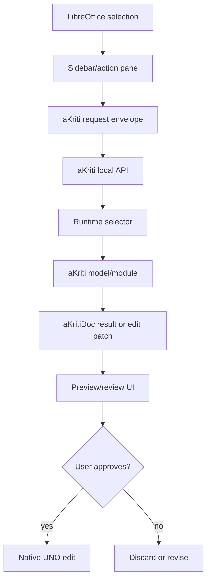

# aKriti LibreOffice Native Integration

**Status:** Draft implementation spec  
**Date:** 2026-05-20  
**Purpose:** Define how aKriti should integrate natively with LibreOffice while keeping model/runtime logic outside the office core where appropriate.

## 1. Integration principle

LibreOffice integration should be native at the document/UI boundary and decoupled at the model/runtime boundary.

```text
LibreOffice native document model
        |
        v
UNO/C++ sidebar and canvas integration
        |
        v
aKriti local API or library boundary
        |
        v
aKriti Runtime and models
```

## 2. Why not a thin extension-only product

aKriti should not be just a browser-like extension bolted onto LibreOffice.

Required native behaviors:
- understand current document structure.
- read user selection.
- map model output to native edit operations.
- preview edits before applying.
- preserve undo/redo.
- handle Writer/Calc/Impress separately.
- keep user documents local unless explicit remote mode is enabled.

## 3. LibreOffice surfaces

| Surface | Purpose |
|---|---|
| sidebar chat/action pane | ask, translate, rewrite, explain, verify |
| document canvas overlays | show OCR/layout/table/chart regions |
| selection action menu | act on highlighted text, table, image, chart, page |
| review panel | approve/reject generated edits |
| model manager dialog | choose local aKriti model package |
| privacy/status indicator | local/remote/runtime state |

## 4. Writer workflows

Core actions:
- explain selected text.
- translate selection while preserving style.
- rewrite paragraph.
- extract cited facts from document.
- summarize section.
- identify inconsistencies.
- convert scanned inserted image into editable text.
- preserve original and derived text distinction.

Edit flow:

```text
selection -> aKriti request -> derived patch -> preview -> user approval -> native edit -> undo-compatible operation
```

## 5. Calc workflows

Core actions:
- explain formula.
- generate chart from natural language.
- read chart and explain trend.
- extract table from PDF/image into sheet.
- clean messy imported table.
- translate headers/cells.
- detect anomalies.

Calc-specific requirement:
- generated edits must map to cells, ranges, sheets, formulas, and chart objects.

## 6. Impress workflows

Core actions:
- summarize deck.
- rewrite slide copy.
- translate deck while preserving layout.
- describe images/charts.
- generate speaker notes.
- verify data claims against embedded tables/charts.

Impress-specific requirement:
- preserve slide object positions and avoid destructive layout changes by default.

## 7. aKriti request envelope

```json
{
  "host": "libreoffice",
  "app": "writer | calc | impress",
  "document_id": "lo_doc_...",
  "selection": {},
  "operation": "ask | translate | rewrite | extract | verify | apply_edit",
  "content_refs": [],
  "privacy": {
    "local_only": true
  },
  "runtime_preferences": {
    "model_tier": "tiny | small | core | pro",
    "allow_remote": false
  }
}
```

## 8. Edit patch object

```json
{
  "patch_id": "patch_...",
  "target_app": "writer | calc | impress",
  "target_refs": [],
  "operations": [
    {
      "kind": "replace_text | insert_text | update_cell | insert_table | create_chart | add_comment",
      "target": {},
      "value": {},
      "style_policy": "preserve | adapt | explicit",
      "requires_review": true
    }
  ],
  "provenance": {},
  "risk": "low | medium | high"
}
```

## 9. Safety rules

- never apply high-impact edits without preview.
- preserve undo/redo.
- mark derived text and generated translations where needed.
- keep original evidence available.
- for legal/court documents, default to comments/suggestions instead of direct destructive edits.

## 10. Runtime boundary

LibreOffice should not need to know whether a request was served by:
- GGUF.
- MLX.
- ONNX.
- LiteRT.
- remote Pro model.

LibreOffice should know:
- local or remote.
- model tier.
- operation status.
- citations/provenance.
- patch preview.

## 11. ASCII flow

```text
LibreOffice selection
        |
        v
sidebar action
        |
        v
aKriti request envelope
        |
        v
aKriti API/runtime
        |
        v
aKritiDoc / derived patch
        |
        v
preview and approval
        |
        v
native UNO edit
```

## 12. Mermaid flow




## Research References

This doc is connected to the numbered research bibliography in `docs/akriti-research-reference-index.md`. Those references are engineering anchors for aKriti-owned implementation; they are not product dependencies. Only open weights may enter model lineage, and only with manifest provenance.

## LibreOffice Schema Extraction and Formula Workflows

Reference anchors: [26], [27].

LibreOffice integration should expose `aKritiExtract` and `aKritiMath` as native document workflows.

Writer actions:

- Generate an extraction schema from a natural-language request.
- Extract named entities, dates, citations, clauses, signatures, stamps, and formulas from selection or document.
- Convert scanned equations into editable LibreOffice formula objects.
- Insert LaTeX/MathML as formula objects with preview.
- Export extracted fields to JSON, comments, Writer fields, or a summary table.

Calc actions:

- Extract tables from PDF/image into cells.
- Extract formulas from screenshots/scans into Calc-compatible or LibreOffice Math-compatible representations.
- Generate formulas from natural language with preview before insertion.
- Compare chart data against extracted table/formula values.

Impress actions:

- Extract formulas, figure captions, chart series, and slide metadata.
- Convert rendered equations into editable formula objects where possible.
- Generate alt text and math-aware speaker notes.

Safety rule:

```text
Formula edits, legal/financial fields, citations, and normalized values require preview and evidence. Low-confidence symbols or fields must be shown to the user before insertion.
```

## Shruti voice and audio workflows

Reference anchor: [40].

Shruti is the audio companion lane for LibreOffice. It should integrate through the same aKriti request envelope and preview/apply rules.

Writer voice workflows:

- dictate text into the current cursor position.
- transcribe an audio note into a comment.
- read selected text, page, or section aloud.
- voice command: "translate this paragraph to English".
- voice command: "summarize this section".
- voice command: "rewrite this paragraph formally".

Calc voice workflows:

- read selected cells aloud.
- voice command: "explain this formula".
- voice command: "extract this table into the sheet".
- voice command: "generate a chart from this range".

Impress voice workflows:

- generate speaker notes from selected slide.
- read slide notes aloud.
- voice command: "summarize this deck".
- voice command: "translate this slide".

Safety rules:

- Voice commands create preview-first action requests.
- Destructive edits require explicit confirmation.
- Transcripts are derived artifacts and must show confidence for low-quality audio.
- Read-aloud should preserve citations/page references when requested.
- Legal/financial/court documents default to comments/suggestions, not direct edits.

Architecture:

```text
Shruti audio artifact
    -> aKriti request envelope
    -> aKritiDoc/action patch
    -> LibreOffice preview/review
    -> native UNO operation or read-aloud output
```
