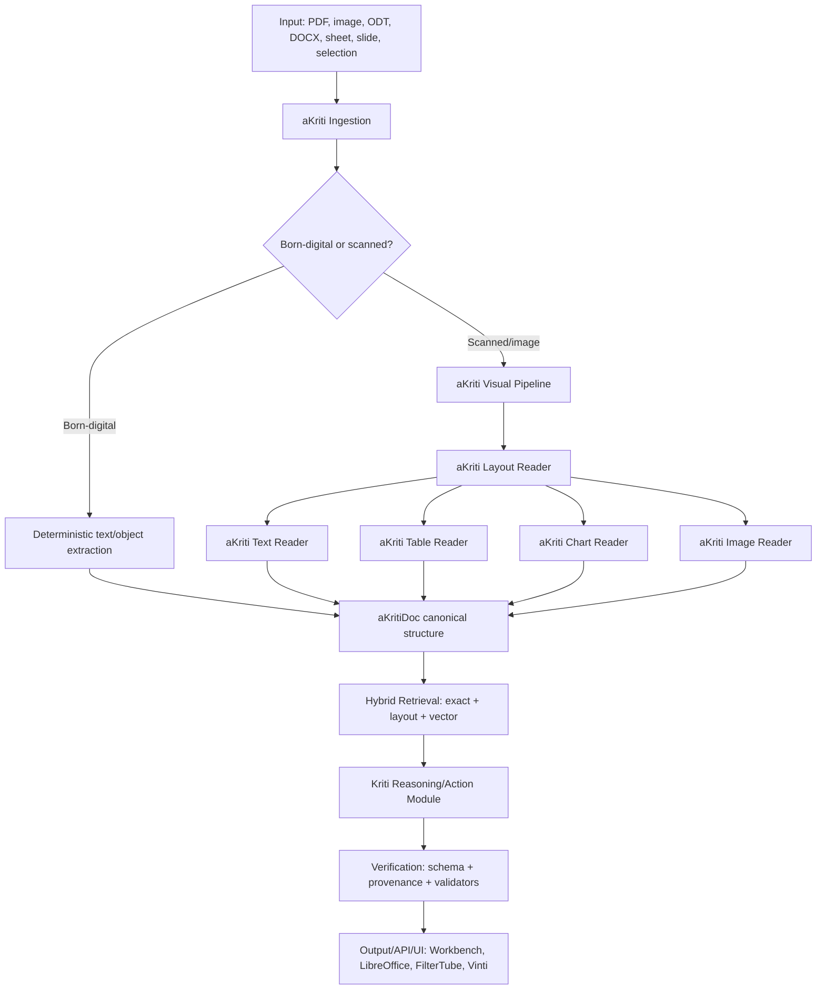
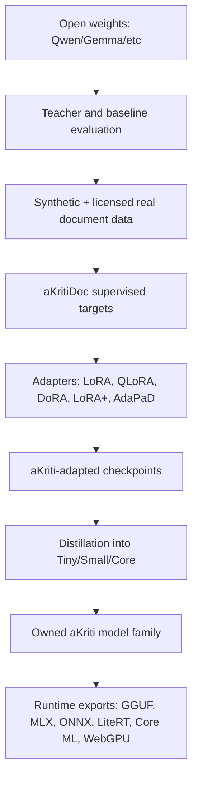

# aKriti Master Architecture

**Status:** Locked planning spec  
**Date:** 2026-05-19  
**Primary sources:** `LOCAL_DOCS/codex_chat1.md`, `LOCAL_DOCS/codex_chat2(main).md`, `LOCAL_DOCS/AKRITI_CONTEXT_HANDOFF_v1.0.md`, `LOCAL_DOCS/agent-research-brief-march-2026.md`, `LOCAL_DOCS/deep-research-report*.md`, `LOCAL_DOCS/research-credits.md`, `LOCAL_DOCS/vlmrun-orion-whitepaper-latest.pdf`

## 1. North star

aKriti is a local-first, multilingual document intelligence model family and API platform.

It must power:
- everyday document work
- LibreOffice-native document intelligence
- PDF/image/table/chart extraction
- translation and rewriting with formatting preservation
- local/offline analysis on low-compute devices
- FilterTube semantic filtering and thumbnail/keyframe understanding
- Vinti/court-document workflows later

The product is not a wrapper around external OCR/VLM systems. External projects are used only as research references, open-weight starting points, teacher/baseline candidates during R&D, or benchmark opponents.

## 2. Ownership boundary

### Allowed

```text
open weights
open papers
open-source training code
public datasets with compatible licenses
architecture ideas from public projects
temporary local bake-offs during R&D
```

### Not allowed as final product dependencies

```text
requiring GLM-OCR / DeepSeek-OCR / HunyuanOCR / PaddleOCR as product engines
requiring third-party cloud OCR/VLM APIs
shipping aKriti as a wrapper around another document parser
outsourcing OCR/layout/chart/translation/reasoning identity to another product
```

### Final ownership target

```text
our schema
our datasets
our synthetic generators
our training/evaluation harness
our adapters/checkpoints
our modules
our runtime abstraction
our APIs
our LibreOffice integration
our UI/UX
```

## 3. Product surfaces

```text
                   +-------------------------+
                   |      aKriti Core        |
                   | model family + API      |
                   +-----------+-------------+
                               |
        +----------------------+----------------------+
        |                      |                      |
+-------v--------+    +--------v---------+    +-------v--------+
| aKriti         |    | LibreOffice      |    | FilterTube     |
| Workbench      |    | native sidebar   |    | semantic local |
| web/desktop UI |    | and canvas       |    | filtering      |
+-------+--------+    +--------+---------+    +-------+--------+
        |                      |                      |
        +----------------------+----------------------+
                               |
                       +-------v--------+
                       | Vinti / court  |
                       | document apps  |
                       +----------------+
```

## 4. Capability map

```text
Input types
  PDF, scanned PDF, image, screenshot, ODT, DOCX, sheet, slide, chart, table, video thumbnail/keyframe

Perception capabilities
  OCR/text reading
  layout detection
  reading order
  table structure
  chart/plot understanding
  image/figure understanding
  stamps/signatures/marginalia detection
  handwriting/mixed-script uncertainty detection

Transformation capabilities
  translate
  rewrite
  summarize
  explain
  extract
  convert file formats
  recreate table/chart
  generate structured JSON/Markdown/HTML/ODT/DOCX views

Verification capabilities
  schema validation
  exact-search/provenance grounding
  confidence calibration
  multi-pass reread
  restoration-vs-original comparison
  user review queue

Action capabilities
  apply Writer edits
  update Calc ranges
  recreate charts
  add comments
  export artifacts
  power browser/mobile/desktop features
```

## 5. System-level architecture



## 6. Owned module architecture

```text
aKriti Layout Reader
  Page geometry, block detection, reading order, bboxes, region hierarchy.

aKriti Text Reader
  OCR/VLM text reading, mixed-script handling, line/span confidence, exact text provenance.

aKriti Table Reader
  Cell graph, merged cells, headers, row/column reconstruction, export to Calc/CSV/HTML.

aKriti Chart Reader
  Chart type, axes, legends, data extraction, trend explanation, chart recreation.

aKriti Image Reader
  Figures, diagrams, screenshots, captions, alt-text, visual QA.

aKriti Restoration Module
  Non-destructive deblur/denoise/dewarp/super-resolution/character restoration.

aKriti Translation Module
  Structure-preserving multilingual translation and transliteration where requested.

Kriti Reasoning/Action Module
  Tool/action planning, constrained JSON calls, document edits, user-facing explanation.

aKriti Runtime
  Backend abstraction over GGUF, MLX, ONNX, LiteRT, Core ML, WebGPU/WASM, CUDA/TensorRT.
```

## 7. aKritiDoc canonical representation

aKritiDoc is the non-negotiable product primitive. Every parser, model, UI, and export writes through it.

Minimum top-level fields:
- `akriti_doc_version`
- `document_id`
- `source_artifacts`
- `pages`
- `blocks`
- `tables`
- `charts`
- `images`
- `entities`
- `translations`
- `transforms`
- `provenance`
- `quality`
- `history`
- `engine_trace`
- `exports`

Coordinate policy:
- store page dimensions
- store transform metadata
- store normalized bbox coordinates
- preserve source artifact hashes
- never overwrite original evidence

## 8. Model family

```text
aKriti Tiny
  50-300 MB
  routing, embeddings, thumbnails, page triage, FilterTube semantic filtering

aKriti Small
  300 MB-1.5 GB
  local OCR assist, image/page understanding, simple document Q&A

aKriti Core
  target around 3B active/main model
  primary local document VLM/reasoning model

aKriti Pro
  8B+ or MoE/cloud/workstation teacher/verifier model

Kriti
  reasoning/action layer for document commands, tool calls, editing, planning
```

Qwen3.6 is the current strong open-weight candidate family. Qwen3.7 is the only pending near-term model event to watch before locking the first serious base/teacher. The architecture must not depend on Qwen; Qwen weights are raw material if they remain best.

## 9. Training and ownership flow



## 10. Runtime architecture

```text
AkritiRuntime
  Python research backend
  C++ native/LibreOffice bridge
  GGUF/llama.cpp CPU/NVIDIA backend
  MLX Apple Silicon backend
  ONNX Runtime cross-platform backend
  LiteRT Android/iOS/edge backend
  Core ML Apple-native backend
  WebGPU/WASM browser backend
  CUDA/TensorRT cloud/workstation backend
```

Runtime rule:

```text
choose the cheapest local capability that satisfies correctness;
escalate only when confidence/provenance/validator gates require it.
```

## 11. LibreOffice target architecture

```text
LibreOffice Writer/Calc/Impress
    |
    | selected text/table/chart/image/page/document
    v
Native aKriti sidebar/canvas
    |
    | local action request
    v
aKriti local service / embedded runtime
    |
    | constrained action JSON + provenance + preview
    v
LibreOffice native edit application
```

LibreOffice operations:
- explain selected text
- translate selection while preserving formatting
- rewrite selected text
- parse scanned/PDF content into editable structure
- extract/recreate tables
- read/explain/recreate charts
- describe images for accessibility
- generate comments/provenance notes
- apply edits only after preview/approval

## 12. FilterTube target architecture

```text
YouTube title/channel/description
    -> exact rules
    -> tiny text classifier / embeddings
    -> thumbnail vision classifier
    -> tiny VLM only if ambiguous
    -> cache by video ID + thumbnail hash
    -> allow / hide / blur / warn / explain
```

Browser target:
- TypeScript
- WebGPU/WASM
- ONNX Runtime Web or equivalent
- small local models only

## 13. Vinti/court-document target

Vinti is downstream. It uses aKriti, but it is not the core aKriti repo/product.

Court-specific capabilities:
- chronology extraction
- parties/entities extraction
- dates/deadlines extraction
- exhibit/evidence mapping
- procedural stage classification
- missing document detection
- exact citation grounding
- multilingual translation

Boundary:

```text
AI assists structure.
AI does not judge.
AI does not decide verdicts.
```

## 14. Restoration and diffusion policy

Diffusion is allowed for restoration only.

Allowed:
- deblur
- denoise
- dewarp
- super-resolution
- character restoration
- background cleanup
- scan enhancement

Not allowed as core:
- primary factual OCR
- legal text generation
- final evidence replacement
- unverified restored text

Policy:

```text
original artifact is immutable evidence
restored artifact is derived evidence
reading original and restored must be comparable
disagreement triggers low-confidence/review
```

## 15. Retrieval policy

aKriti is structured-document-first and exact-search-first.

Retrieval order:
1. exact search over text/spans/entities
2. layout/page/block/table/chart search
3. metadata filters
4. vector semantic search
5. long-context reasoning only when needed

This avoids vector-RAG-only failure on names, dates, statutes, amounts, citations, and table cells.

## 16. Verification policy

Use evidence generators and deterministic validators, not blind trust.

```text
model proposes
validators check
provenance is shown
user approves high-impact edits
logs become training data
```

Evidence generators are internal aKriti passes/modules in final product. External OCR/VLM projects may be used only during R&D for comparison or teacher data.

## 17. Final architecture lock

```text
aKriti is a local-first, owned, multilingual document intelligence substrate.
It starts from open weights only if useful.
It owns every product-critical module.
It exposes stable APIs so any UI/software can plug into it.
```
