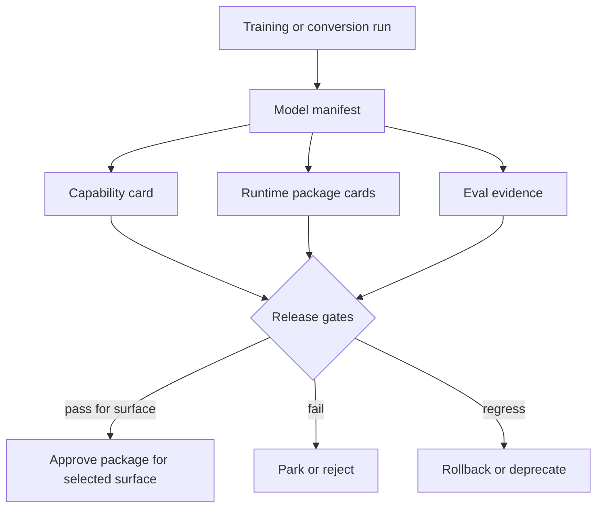

# aKriti Model Package Manifests

**Status:** Draft implementation-control spec, created 2026-05-20  
**Purpose:** Define the manifest, capability card, runtime package card, and release evidence required before any aKriti model package is considered usable by Workbench, LibreOffice, FilterTube, or downstream projects.

This document expands the package section in `docs/akriti-model-registry-release-gates.md` and connects it to:

- `docs/akriti-training-and-distillation-plan.md`
- `docs/akriti-runtime-deployment-matrix.md`
- `docs/akriti-evaluation-harness.md`
- `docs/akriti-fixture-corpus-and-experiment-cards.md`

## 1. Package principle

A checkpoint is not a product. A package is a checkpoint plus provenance, runtime conversion, eval evidence, capability limits, and rollback metadata.

```text
checkpoint / adapter / student
        |
        v
model registry entry
        |
        v
runtime package variants
        |
        v
capability card + eval evidence
        |
        v
release gate decision
```

No aKriti UI should depend on a model artifact that lacks a manifest.

## 2. Ownership language

Use precise wording.

| Situation | Allowed wording | Forbidden wording |
|---|---|---|
| Open-weight base with aKriti adapter | `open-derived aKriti adapter package` | `fully owned model` |
| Distilled student from open/base teachers | `aKriti distilled student with mixed lineage` | `trained from scratch` |
| Fully trained owned module with owned/verified data | `aKriti-owned module checkpoint` | `open model wrapper` |
| External OCR/VLM systems | `engineering reference only` | `training-label provider`, `external mentor`, `verification provider`, `runtime dependency` |

Locked rule:

```text
The aKriti system, schemas, APIs, runtime packaging, evals, product UX, and owned modules are ours.
Base-weight provenance must still be stated honestly.
```

## 3. Model manifest schema

```json
{
  "schema_version": "akriti.model_manifest.v0",
  "model_id": "akriti-core-doc-qwen36-lora-akritidoc-v0",
  "display_name": "aKriti Core Document VLM v0",
  "tier": "tiny | small | core | pro | kriti",
  "status": "experimental | candidate | preview | default-local | restricted | deprecated",
  "roles": ["parser", "verifier", "embedding", "restoration", "translation", "action", "teacher"],
  "lineage": {
    "weights_origin": "open | owned | mixed",
    "base_models": [
      {
        "name": "...",
        "version": "...",
        "license": "...",
        "source_url": "...",
        "sha256": "...",
        "use": "initialization | teacher | baseline | distillation_source"
      }
    ],
    "owned_components": ["adapter", "runtime_package", "evals", "aKritiDoc heads"],
    "external_runtime_dependencies": []
  },
  "training": {
    "method": "none | lora | qlora | dora | distillation | full | hybrid",
    "datasets": ["akriti-golden-25", "akriti-scan-30"],
    "run_ids": [],
    "internal_mentor_sources": [],
    "hardware": "RTX 2060 | Mac M4 | H100 | H200 | Blackwell | mixed",
    "budget": {
      "tokens": null,
      "steps": null,
      "wall_clock_hours": null
    }
  },
  "capabilities": {
    "document_parse": false,
    "ocr_text": false,
    "layout": false,
    "tables": false,
    "charts": false,
    "image_caption": false,
    "translation": false,
    "retrieval_qa": false,
    "edit_actions": false,
    "restoration": false,
    "thumbnail_filtering": false
  },
  "languages_scripts": {
    "supported": [],
    "experimental": [],
    "not_supported": []
  },
  "limits": {
    "max_pages_sync": 0,
    "max_pages_async": 0,
    "max_context_tokens": 0,
    "max_image_resolution": "",
    "requires_gpu": false,
    "supports_batching": false
  },
  "confidence_policy": {
    "reports_confidence": true,
    "supports_voting": false,
    "low_confidence_threshold": 0.65,
    "abstention_supported": true,
    "review_queue_supported": true
  },
  "eval_evidence": {
    "fixture_bundles": [],
    "reports": [],
    "promotion_gates_passed": [],
    "known_regressions": [],
    "known_failure_modes": []
  },
  "runtime_packages": [],
  "release": {
    "created_at": "2026-05-20T00:00:00Z",
    "created_by": "...",
    "default_for": [],
    "blocked_for": [],
    "rollback_to": null
  }
}
```

## 4. Runtime package manifest schema

Each runtime package belongs to one model manifest.

```json
{
  "schema_version": "akriti.runtime_package.v0",
  "package_id": "akriti-core-doc-qwen36-lora-akritidoc-v0-gguf-q4_k_m-macos",
  "model_id": "akriti-core-doc-qwen36-lora-akritidoc-v0",
  "runtime": "gguf | mlx | onnx | litert | coreml | webgpu | cuda | tensorrt | vllm | sglang",
  "format": "gguf | safetensors | mlpackage | onnx | tflite | wasm_bundle | engine",
  "quantization": "fp16 | bf16 | q8 | q6_k | q5_k_m | q4_k_m | q3_k_m | int8 | int4 | nf4 | awq | gptq | hqq",
  "platforms": ["macos", "linux", "windows", "browser", "android", "ios"],
  "files": [
    {
      "path": "models/...",
      "sha256": "...",
      "size_bytes": 0,
      "required": true
    }
  ],
  "runtime_requirements": {
    "min_ram_gb": 0,
    "min_vram_gb": 0,
    "recommended_ram_gb": 0,
    "recommended_vram_gb": 0,
    "cpu_features": [],
    "gpu_features": [],
    "browser_requirements": []
  },
  "measured_performance": {
    "device_profile": "mac-m4-24gb | rtx-2060-6gb | cpu-8gb | browser-webgpu | cloud-h100",
    "cold_start_ms": null,
    "first_token_ms": null,
    "tokens_per_sec": null,
    "pages_per_minute": null,
    "thumbnail_latency_ms": null,
    "peak_ram_mb": null,
    "peak_vram_mb": null
  },
  "quality_delta_vs_reference": {
    "reference_package_id": null,
    "ocr_delta": null,
    "layout_delta": null,
    "table_delta": null,
    "chart_delta": null,
    "translation_delta": null,
    "hallucination_delta": null
  },
  "approved_surfaces": ["workbench", "libreoffice", "filtertube", "server", "research"],
  "blocked_surfaces": [],
  "notes": []
}
```

## 5. Capability card format

Every model should also have a human-readable card.

```markdown
# Capability Card: {model_id}

## What it is
- Tier:
- Role:
- Weight lineage:
- Intended surfaces:

## What it can do
- ...

## What it cannot do
- ...

## Supported languages/scripts
- Stable:
- Experimental:
- Not supported:

## Evidence
- Fixture bundles:
- Eval reports:
- Runtime package reports:
- Known regressions:

## Confidence and review behavior
- Confidence score:
- Voting:
- Abstention:
- Low-confidence UI:

## Local hardware guidance
- Minimum:
- Recommended:
- Known failure/OOM modes:

## Safety status
- High-stakes/legal safe: yes | no | restricted
- Destructive edits allowed: never without preview and user approval
- Cloud required: yes | no | optional with consent
```

## 6. Tier-specific package expectations

### aKriti Tiny

Role:

```text
routing, embeddings, thumbnail/page triage, lightweight classifiers, ambiguity detection
```

Required package variants:

| Runtime | Priority | Reason |
|---|---:|---|
| WebGPU/WASM | high | FilterTube and browser-local use |
| ONNX Runtime | high | cross-platform desktop embedding/classifier path |
| GGUF or small native runtime | medium | CPU fallback |
| LiteRT/Core ML | medium | future mobile path |

Required capabilities before preview:
- thumbnail/title semantic filtering.
- page triage: text-heavy, table-heavy, chart-heavy, image-heavy, degraded scan.
- confidence score for ambiguous routing.

Required eval evidence:
- `akriti-filtertube-500`.
- page triage subset from `akriti-golden-25` and `akriti-scan-30`.
- browser latency and package-size report.

### aKriti Small

Role:

```text
local OCR assist, simple page understanding, image/figure description, lightweight translation assist
```

Required package variants:

| Runtime | Priority | Reason |
|---|---:|---|
| GGUF Q4/Q5 | high | broad local desktop use |
| MLX | high | Mac M-series path |
| ONNX | medium | integration and cross-platform experiments |
| LiteRT/Core ML | medium | mobile/edge exploration |

Required capabilities before preview:
- page crop OCR assist.
- local page summary with citations.
- basic image/figure caption with source region.
- low-confidence review routing.

Required eval evidence:
- `akriti-scan-30`.
- `akriti-vlm-grounded-50` subset.
- runtime card for Mac M4 and CPU/RTX where feasible.

### aKriti Core

Role:

```text
around-3B primary local document VLM/reasoning model for everyday document intelligence
```

Required package variants:

| Runtime | Priority | Reason |
|---|---:|---|
| GGUF Q4_K_M/Q5_K_M/Q8 | high | default local packaging and quality ladder |
| MLX | high | Mac M-series primary development path |
| ONNX | medium | service/integration portability |
| CUDA/vLLM/SGLang | medium | workstation/cloud research and teacher batching |

Required capabilities before preview:
- parse document regions into `aKritiDoc` slices.
- grounded QA with citations.
- extract and reason over tables/charts at basic level.
- layout-preserving translation blocks.
- safe edit proposal generation, not direct edits.

Required eval evidence:
- `akriti-golden-25`.
- `akriti-vlm-grounded-50`.
- `akriti-tablechart-45`.
- `akriti-indic-50`.
- EXP-009 confidence review cases.
- at least one local runtime package report.

### aKriti Pro

Role:

```text
teacher, verifier, workstation/cloud model, data generator, stronger judge for difficult documents
```

Required package variants:

| Runtime | Priority | Reason |
|---|---:|---|
| vLLM/SGLang | high | batch internal mentor generation and eval sweeps |
| CUDA/TensorRT-LLM | medium | GPU research source optimization lane |
| MLX/GGUF | low | only if package is practically usable |

Required capabilities before preview:
- high-quality internal mentor generation for `aKritiDoc` labels.
- verifier/judge behavior for OCR/layout/table/chart/translation candidates.
- abstention and unsupported-claim detection.

Required eval evidence:
- teacher output verification reports.
- disagreement analysis against deterministic baselines and human corrections.
- cost/time per page for internal mentor generation.

### Kriti reasoning/action layer

Role:

```text
typed document-command layer over aKriti models and APIs
```

Required package variants:

| Runtime | Priority | Reason |
|---|---:|---|
| local structured generation runtime | high | offline actions in LibreOffice/Workbench |
| server/workstation runtime | medium | stronger planning for complex docs |

Required capabilities before preview:
- constrained action envelopes.
- tool/action JSON validity.
- previewable edit patches.
- safe refusal/abstention for risky actions.

Required eval evidence:
- `akriti-libreoffice-actions-40`.
- destructive-edit prevention tests.
- schema-valid action generation rate.

## 7. Surface approval matrix

A model package can be approved for one surface and blocked for another.

| Surface | Required evidence |
|---|---|
| Workbench | visual overlays, source evidence, low-confidence review behavior |
| LibreOffice | selection fidelity, patch preview/apply/rollback, local runtime stability |
| FilterTube | browser latency, package size, false-block safety, user-rule override |
| Server/cloud teacher | batch throughput, cost per page, verified teacher quality |
| Vinti downstream later | exact citations, legal safety mode, abstention, audit trail; not required for aKriti v1 |

## 8. Quantization release ladder

Quantized packages must be compared against a reference package.

```text
reference fp16/bf16 or Q8
    |
    v
Q6_K / high-quality local
    |
    v
Q5_K_M / everyday quality package
    |
    v
Q4_K_M / default consumer package
    |
    v
Q3_K_M / low-memory fallback
```

Rules:
- Do not make the fastest package the default unless quality gates pass.
- Calibration data must use aKriti document fixtures, not generic chat logs.
- Any quantization that increases hallucination or loses citations is blocked for document QA.
- Low-memory packages must show the user their limitations.

## 9. Manifest validation rules

A manifest is invalid if:

| Missing/invalid field | Why it fails |
|---|---|
| unknown base license | cannot ship responsibly |
| missing `weights_origin` | ownership claim is ambiguous |
| no fixture/eval evidence | capability claim is unsupported |
| no runtime package card | UI cannot choose safe local backend |
| no failure modes | users cannot understand limits |
| no confidence policy | uncertainty can be hidden |
| no rollback target | default package cannot be safely reverted |
| external OCR/VLM listed as runtime dependency | violates ownership boundary |

## 10. Release gate checklist

Before `preview`:

```text
[ ] manifest validates
[ ] capability card exists
[ ] at least one runtime package exists
[ ] at least one fixture bundle report exists
[ ] low-confidence behavior is documented
[ ] known failure modes are documented
[ ] package is not used for Vinti/legal claims unless explicitly gated
```

Before `default-local`:

```text
[ ] held-out eval report passes
[ ] runtime report passes for target device tier
[ ] regression report passes for unrelated document tasks
[ ] package can be rolled back
[ ] UI surfaces show confidence/evidence
[ ] no hidden cloud dependency
[ ] no external OCR/VLM runtime dependency
```

## 11. ASCII package flow

```text
training run / conversion run
          |
          v
     model manifest
          |
   +------+------+
   |             |
   v             v
capability    runtime
  card        package cards
   |             |
   +------+------+
          |
          v
  eval + release gates
          |
          v
surface approval: Workbench / LibreOffice / FilterTube / server / downstream later
```

## 12. Mermaid package flow



## 13. First implementation artifacts

When implementation starts, create these files before model downloads:

```text
registry/models/.gitkeep
registry/packages/.gitkeep
registry/capability-cards/.gitkeep
registry/eval-links/.gitkeep
schemas/model-manifest.schema.json
schemas/runtime-package.schema.json
schemas/capability-card.schema.json
```

Then add placeholder manifests for:

```text
akriti-tiny-router-owned-thumb-v0
akriti-small-text-open-derived-indic-v0
akriti-core-doc-open-derived-akritidoc-v0
akriti-pro-teacher-open-derived-doc-v0
kriti-action-owned-lo-v0
```

These are placeholders until evidence exists. Their status must remain `experimental`.

## External Artifact Boundary

Every model package must prove that aKriti owns the implementation path. External OCR/VLM/PDF/layout/video/reasoning systems may be cited as engineering references, but they must not appear as training-label providers, verification providers, runtime dependencies, or external mentors. The only external model artifact permitted in a model package is open weights with explicit manifest provenance.

Detailed named research notes are kept outside the project repo.

## Research References

This doc is connected to the numbered research bibliography in `docs/akriti-research-reference-index.md`. Those references are engineering anchors for aKriti-owned implementation; they are not product dependencies. Only open weights may enter model lineage, and only with manifest provenance.

## Language support and input-modality manifest extensions

Reference anchors: [35], [36].

Every model/capability package must declare language support by level, not as a vague global claim.

```json
{
  "languages_scripts": {
    "Hindi_Devanagari": {
      "L0_script_detection": "supported",
      "L1_ocr_text_reading": "candidate",
      "L2_layout_reading_order": "candidate",
      "L3_entity_terminology_preservation": "experimental",
      "L4_translation_transliteration": "experimental",
      "L5_structured_extraction_reasoning": "experimental",
      "L6_vinti_grade": "not_supported",
      "eval_report_refs": []
    }
  },
  "input_modalities": {
    "text_prompt": true,
    "image_page": true,
    "file_document": true,
    "region_selection": true,
    "structured_schema": true,
    "voice_audio": false
  },
  "runtime_precision_reports": [],
  "known_language_failure_modes": []
}
```

Rules:

- `supported` requires held-out eval evidence.
- `vinti_supported` requires legal/court fixtures, grounding, human-review behavior, and triage stability.
- voice/audio should remain false unless a separate Shruti package provides ASR/TTS/voice-command artifacts with its own evals.
- a package can be approved for general Workbench use while blocked for Vinti.

## Harness and feedback release metadata

Reference anchor: [37].

Model packages alone are not enough for Vinti/aKriti behavior. A release must also record the harness that wrapped the model.

```json
{
  "release_bundle": {
    "model_version": "akriti-vinti-0.1.0",
    "schema_version": "akritiDoc-0.2",
    "harness_version": "vinti-harness-0.1.3",
    "analyzer_versions": {
      "case_type": "0.1.0",
      "readiness": "0.1.3",
      "complexity": "0.1.2",
      "language_ambiguity": "0.1.1",
      "audit": "0.1.0"
    },
    "eval_report_refs": [],
    "feedback_dataset_refs": [],
    "rollback_target": "vinti-harness-0.1.2"
  }
}
```

Rules:

- Harness-only releases need eval reports.
- Adapter releases need eval reports and model manifests.
- Feedback datasets require consent/privacy eligibility records.
- Vinti ledger events must be able to reconstruct which release bundle produced a routing state.

## Tokenizer, active-parameter, and orchestrator metadata

Reference anchor: [38].

Model manifests must record tokenizer and runtime behavior because document intelligence quality depends on sequence length, script handling, and local runtime stability.

```json
{
  "tokenizer_report": {
    "vocab_size": 0,
    "tokenizer_family": "bpe | unigram | sentencepiece | byte_fallback | unknown",
    "chars_per_token": {
      "en": 0.0,
      "hi_Devanagari": 0.0,
      "hinglish_Latin": 0.0
    },
    "tokens_per_page": {},
    "tokens_per_case_bundle": {},
    "indic_glyph_cases_report_ref": ""
  },
  "architecture_efficiency": {
    "total_parameters": null,
    "active_parameters_per_token": null,
    "is_moe_or_sparse_active": false,
    "notes": ""
  },
  "orchestrator_capability": {
    "tool_calling": "unsupported | experimental | candidate | supported",
    "structured_outputs": "unsupported | experimental | candidate | supported",
    "abstention": "unsupported | experimental | candidate | supported",
    "loop_control": "unsupported | experimental | candidate | supported",
    "raw_chain_of_thought_exposed": false
  }
}
```

Rules:

- Bad tokenization for a supported language blocks local-runtime claims until measured and documented.
- Active-parameter efficiency is useful only if document evals pass; speed without grounding is not a product win.
- Raw chain-of-thought must not be exposed in legal/court workflows. Expose structured evidence, votes, tool calls, review reasons, and page-grounded rationale instead.
