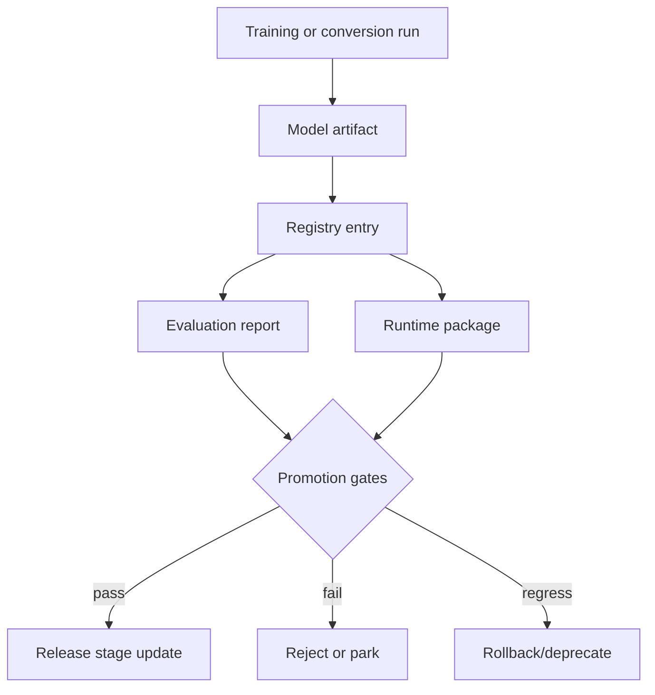

# aKriti Model Registry and Release Gates

**Status:** Draft implementation spec  
**Date:** 2026-05-20  
**Purpose:** Define how aKriti model artifacts, adapters, runtimes, datasets, and releases are named, tracked, tested, and promoted.

## 1. Registry principle

No model package should ship without traceability.

```text
model artifact
  -> base provenance
  -> training data
  -> eval results
  -> runtime package
  -> release decision
```

## 2. Registry object

```json
{
  "model_id": "akriti-core-qwen36-lora-doc-v0",
  "tier": "tiny | small | core | pro | kriti",
  "role": "parser | verifier | embedding | restoration | action | teacher",
  "base_model": {
    "name": "...",
    "license": "...",
    "weights_origin": "open | owned | mixed",
    "checkpoint": "..."
  },
  "training": {
    "method": "none | lora | qlora | distillation | full",
    "datasets": [],
    "run_ids": []
  },
  "evaluation": {
    "report_ids": [],
    "promotion_status": "candidate | approved | rejected | parked"
  },
  "runtime_packages": [],
  "created_at": "2026-05-20T00:00:00Z"
}
```

## 3. Artifact types

| Artifact | Examples |
|---|---|
| base checkpoint | open-weight VLM/LLM base |
| adapter | LoRA/QLoRA/DoRA/adaptive low-rank training reference-style adapter |
| student checkpoint | distilled aKriti Tiny/Small/Core |
| embedding model | text/image/multimodal embedding package |
| restoration model | deblur/denoise/dewarp model |
| runtime package | GGUF, MLX, ONNX, LiteRT, Core ML, WebGPU |
| eval report | JSON/Markdown results with failure samples |
| dataset manifest | source/license/split/checksum metadata |

## 4. Naming convention

```text
akriti-{tier}-{role}-{base-or-owned}-{capability}-{version}
```

Examples:

```text
akriti-tiny-router-owned-thumb-v0
akriti-small-text-qwen36-lora-indic-v0
akriti-core-doc-qwen36-lora-akritidoc-v0
akriti-core-doc-owned-distilled-v1
akriti-pro-teacher-qwen37-doc-v0
kriti-action-owned-lo-v0
```

Runtime packages:

```text
{model_id}-{runtime}-{quantization}-{platform}
```

Examples:

```text
akriti-core-doc-owned-distilled-v1-gguf-q4_k_m-macos
akriti-tiny-router-owned-thumb-v0-webgpu-int8-browser
```

## 5. Release stages

```text
experimental
  local research only

candidate
  passes schema and basic evals

preview
  usable behind explicit flag

default-local
  safe enough for ordinary local use

restricted
  only for non-high-stakes use

deprecated
  replaced or unsafe
```

## 6. Promotion gates

### Gate A: provenance

Required:
- base model and license known.
- dataset manifests known.
- training run recorded.
- runtime conversion recorded.

### Gate B: schema

Required:
- output validates against `aKritiDoc`.
- structured generation outputs pass schema validation.
- invalid JSON/object rate below threshold.

### Gate C: document quality

Required:
- OCR/text metrics.
- layout metrics.
- table/chart metrics where relevant.
- retrieval/grounding metrics.
- failure samples reviewed.

### Gate D: safety

Required:
- hallucination and unsupported-claim rate measured.
- restoration/entity drift checked.
- destructive edits require approval.
- legal/court mode is conservative.

### Gate E: runtime

Required:
- latency measured.
- RAM/VRAM measured.
- package size recorded.
- target hardware profile tested.

## 7. Package manifest

```json
{
  "package_id": "akriti-core-doc-owned-distilled-v1-gguf-q4_k_m-macos",
  "model_id": "akriti-core-doc-owned-distilled-v1",
  "runtime": "gguf",
  "quantization": "Q4_K_M",
  "platform": "macos | linux | windows | browser | android | ios",
  "file": "...",
  "sha256": "...",
  "size_bytes": 0,
  "capabilities": [
    "parse",
    "ask",
    "extract_table"
  ],
  "limits": {
    "max_pages": 0,
    "max_context_tokens": 0,
    "supports_images": true
  }
}
```

## 8. Capability card

Every released model should have a human-readable card:
- what it can do.
- what it cannot do.
- local hardware requirements.
- supported languages/scripts.
- known failure modes.
- whether weights are open-derived, mixed, or owned.
- whether it is safe for legal/high-stakes review.

## 9. Rollback policy

If a model regresses:
- remove default status.
- keep package available only if user has pinned it.
- log regression.
- mark as parked/deprecated.
- prevent silent downgrade/upgrade in LibreOffice and FilterTube.

## 10. ASCII release flow

```text
training run
    |
    v
model artifact
    |
    v
registry entry
    |
    v
eval report
    |
    v
runtime package
    |
    v
promotion gates
    |
    v
release / park / reject
```

## 11. Mermaid release flow




## 12. Model package manifest handoff

See `docs/akriti-model-package-manifests.md` for the expanded model manifest, runtime package card, capability card, tier-specific release expectations, quantization ladder, and surface approval rules.

## Research References

This doc is connected to the numbered research bibliography in `docs/akriti-research-reference-index.md`. Those references are engineering anchors for aKriti-owned implementation; they are not product dependencies. Only open weights may enter model lineage, and only with manifest provenance.
