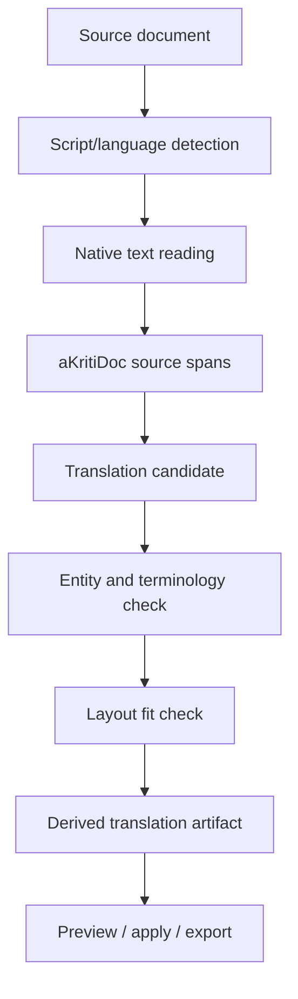

# aKriti Multilingual, Indic, and Translation Plan

**Status:** Draft implementation spec  
**Date:** 2026-05-20  
**Purpose:** Define how aKriti handles Indic scripts, Hinglish/code-mixed text, translation, tokenizer choices, and layout-preserving multilingual document workflows.

## 1. Core principle

aKriti must treat Indic-language document intelligence as a first-class capability, not a localization add-on.

```text
native script fidelity
    >
romanized convenience
    >
generic English-only document parsing
```

Hinglish/code-mixed text is important, but it must not replace native-script fidelity for Hindi, Marathi, Bengali, Tamil, Telugu, Kannada, Malayalam, Gujarati, Punjabi, Urdu, Odia, Assamese, or other Indian-language documents.

## 2. Language layers

| Layer | Requirement |
|---|---|
| script recognition | identify script per span/block |
| language identification | identify language per span/block/page |
| OCR/text reading | preserve native characters and diacritics |
| translation | preserve meaning, entities, numbers, and layout |
| transliteration | optional derived artifact, never source replacement |
| code-mixed handling | keep mixed-language spans coherent |
| legal/court terminology | maintain consistent glossary and citations |

## 3. Tokenizer policy

Do not change tokenizers inside borrowed/open pretrained bases in v1.

For owned student models:
- evaluate `Unigram` tokenization.
- use byte fallback or equivalent unknown-character robustness.
- keep grapheme/Unicode behavior explicit.
- measure per-script compression and CER.

Why `Unigram` is preferred for owned students:
- language-independent.
- works on raw Unicode.
- good fit for multilingual scripts.
- deterministic and lightweight.
- aligns with SentencePiece-style deployment.

Adoption gate:

```text
custom tokenizer ships only if it improves measured document behavior or runtime.
```

Metrics:
- tokens per character per script.
- OCR CER per script.
- translation quality.
- model latency.
- vocabulary coverage.
- entity preservation.

## 4. Hinglish policy

Hinglish is:
- augmentation data.
- alignment data.
- user-query support.
- chat/action convenience.

Hinglish is not:
- a replacement for native Hindi/Indic scripts.
- a reason to degrade Devanagari or other scripts.
- the canonical storage form for source document text.

Represent Hinglish as source only if the document actually contains romanized Hinglish.

## 5. Translation workflow

```text
source block/span/table/chart
        |
        v
language/script detection
        |
        v
translation candidate
        |
        v
terminology/entity check
        |
        v
layout fit check
        |
        v
derived translation artifact
        |
        v
preview/apply/export
```

Translations are derived artifacts, not source replacements.

## 6. Layout-preserving translation

Translation must preserve:
- paragraph order.
- table cells.
- chart labels.
- footnotes.
- headings.
- citations.
- numbering.
- style where safe.

If translated text does not fit the original layout:
- propose resizing/reflow.
- mark overflow.
- ask user before destructive layout changes.

## 7. Terminology and entity preservation

For legal/court and official documents, preserve:
- names.
- dates.
- amounts.
- legal sections.
- case numbers.
- court names.
- addresses.
- exhibit references.
- seals/stamps/signatures as non-text visual artifacts.

Use glossary constraints where possible.

## 8. aKritiDoc representation

Source span:

```json
{
  "span_id": "span_...",
  "text": "मूल पाठ",
  "language": "hi",
  "script": "Devanagari",
  "bbox": {},
  "provenance": {}
}
```

Translation artifact:

```json
{
  "artifact_id": "derived_translation_...",
  "kind": "translation",
  "source_refs": ["span_..."],
  "content": {
    "target_language": "en",
    "text": "translated text",
    "terminology_notes": []
  },
  "requires_user_approval": true
}
```

## 9. Evaluation

Metrics:
- chrF/BLEU as rough automated checks.
- terminology consistency.
- entity preservation.
- numeric preservation.
- layout preservation.
- human review for legal/high-stakes samples.
- back-translation only as a diagnostic, not as proof.

Indic-specific evals:
- per-script CER.
- code-mixed sentence handling.
- conjunct/diacritic fidelity.
- punctuation and danda handling.
- OCR + translation pipeline quality.

## 10. Initial language priority

Start with:
- English.
- Hindi/Devanagari.
- Hinglish/code-mixed Hindi-English.

Then expand based on data availability:
- Marathi.
- Bengali.
- Tamil.
- Telugu.
- Kannada.
- Malayalam.
- Gujarati.
- Punjabi.
- Urdu.
- Odia.
- Assamese.

## 11. ASCII flow

```text
source document
    |
    v
script + language detection
    |
    v
native OCR/text reading
    |
    v
aKritiDoc source spans
    |
    v
translation/transliteration derived artifacts
    |
    v
preview/export/edit
```

## 12. Mermaid flow




## Research References

This doc is connected to the numbered research bibliography in `docs/akriti-research-reference-index.md`. Those references are engineering anchors for aKriti-owned implementation; they are not product dependencies. Only open weights may enter model lineage, and only with manifest provenance.

## 13. Formal language support levels

Reference anchors: [34], [35].

aKriti must not claim broad language support as a single marketing label. Each language/script must be tagged by measured capability level:

| Level | Capability |
|---|---|
| `L0` | script detection |
| `L1` | OCR/text reading |
| `L2` | layout-aware reading order |
| `L3` | entity and terminology preservation |
| `L4` | translation/transliteration as derived artifacts |
| `L5` | structured extraction and reasoning |
| `L6` | Vinti-grade legal/court triage reliability |

Support states:

```text
experimental
candidate
supported
vinti_supported
not_supported
```

Example:

```json
{
  "language": "Hindi",
  "script": "Devanagari",
  "levels": {
    "L0": "supported",
    "L1": "candidate",
    "L2": "candidate",
    "L3": "experimental",
    "L4": "experimental",
    "L5": "experimental",
    "L6": "not_supported"
  },
  "eval_report_refs": []
}
```

Vinti-grade support requires more than OCR:

- case numbers, names, dates, amounts, sections, court names, addresses, exhibit references, stamps, signatures, and orders are preserved or flagged.
- every high-impact claim links to page/block/span/bbox evidence.
- ambiguous glyphs or script spans route to review.
- human review paths are stable.

## 14. Language evaluation gates

Per language/script, record:

- CER/WER and Indic CER.
- layout accuracy.
- reading-order accuracy.
- entity preservation.
- terminology consistency.
- translation meaning and layout preservation.
- ambiguous glyph recall.
- review recall.
- hallucination or unsupported-claim rate.
- Vinti triage drift if the language is used in court workflows.

Tokenizer policy remains:

```text
Do not change tokenizers inside borrowed/open pretrained bases in v1.
For owned student models, evaluate Unicode/grapheme behavior, byte fallback, per-script compression, and CER.
```
