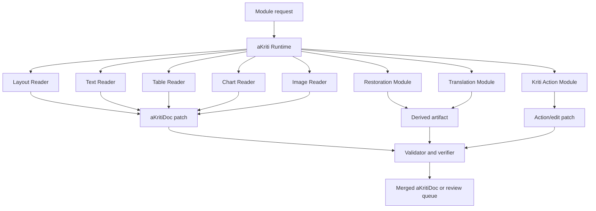

# aKriti Owned Module Interface Contracts

**Status:** Draft implementation spec  
**Date:** 2026-05-20  
**Purpose:** Define common interfaces for aKriti-owned modules so Layout, Text, Table, Chart, Image, Restoration, Translation, Runtime, and Kriti action components can be implemented independently while producing compatible `aKritiDoc` artifacts.

## 1. Core principle

Every owned module must be replaceable behind a stable contract.

```text
module input
    |
    v
owned module implementation
    |
    v
typed output fragment
    |
    v
aKritiDoc merge + validation + verification
```

The module implementation can change from baseline heuristics to open-weight adapters to owned students without changing the product contract.

## 2. Common module request

```json
{
  "request_id": "req_...",
  "module": "layout | text | table | chart | image | restoration | translation | reasoning",
  "operation": "parse | verify | restore | translate | describe | extract | vote",
  "document_ref": {
    "document_id": "doc_...",
    "page_ids": ["page_0001"]
  },
  "target_refs": [],
  "artifacts": [],
  "constraints": {
    "local_only": true,
    "requires_provenance": true,
    "requires_structured_output": true,
    "risk_level": "low | medium | high"
  },
  "runtime_preferences": {
    "tier": "tiny | small | core | pro",
    "max_latency_ms": null,
    "max_memory_mb": null
  }
}
```

## 3. Common module response

```json
{
  "request_id": "req_...",
  "module": "text",
  "status": "success | partial | failed | abstained",
  "akritidoc_patch": {},
  "derived_artifacts": [],
  "confidence": {},
  "verification": {},
  "review_items": [],
  "runtime": {
    "model_id": "...",
    "package_id": "...",
    "latency_ms": 0,
    "memory_mb": 0
  },
  "errors": []
}
```

All module responses must be mergeable into `aKritiDoc` or explicitly abstain/fail with reasons.

## 4. Patch format

Modules should return patches, not whole-document rewrites.

```json
{
  "patch_id": "patch_...",
  "target_document_id": "doc_...",
  "ops": [
    {
      "op": "add | update | delete | link",
      "path": "/pages/0/blocks/-",
      "value": {},
      "source_refs": [],
      "confidence": {}
    }
  ]
}
```

Patch rules:
- no module can delete source evidence.
- source text cannot be overwritten by derived text.
- high-risk patches require review.
- patch validation runs before merge.

## 5. aKriti Layout Reader

Purpose:
- detect page regions.
- classify blocks.
- establish reading order.
- expose uncertain regions for review.

Input:
- page render artifact.
- optional deterministic PDF structure.
- optional previous blocks.

Output:
- page blocks with bbox.
- block types.
- reading order list.
- confidence per block/order edge.

Required failures:
- mark `unknown` instead of guessing.
- create review item for overlapping/conflicting blocks.

## 6. aKriti Text Reader

Purpose:
- read visible text from source regions.
- preserve script/language.
- produce spans with bbox and confidence.

Input:
- text block crop or page region.
- optional deterministic text layer.
- optional restored artifact.

Output:
- text spans.
- script/language labels.
- text confidence.
- provenance to source region.

Required failures:
- abstain on unreadable text.
- flag entity drift when restored reread changes dates, amounts, or names.

## 7. aKriti Table Reader

Purpose:
- extract table structure and cell text.
- reconstruct CSV/HTML/ODS-ready representations.

Input:
- table block region.
- text spans.
- optional layout hints.

Output:
- table object.
- cell grid.
- merged cells.
- cell text spans.
- export artifacts.

Required failures:
- review if row/column structure is uncertain.
- do not flatten tables into prose as the only output.

## 8. aKriti Chart Reader

Purpose:
- understand charts/plots and reconstruct data where possible.

Input:
- chart block/crop.
- optional nearby caption/text.

Output:
- chart type.
- axes.
- legends.
- series.
- reconstructed data table when possible.
- chart QA evidence.

Required failures:
- mark unknown chart type if uncertain.
- separate visual description from reconstructed numeric data.

## 9. aKriti Image Reader

Purpose:
- identify and describe figures, diagrams, stamps, signatures, and visual evidence.

Input:
- image/figure block crop.
- optional text context.

Output:
- visual artifact metadata.
- optional caption/description as derived artifact.
- tags/classes.
- confidence and provenance.

Required failures:
- generated caption must not be source text.
- signatures/stamps should be treated as visual evidence, not OCR text unless explicitly read.

## 10. aKriti Restoration Module

Purpose:
- improve degraded document images as derived artifacts.

Input:
- page or crop artifact.
- quality report.

Output:
- restored artifact.
- restoration operation metadata.
- hallucination/entity-drift risk.
- suggested reread targets.

Required failures:
- never overwrite original.
- reject or review if new high-impact entities appear after restoration.

## 11. aKriti Translation Module

Purpose:
- translate while preserving layout, entities, and provenance.

Input:
- source spans/blocks/tables.
- target language.
- glossary/terminology constraints.

Output:
- derived translation artifacts.
- layout fit report.
- entity preservation report.
- optional edit patch.

Required failures:
- mark overflow or layout mismatch.
- review if entities/numbers/legal terms changed.

## 12. Kriti Reasoning/Action Module

Purpose:
- plan and execute typed document actions.

Input:
- user request.
- target refs.
- retrieved evidence.
- privacy/risk constraints.

Output:
- action envelope.
- plan steps.
- citations.
- edit patches or answers.
- review/approval requirements.

Required failures:
- abstain if evidence is insufficient.
- ask review/approval before high-risk action.

## 13. aKriti Runtime

Purpose:
- route module requests to the right model/package/backend.

Input:
- module request.
- model registry.
- hardware profile.
- privacy constraints.

Output:
- selected backend.
- runtime metrics.
- model/package provenance.
- failure fallback.

Required failures:
- never silently use remote backend.
- never use untrusted package in high-stakes mode.

## 14. Confidence and review integration

Every module must support:
- confidence object.
- review item emission.
- source refs.
- derived artifact refs.
- abstention.

If the module cannot provide confidence/provenance, it cannot be default for high-stakes workflows.

## 15. Structured-output rule

All module outputs should be generated or converted into typed JSON-compatible objects.

Use constrained generation where possible for:
- table objects.
- chart objects.
- action envelopes.
- verification reports.
- edit patches.

Invalid structured output is a module failure, not a warning.

## 16. ASCII module architecture

```text
                 aKriti Runtime
                       |
     +-----------------+-----------------+
     |                 |                 |
     v                 v                 v
 Layout Reader     Text Reader       Table Reader
     |                 |                 |
     +---------+-------+-------+---------+
               |               |
               v               v
          aKritiDoc patch   Review items
               |               |
               +-------+-------+
                       |
                       v
              validator + verifier
```

## 17. Mermaid module architecture




## 15. Executable schema handoff

See `docs/akriti-contract-schema-implementation-spec.md` for the concrete module request, module response, aKritiDoc patch, confidence, provenance, runtime-stats, and review-item schema responsibilities.

## Research References

This doc is connected to the numbered research bibliography in `docs/akriti-research-reference-index.md`. Those references are engineering anchors for aKriti-owned implementation; they are not product dependencies. Only open weights may enter model lineage, and only with manifest provenance.
