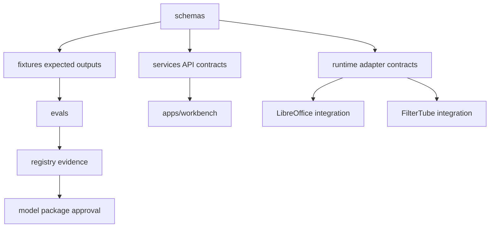

# aKriti Repository Scaffold Blueprint

**Status:** Draft implementation scaffold, created 2026-05-20  
**Purpose:** Define the first concrete repository structure that should be created before model experiments, runtime packaging, or LibreOffice/FilterTube product work begins.

This document operationalizes:

- `docs/akriti-repository-implementation-map.md`
- `docs/akriti-first-milestone-roadmap.md`
- `docs/akriti-fixture-corpus-and-experiment-cards.md`
- `docs/akriti-model-package-manifests.md`
- `docs/akriti-spec-coverage-traceability.md`

The rule is simple:

```text
Create executable contracts first.
Do not begin model claims until schemas, fixtures, evals, and registry manifests exist.
```

## 1. Scaffold principle

The first code should make the documentation falsifiable.

```text
docs say aKritiDoc exists
        |
        v
schema validates aKritiDoc
        |
        v
fixture contains expected aKritiDoc
        |
        v
eval harness compares candidate output
        |
        v
registry decides whether model/runtime claim is allowed
```

This prevents the project from becoming a loose collection of demos.

## 2. First scaffold batch

Create only these top-level directories in the first implementation batch:

```text
schemas/
fixtures/
evals/
registry/
packages/
services/
runtimes/
apps/
integrations/
tools/
```

Do not add large files, model weights, private data, or generated page images in the first scaffold batch.

## 3. Directory ownership map

| Path | Owner role | Stability | Purpose |
|---|---|---:|---|
| `schemas/` | contract owner | high | JSON Schemas and typed contracts used by every module |
| `fixtures/` | eval/data owner | medium-high | tiny source artifacts, manifests, expected outputs, dataset cards |
| `evals/` | evaluation owner | medium-high | metric definitions, runners, reports, failure taxonomy |
| `registry/` | release owner | high | model manifests, runtime package cards, capability cards |
| `packages/` | research/tooling owner | medium | Python/Rust/TS package prototypes and reusable libraries |
| `services/` | API owner | medium | local aKriti API job lifecycle and workers |
| `runtimes/` | runtime owner | medium | backend adapters for GGUF, MLX, ONNX, WebGPU, LiteRT, etc. |
| `apps/` | product owner | medium | Workbench and user-facing development shells |
| `integrations/` | integration owner | medium | LibreOffice and FilterTube bridges; Vinti later only |
| `tools/` | developer tooling owner | medium | validators, converters, manifest generation, fixture builders |

Ownership here means accountability, not separate people. Each area should have a clear contract and review checklist.

## 4. Minimal file tree

First useful scaffold:

```text
aKriti/
  schemas/
    README.md
    akritidoc/
      v0.schema.json
      examples/
        minimal-page.akritidoc.json
    api/
      job.schema.json
      error.schema.json
      progress-event.schema.json
    modules/
      request.schema.json
      response.schema.json
    actions/
      edit-patch.schema.json
      review-item.schema.json
    registry/
      model-manifest.schema.json
      runtime-package.schema.json
      capability-card.schema.json

  fixtures/
    README.md
    manifests/
      fixture-index.jsonl
      dataset-cards/
        akriti-golden-25.md
        akriti-scan-30.md
        akriti-tablechart-45.md
        akriti-indic-50.md
        akriti-filtertube-500.md
    raw/
      README.md
    rendered/
      README.md
    akritidoc/
      expected/
        minimal-page.akritidoc.json
    expected/
      text/
      layout/
      tables/
      charts/
      translations/
      edits/
      retrieval/
      confidence/

  evals/
    README.md
    metrics/
      README.md
      schema-validity.md
      text-cer-wer.md
      bbox-iou.md
      reading-order.md
      table-structure.md
      chart-reconstruction.md
      citation-grounding.md
      confidence-review.md
      runtime.md
    runners/
      README.md
    reports/
      README.md
    failure-taxonomy/
      README.md

  registry/
    README.md
    models/
      akriti-tiny-router-owned-thumb-v0.json
      akriti-small-text-open-derived-indic-v0.json
      akriti-core-doc-open-derived-akritidoc-v0.json
      akriti-pro-teacher-open-derived-doc-v0.json
      kriti-action-owned-lo-v0.json
    packages/
      README.md
    capability-cards/
      README.md
    eval-links/
      README.md

  packages/
    README.md
    akriti_research/
      README.md
    akriti_contracts/
      README.md

  services/
    README.md
    akriti_api/
      README.md

  runtimes/
    README.md
    adapter-contract.md
    gguf/
      README.md
    mlx/
      README.md
    onnx/
      README.md
    webgpu/
      README.md
    litert/
      README.md
    coreml/
      README.md
    vllm/
      README.md
    sglang/
      README.md
    tensorrt_llm/
      README.md

  apps/
    README.md
    workbench/
      README.md

  integrations/
    README.md
    libreoffice/
      README.md
    filtertube/
      README.md
    vinti/
      README.md

  tools/
    README.md
    validators/
      README.md
    converters/
      README.md
    manifests/
      README.md
```

## 5. Do-not-create-yet list

Do not create these until there is an immediate implementation owner and a first artifact:

| Path/type | Why not yet |
|---|---|
| large raw datasets | privacy, storage, licensing, repo bloat |
| model weights/checkpoints | should live in external artifact storage with manifests only |
| vector indexes | generated artifacts; reproducible from fixtures/docs |
| Vinti-specific datasets | Vinti is downstream after core aKriti APIs stabilize |
| full mobile app shells | desktop/browser/local contracts should exist first |
| complex training framework glue | premature before schemas/evals/fixtures |
| multiple competing UI apps | Workbench should be the first inspection surface |

## 6. Dependency graph

ASCII:

```text
schemas
  |
  +--> fixtures expected outputs
  |       |
  |       v
  |     evals
  |       |
  |       v
  |   registry evidence
  |
  +--> services API contracts
  |       |
  |       v
  |     apps/workbench
  |
  +--> runtime adapter contracts
          |
          v
   LibreOffice / FilterTube integrations
```

Mermaid:



## 7. Contract files to implement first

### 7.1 `schemas/akritidoc/v0.schema.json`

Must cover:

```text
document_id
schema_version
source
pages
blocks
spans
tables
charts
images
provenance
confidence
derived_artifacts
operations
verification
```

Exit gate:

```text
minimal-page.akritidoc.json validates.
```

### 7.2 `schemas/api/job.schema.json`

Must cover:

```text
job_id
job_type
status
input_refs
output_refs
progress
warnings
errors
created_at
updated_at
privacy_mode
```

Exit gate:

```text
fake parse job can move queued -> running -> complete and point to fixture aKritiDoc.
```

### 7.3 `schemas/actions/edit-patch.schema.json`

Must cover:

```text
patch_id
source_selection
operation
risk_level
preview
inverse_patch
requires_user_approval
provenance
```

Exit gate:

```text
LibreOffice proof can preview a comment/translation/rewrite patch without applying it silently.
```

### 7.4 `schemas/registry/model-manifest.schema.json`

Must cover:

```text
model_id
tier
lineage
training
eval_evidence
capabilities
confidence_policy
runtime_packages
release_status
rollback_to
```

Exit gate:

```text
placeholder experimental manifests validate while clearly stating that no model is production-ready.
```

## 8. Placeholder model manifest policy

The first registry manifests are placeholders. They must not imply real model readiness.

Required status:

```text
experimental
```

Required warning:

```text
This is a planning placeholder. It has no release approval until fixture/eval/runtime evidence exists.
```

Initial placeholder model IDs:

| Model ID | Purpose | Allowed status |
|---|---|---|
| `akriti-tiny-router-owned-thumb-v0` | tiny thumbnail/page routing target | `experimental` |
| `akriti-small-text-open-derived-indic-v0` | open-derived small text/Indic target | `experimental` |
| `akriti-core-doc-open-derived-akritidoc-v0` | open-derived Core document VLM target | `experimental` |
| `akriti-pro-teacher-open-derived-doc-v0` | open-derived teacher/verifier target | `experimental` |
| `kriti-action-owned-lo-v0` | local action schema behavior target | `experimental` |

## 9. Fixture scaffold policy

The first fixture files should be tiny and inspectable.

Recommended first fixture:

```text
fixtures/akritidoc/expected/minimal-page.akritidoc.json
```

It should contain:

```text
one document
one page
one heading block
one paragraph block
one image/figure block
one low-confidence span or review item
source provenance for every block
```

Reason:

```text
This single fixture can exercise schema validation, overlays, confidence UI, citations, and basic API job output.
```

## 10. Eval scaffold policy

Do not implement all metrics at once. Start with metric definitions and tiny stubs.

First metrics:

| Metric | Why first |
|---|---|
| schema validity | all output must validate before quality claims |
| text exact/CER | simplest text baseline |
| bbox IoU | layout needs coordinates |
| reading order | document understanding fails if order is wrong |
| citation grounding | verification-first invariant |
| confidence review | low-confidence UX must exist early |

Later metrics:

```text
table cell graph
chart data reconstruction
translation terminology preservation
runtime profiling
restoration drift
LibreOffice patch correctness
```

## 11. Runtime adapter contract

`runtimes/adapter-contract.md` should define:

```text
load_package(package_manifest)
unload_package(package_id)
capabilities(package_id)
run(request) -> module response
measure(request) -> runtime stats
healthcheck()
```

All runtime adapters must return:

```text
structured output
runtime stats
warnings/errors
confidence when available
provenance when available
```

Runtime adapters must not return user-facing final answers directly. They return candidate structured outputs that pass through aKritiDoc/eval/review layers.

## 12. Service scaffold policy

`services/akriti_api` should start as a fake local API over fixtures.

First behavior:

```text
POST /v1/parse
  creates fake job

GET /v1/jobs/{id}
  returns queued/running/complete

GET /v1/artifacts/{id}
  returns fixture aKritiDoc
```

Why fake first:

```text
It proves product flow, job lifecycle, privacy fields, and Workbench integration before model complexity enters.
```

## 13. Workbench scaffold policy

`apps/workbench` should start as a static fixture viewer.

First UI capabilities:

```text
load fixture aKritiDoc
show rendered page placeholder
show block list
show bbox overlays if coordinates exist
show low-confidence/review items
show source provenance panel
```

No model is needed for this. The point is to make `aKritiDoc` visible.

## 14. Integration scaffold policy

### LibreOffice

First scaffold:

```text
integrations/libreoffice/
  README.md
  request-envelope.example.json
  edit-patch.example.json
```

Initial goal:

```text
prove the request/patch contract before native C++/UNO implementation.
```

### FilterTube

First scaffold:

```text
integrations/filtertube/
  README.md
  thumbnail-record.example.json
  filter-decision.example.json
```

Initial goal:

```text
prove local thumbnail/title semantic filtering contract before WebGPU model packaging.
```

### Vinti

First scaffold:

```text
integrations/vinti/README.md
```

Content should say:

```text
Vinti is a long-term separate downstream court/legal product based on aKriti.
This directory remains contract-only until aKriti v1 APIs and model packages stabilize.
```

## 15. Language and tooling choices

Use the simplest stack that supports the contract-first path.

| Area | First choice | Reason |
|---|---|---|
| schemas | JSON Schema | language-neutral, usable by Python/TS/Rust/C++ tooling |
| fixture/eval prototypes | Python | ML/eval ecosystem and fast iteration |
| local service prototype | Python/FastAPI or Rust later | start fast, keep service boundary replaceable |
| Workbench | TypeScript web app | fastest inspection UI and later desktop/web reuse |
| LibreOffice native path | C++/UNO later | matches LibreOffice architecture |
| safety-critical local runtime glue | Rust or C++ later | deterministic, packaged local service path |
| model training | Python/PyTorch/JAX where needed | current research ecosystem |

Do not use a language because it is fashionable. Use it where it reduces risk.

## 16. First implementation commit sequence

Recommended concrete commit sequence:

```text
1. scaffold schemas/ fixtures/ evals/ registry/ with README files
2. add aKritiDoc v0 schema and minimal fixture
3. add schema validator command skeleton
4. add API job/error/progress schemas
5. add model/runtime package schema placeholders
6. add fixture manifest and dataset-card templates
7. add eval metric definitions and report format
8. add fake local API job lifecycle over fixture artifact
9. add Workbench static fixture viewer
10. add LibreOffice and FilterTube example request/response contracts
```

Stop after each commit if the shape is wrong. Do not pile model code on top of unstable contracts.

## 17. Scaffold acceptance checklist

The scaffold phase is acceptable when:

```text
[ ] all created directories have README files explaining ownership and allowed artifacts
[ ] schemas exist for aKritiDoc, jobs, actions, module IO, registry, runtime packages
[ ] one minimal aKritiDoc fixture exists
[ ] fixture manifest points to that fixture
[ ] dataset card template exists
[ ] eval report format exists
[ ] placeholder model manifests are explicitly experimental
[ ] runtime adapter contract exists
[ ] Workbench can be planned against fixture aKritiDoc
[ ] LibreOffice and FilterTube contracts exist as examples
[ ] Vinti is documented as downstream-only, not active core scope
```

## 18. Anti-drift rules

These rules prevent the scaffold from drifting into an unfocused demo repo.

| Rule | Reason |
|---|---|
| No model download in scaffold commit | avoids false progress and heavy dependencies |
| No external OCR/VLM runtime dependency | preserves ownership boundary |
| No private docs in fixtures | privacy-first from day one |
| No Vinti implementation before aKriti core contracts | downstream boundary stays clean |
| No runtime package without manifest | prevents untracked model artifacts |
| No UI answer without provenance field | verification-first invariant |
| No low-confidence hiding | review behavior must exist early |

## 19. Relationship to future research skills

The installed research skills become useful after scaffold exists:

| Skill family | When to use |
|---|---|
| `akriti-experiment-loop` | after fixtures/evals can run a fixed-budget experiment |
| `autoresearch` | after multiple competing hypotheses have executable evals |
| PEFT/Axolotl/Unsloth skills | after model manifests and dataset slices exist |
| GGUF/llama.cpp/MLX/runtime skills | after runtime package card schema exists |
| ARA research manager | after a meaningful research session, as an epilogue only |

## 20. Why this comes before training

Training before this scaffold would answer the wrong question.

Bad question:

```text
Can we make a model produce impressive document answers?
```

Correct question:

```text
Can a model produce verified, local-first, aKritiDoc-compatible document intelligence that survives evals and can plug into LibreOffice, FilterTube, Workbench, and downstream products?
```

The scaffold makes the second question executable.

## 21. Contract schema implementation handoff

See `docs/akriti-contract-schema-implementation-spec.md` for the concrete schema package layout, shared definitions, validation modes, invariant checker responsibilities, examples, and schema-phase completion gate.

## 22. Scaffold backlog handoff

See `docs/akriti-scaffold-implementation-backlog.md` for the ticket-level implementation plan, dependencies, acceptance criteria, and gates for turning this scaffold blueprint into files.

## Research References

This doc is connected to the numbered research bibliography in `docs/akriti-research-reference-index.md`. Those references are engineering anchors for aKriti-owned implementation; they are not product dependencies. Only open weights may enter model lineage, and only with manifest provenance.
