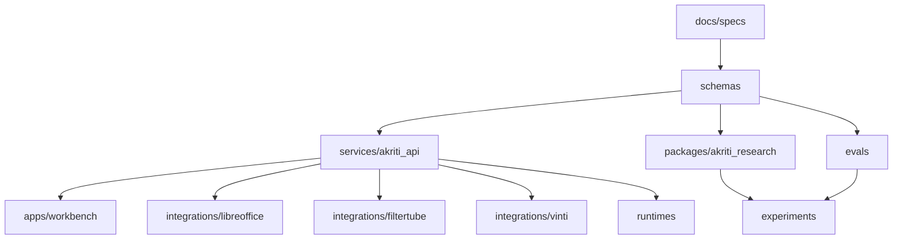

# aKriti Repository Implementation Map

**Status:** Draft implementation spec  
**Date:** 2026-05-20  
**Purpose:** Translate the documentation architecture into a concrete repository/package layout that can be implemented in small, reviewable commits.

## 1. Core principle

The repository should separate stable contracts from experimental model code.

```text
contracts and schemas
  must be stable and testable

research experiments
  can move fast and fail

runtime/product integrations
  depend on contracts, not on experiment internals
```

## 2. Proposed top-level layout

```text
aKriti/
  docs/
  agent-skills/
  schemas/
  crates/
  packages/
  services/
  apps/
  experiments/
  datasets/
  evals/
  runtimes/
  integrations/
  tools/
```

Do not create every directory at once unless there is an immediate owner and first file.

## 3. Directory roles

| Path | Role |
|---|---|
| `docs/` | source-of-truth architecture/specs |
| `agent-skills/` | portable repo copies of custom provider-native code agent harness skills |
| `schemas/` | JSON Schema / Pydantic / TypeScript schema definitions |
| `crates/` | Rust libraries for safe local services, indexing, and runtime glue |
| `packages/` | Python packages for research, schemas, evals, and module prototypes |
| `services/` | local API server and background worker |
| `apps/` | Workbench and user-facing shells |
| `experiments/` | fixed-budget research runs and protocols |
| `datasets/` | dataset manifests only, not large raw data |
| `evals/` | evaluation harness, metrics, fixtures |
| `runtimes/` | backend adapters for GGUF, MLX, ONNX, LiteRT, WebGPU, vLLM |
| `integrations/` | LibreOffice, FilterTube, Vinti adapters |
| `tools/` | developer CLIs and conversion utilities |

## 4. Contract-first packages

Start here:

```text
schemas/akritidoc/
schemas/api/
schemas/jobs/
schemas/actions/
schemas/model_registry/
```

These should define:
- `aKritiDoc`.
- module request/response.
- API job object.
- edit patch.
- review item.
- model registry entry.
- export artifact.

## 5. Python research package

Initial Python package:

```text
packages/akriti_research/
  akriti_research/
    __init__.py
    datasets/
    metrics/
    bakeoff/
    experiments/
    converters/
```

Purpose:
- synthetic data generation.
- baseline bake-offs.
- eval metrics.
- adapter/distillation prototypes.
- conversion to/from `aKritiDoc`.

Python is the right first home for research because the model/eval ecosystem is Python-first.

## 6. Local service package

Initial service:

```text
services/akriti_api/
  app/
    api/
    jobs/
    workers/
    storage/
    privacy/
    runtime_selector/
```

Purpose:
- expose `/v1/parse`, `/v1/ask`, `/v1/search`, etc.
- manage async jobs.
- stream progress events.
- call runtime adapters.
- return `aKritiDoc`.

The API should be runtime-agnostic.

## 7. Runtime adapters

```text
runtimes/
  gguf/
  mlx/
  onnx/
  webgpu/
  litert/
  coreml/
  vllm/
  tensorrt_llm/
```

Runtime adapter contract:

```text
load package
report capabilities
run module request
return structured output or failure
report latency/memory
```

## 8. Evaluation package

```text
evals/
  fixtures/
  metrics/
  reports/
  runners/
```

Initial metrics:
- CER/WER.
- bbox IoU.
- reading order.
- table cell F1.
- chart extraction metrics.
- citation accuracy.
- hallucination/unsupported claim rate.
- runtime metrics.

## 9. Workbench app

```text
apps/workbench/
  src/
    viewer/
    overlays/
    chat/
    review_queue/
    export/
    model_manager/
```

Workbench should consume:
- `aKritiDoc`.
- job events.
- review items.
- edit patches.
- export artifacts.

## 10. Integrations

```text
integrations/libreoffice/
integrations/filtertube/
integrations/vinti/
```

Each integration should be thin over the same API/contracts:
- LibreOffice maps selections and patches to native document operations.
- FilterTube maps thumbnails/titles to local semantic scores.
- Vinti maps case documents to high-stakes legal-document workflows.

## 11. Experiment workspace

```text
experiments/
  EXP-OCR-001/
    protocol.md
    results/
    analysis.md
  EXP-RUNTIME-001/
  EXP-FILTERTUBE-001/
```

Rules:
- every experiment starts with a protocol.
- fixed budget is stated before running.
- failures are logged.
- results link to eval reports.

## 12. Large artifact policy

Do not commit:
- model weights.
- raw private documents.
- large datasets.
- generated page images at scale.
- vector indexes.

Commit:
- manifests.
- checksums.
- small fixtures.
- synthetic generation recipes.
- eval result summaries.

## 13. First code commit order

Recommended order:

```text
1. schemas/akritidoc JSON Schema
2. schemas/api job/action/export schemas
3. packages/akriti_research minimal metrics
4. evals/fixtures tiny synthetic docs
5. services/akriti_api minimal job object
6. apps/workbench static aKritiDoc viewer
7. runtime adapter interface
8. first GGUF/MLX/WebGPU smoke adapter
```

## 14. ASCII layout map

```text
docs
  |
  v
schemas --------------+
  |                   |
  v                   v
services/api      packages/research
  |                   |
  v                   v
apps/workbench     evals/experiments
  |                   |
  +--------+----------+
           |
           v
       runtimes + integrations
```

## 15. Mermaid layout map




## 15. Scaffold blueprint handoff

See `docs/akriti-repo-scaffold-blueprint.md` for the concrete first scaffold batch, minimal file tree, directory ownership map, dependency graph, placeholder model manifest policy, and scaffold acceptance checklist.

## Research References

This doc is connected to the numbered research bibliography in `docs/akriti-research-reference-index.md`. Those references are engineering anchors for aKriti-owned implementation; they are not product dependencies. Only open weights may enter model lineage, and only with manifest provenance.
