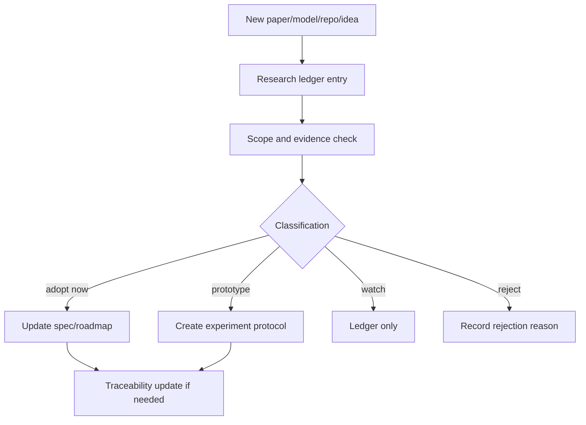

# aKriti Research Maintenance and Provenance

**Status:** Draft operating spec  
**Date:** 2026-05-20  
**Purpose:** Define how future aKriti research updates should be recorded, evaluated, and promoted without destabilizing the locked roadmap.

## 1. Core principle

New research should enter aKriti through evidence, not excitement.

```text
new paper / model / repo / tweet
        |
        v
research ledger entry
        |
        v
classification: adopt / prototype / watch / reject
        |
        v
experiment or decision update only if justified
```

The project should stay curious without becoming chaotic.

## 2. Files to update by event type

| Event type | Update |
|---|---|
| new paper/repo/model | `akriti-research-ledger.md` |
| changed project boundary | `akriti-decision-log.md` |
| new experiment idea | `akriti-experiment-loop.md` or experiment protocol |
| completed experiment | experiment report plus relevant ledger note |
| new runtime result | `akriti-hardware-experiment-plan.md` or model registry |
| new product requirement | relevant product spec plus traceability map |
| new invariant | `akriti-spec-coverage-traceability.md` and decision log |
| new implementation task | `akriti-first-milestone-roadmap.md` or issue/task tracker later |

## 3. Research entry template

```markdown
### {item name}

Status: adopt now | prototype | watch | reject

What it is:
- ...

Why it matters for aKriti:
- ...

Use in aKriti:
- Core:
- Tiny/Small:
- LibreOffice:
- FilterTube:
- Vinti:

Risks:
- ...

Decision:
- ...
```

## 4. Promotion categories

| Category | Meaning | Required next action |
|---|---|---|
| `adopt now` | directly supports locked implementation path | add to roadmap/spec or implementation task |
| `prototype` | promising, needs experiment | create experiment protocol |
| `watch` | interesting but immature/not actionable | keep in ledger |
| `reject` | violates constraints or not useful | record reason, do not revisit without new evidence |

## 5. Scope calibration rules

Avoid over-claiming:

```text
"This may help aKriti Tiny thumbnail filtering"
is better than
"This solves local VLMs"
```

Every research note should answer:
- which module or product surface does this affect?
- what evidence exists?
- what is still unproven?
- what would falsify its usefulness?

## 6. Evidence classes

| Evidence | Strength |
|---|---|
| local experiment on aKriti fixture | strongest |
| reproduced open benchmark | strong |
| paper benchmark only | medium |
| author blog/tweet | weak but useful for discovery |
| demo video only | weak |
| intuition/hype | not enough |

## 7. Decision update rules

Only update `akriti-decision-log.md` when:
- a boundary changes.
- a previously rejected path becomes viable.
- a watch item becomes actionable.
- a new invariant is needed.
- user explicitly locks a decision.

Do not update locked decisions for ordinary paper discovery.

## 8. Experiment provenance

Every experiment should record:
- hypothesis.
- baseline.
- dataset slice.
- hardware.
- fixed budget.
- metric.
- result.
- decision.
- failure samples.

This preserves the difference between:
- what we believed.
- what we tried.
- what actually happened.
- what we decided afterward.

## 9. User vs AI provenance

Use these tags in notes when needed:

| Tag | Meaning |
|---|---|
| `user` | user explicitly stated or chose it |
| `ai-suggested` | assistant inferred or proposed it |
| `ai-executed` | assistant wrote/edited/ran something |
| `user-revised` | user corrected assistant framing |

Important:
- do not mark AI inference as user decision.
- do not claim user endorsed a research direction unless explicitly stated.

## 10. Drift prevention

When a new idea appears, check against invariants:
- Is it local-first compatible?
- Does it preserve ownership direction?
- Does it keep `aKritiDoc` central?
- Does it preserve verification/provenance?
- Does it avoid wrapper dependence?
- Does it support a real product surface?

If not, classify as watch/reject even if technically interesting.

## 11. Session closeout checklist

At the end of a substantial research/docs session:

```text
1. Are new claims captured in the research ledger?
2. Are locked decisions updated only when truly changed?
3. Are new docs linked from docs/README.md?
4. Are new invariants added to traceability if needed?
5. Are uncommitted files intentional?
6. Is the next implementation step clear?
```

## 12. ASCII research maintenance flow

```text
new information
    |
    v
ledger entry
    |
    v
scope + evidence check
    |
    +--> adopt -> docs/roadmap
    +--> prototype -> experiment protocol
    +--> watch -> ledger only
    +--> reject -> ledger reason
```

## 13. Mermaid research maintenance flow




## Session handoff record

See `docs/akriti-research-docs-session-handoff-2026-05-20.md` for the provenance handoff from the post-restart documentation/research pass, including artifacts added, decisions reaffirmed, experiment queue, scaffold backlog, and next-session warnings.

## Research References

This doc is connected to the numbered research bibliography in `docs/akriti-research-reference-index.md`. Those references are engineering anchors for aKriti-owned implementation; they are not product dependencies. Only open weights may enter model lineage, and only with manifest provenance.
