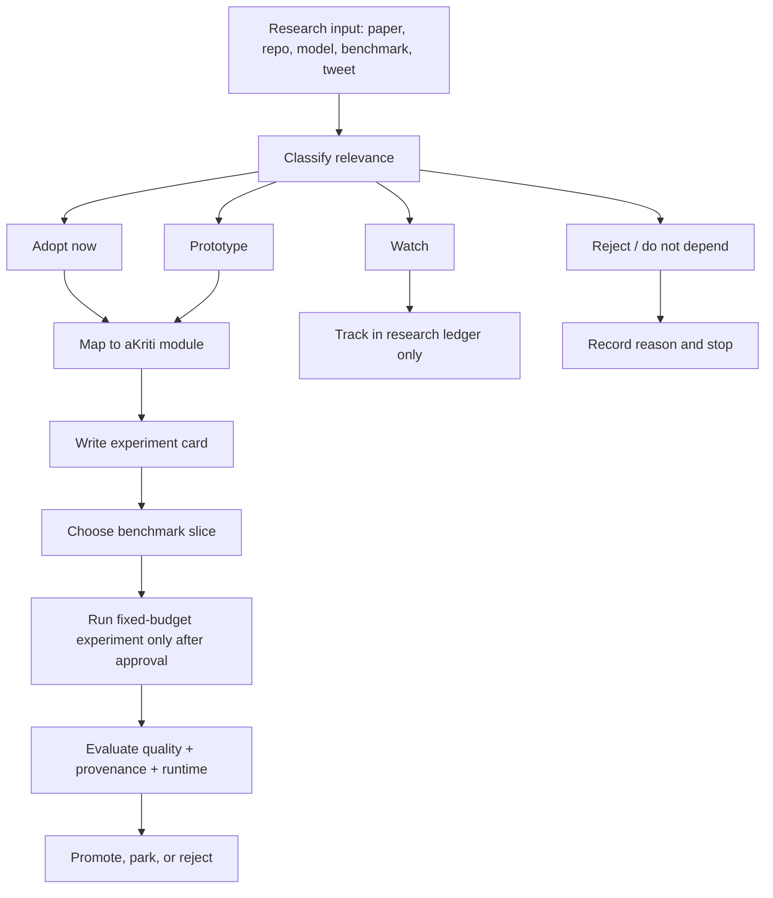

# aKriti Research-to-Experiment Matrix

**Status:** Working control document, created 2026-05-20  
**Purpose:** Convert papers, repos, model releases, tweets, and implementation ideas into bounded aKriti experiments without breaking the locked ownership, VLM-first, local-first, and verification-first decisions.

This document is the bridge between:

- `docs/akriti-research-ledger.md`
- `docs/akriti-experiment-loop.md`
- `docs/akriti-baseline-bakeoff-protocol.md`
- `docs/akriti-evaluation-harness.md`
- `docs/akriti-model-registry-release-gates.md`

It does not replace those files. It explains how a research idea earns the right to influence them.

## 1. Non-negotiable filter

Every incoming idea must pass this filter before it touches roadmap language.

```text
Can it improve aKriti's owned document intelligence stack?

If yes:
  classify it, isolate the exact module it affects, define an eval, and run a fixed-budget experiment.

If no:
  record it as reference-only, watch, or reject.
```

Hard boundaries:

| Boundary | Meaning |
|---|---|
| VLM-first | OCR is one capability inside document understanding, not the product identity. |
| Owned product | External OCR/VLM systems can teach, benchmark, or inspire; they cannot be the shipped product dependency. |
| Local-first | Any adopted technique must have a path to CPU, Apple Silicon, RTX 2060-class, WebGPU, or offline workstation deployment. |
| Verification-first | Improvements are not accepted unless provenance, confidence, and hallucination/error checks survive. |
| Vinti boundary | Vinti is a long-term separate downstream court/legal project based on aKriti, not aKriti v1 scope. |

## 2. Research ingestion flow

ASCII version:

```text
new paper/repo/model/idea
        |
        v
classify: adopt-now | prototype | watch | reject
        |
        v
map to owned aKriti module
        |
        v
define one hypothesis + one benchmark slice + one fixed budget
        |
        v
run only when approved and logged
        |
        v
compare against baseline under aKritiDoc contract
        |
        v
keep | park | reject | promote to roadmap
```

Mermaid version:



## 3. Classification rules

| Classification | Use when | Roadmap effect |
|---|---|---|
| `adopt-now` | The idea is low-risk, architecture-compatible, and needed for v1 scaffolding. | Can be added to specs or milestones immediately. |
| `prototype` | The idea is promising but needs a bounded experiment. | Add an experiment ticket, not a product promise. |
| `watch` | The idea is plausible but too new, unstable, hardware-specific, closed, or not yet relevant. | Keep in ledger; revisit on schedule. |
| `reject` | The idea violates ownership, local-first, verification, licensing, or product scope. | Record why; do not re-litigate unless new evidence appears. |

## 4. Experiment card template

Every prototype must be expressible in this shape before work starts.

```markdown
## EXP-{number}-{slug}

- Hypothesis:
- Module affected:
- Product surface affected:
- Baseline:
- Change:
- Dataset slice:
- Fixed budget:
- Metrics:
- Verification checks:
- Local runtime target:
- Stop condition:
- Promotion gate:
- Decision: pending | keep | park | reject
```

## 5. Technique integration matrix

| Research/input | Classification | aKriti module lane | Product surface | Required benchmark slice | Promotion gate |
|---|---:|---|---|---|---|
| open-weight base-family candidate / open-weight base-family candidate open weights | `prototype` | Core VLM base, Pro teacher, distillation source | Workbench, LibreOffice, all downstream APIs | page QA, OCR-assisted extraction, tables, charts, Indic translation, grounded edits | Beats current open-weight baseline under aKritiDoc with better provenance and acceptable local runtime. |
| open-weight edge-model reference edge / LiteRT-LM | `prototype` | Tiny/Small runtime and skills/session design | mobile, browser-adjacent, FilterTube, low-compute devices | latency, tool-call reliability, tiny task accuracy | Useful only if model/package can run broadly and tool calls stay constrained. |
| external OCR specialist | `reference-only` / `engineering-reference` | Text Reader, Layout Reader | Workbench, LibreOffice | OCR CER/WER, reading order, structured output | aKriti-owned reader must learn from/beat its error buckets; external OCR specialist is not a dependency. |
| external OCR specialist / OCR2 | `reference-only` / `engineering-reference` | Text Reader, Layout Reader, token-budget strategy | Workbench, LibreOffice | multi-resolution OCR, dense scans, page compression | Adopt ideas only if they improve owned module accuracy or token efficiency. |
| external OCR specialist | `reference-only` / `engineering-reference` | Text Reader, Layout Reader | Workbench, LibreOffice | OCR/layout bake-off | Independent engineering reference and benchmark opponent only; not a teacher, label source, verifier, or dependency. |
| external OCR/layout toolkit / deterministic OCR/layout baselines | `baseline-only` | Text Reader, Layout Reader | evaluation harness | deterministic OCR, layout segmentation | Must remain a comparator and fallback idea, not the branded engine. |
| external document-layout reference-style PDF layout UI | `adopt-now as UX/API reference` | aKritiDoc overlays, Workbench review UI | Workbench, later Vinti | block overlay correctness, reviewer speed, correction capture | Adopt visual inspection pattern if it improves human correction and traceability. |
| PEFT / LoRA / QLoRA / DoRA | `adopt-now` | adapter training | all model tiers | module-specific fine-tuning slices | Adapter improves target slice without harming held-out provenance or hallucination checks. |
| LoRA+ / LoRA-FA / VeRA / Delta-LoRA | `prototype` | adapter efficiency | training pipeline | matched-parameter adapter comparison | Keep only if better quality-per-VRAM or faster training under same eval. |
| adaptive low-rank training reference | `prototype` | adaptive rank discovery | training pipeline | per-module adapter rank search | Keep if it finds smaller or stronger ranks than manual LoRA without excessive complexity. |
| Knowledge distillation | `adopt-now` | Tiny/Small/Core students | all local targets | teacher-student agreement, held-out error rate | Student must preserve evidence grounding and confidence calibration, not just mimic text. |
| extreme quantization reference / KV compression | `prototype` | runtime optimization | LibreOffice, Workbench, local long docs | long-document memory, latency, answer quality | Accept only if memory gain does not break citation/exactness behavior. |
| GGUF / llama.cpp | `adopt-now` | CPU/RTX local inference | desktop local runtime | tokens/sec, RAM, page/sec | Must support reliable local packaging and reproducible model cards. |
| MLX | `adopt-now` | Apple Silicon runtime | Mac M4 development and user machines | tokens/sec, image/page latency, memory | Promote for Apple-native local runtime if parity is good enough. |
| ONNX Runtime | `adopt-now` | cross-platform runtime | desktop, browser-adjacent, services | latency, portability, package size | Promote when exporter and kernels are stable for selected model tier. |
| WebGPU/WASM | `adopt-now for tiny lanes` | Tiny/Small browser inference | FilterTube, browser demos | thumbnail classification, semantic filtering, package size | Must stay fast enough for local user experience and not require cloud calls. |
| LiteRT / Core ML | `prototype` | mobile/edge runtime | future mobile/offline apps | device latency, package size, battery | Keep if deployment friction is lower than ONNX/WebGPU/MLX for target device. |
| token-superposition-style pretraining reference | `watch` / `v2 prototype` | pretraining efficiency | model training only | continued pretraining throughput and downstream quality | Consider only after data engine and baseline pretraining loop exist. |
| hierarchical attention reference | `watch` | long-context training | model training only | long-context training cost, citation recall | Not v1; revisit for cloud training once Core baseline exists. |
| neuron-preserving optimizer optimizer | `watch` / `v2 prototype` | optimizer research | model training only | convergence, neuron activity, quality per token | Prototype only after a stable training harness exists. |
| tile-wise sparse FFN | `watch` | sparse inference/training kernels | GPU research source/cloud/workstation | throughput, memory, kernel complexity | Only relevant if kernel stack can be maintained and gains survive real model workloads. |
| four-bit pretraining reference / extreme low precision | `watch` | cloud training/inference compression | Blackwell/H200-class training | training stability and final eval quality | Not a v1 local runtime dependency. |
| world-model reference / world-model reference / V-world-model reference | `prototype` | visual embeddings, anomaly detection, page/thumbnail representation | FilterTube, page triage, image reader | thumbnail semantics, page-region retrieval, anomaly detection | Useful only as representation support; not OCR or reasoning core. |
| DINOv2 / SigLIP / CLIP | `baseline` | visual embeddings | FilterTube, page/image retrieval | semantic retrieval, caption alignment | Keep as baseline or support encoder if it improves local embedding quality. |
| CURIO-style dewarp/rectification | `prototype` | Restoration Module | Workbench, LibreOffice, scanned PDFs | OCR delta, line/character preservation, entity drift | Promote only if restored artifact improves reading while original remains source of truth. |
| TAIR / text-faithful restoration | `reference-only` | Restoration Module eval design | scanned docs | hallucination and character drift checks | Use to design tests, not as dependency. |
| diffusion LMs / dLLM | `watch` | text editing research | future Kriti | constrained infill/edit benchmarks | Not parser/reasoner until it proves verifiable document edits. |
| Goodfire-style interpretability | `watch` | model audit tooling | research only | probes for layout/date/table/chart features | Useful later for debugging, not a build blocker. |
| Natural Language Autoencoders | `watch` | activation explanation | Kriti audit/reasoning research | activation-to-language explanation quality | Long-term audit idea only. |
| DeepDive / KG-style reasoning | `v2 prototype` | evidence graph, multi-hop retrieval | Vinti later, complex Workbench QA | exact citation recall, entity chronology | Use after aKritiDoc and exact-first retrieval are stable. |
| Supertone / speech models | `optional future` | accessibility and voice layer | LibreOffice/mobile later | read-aloud, voice command accuracy | Not core VLM parser; consider only after document stack works. |

## 6. First controlled experiment queue

These are not commands to run now. They are the first useful experiments once implementation starts.

| ID | Hypothesis | Benchmark slice | Fixed budget | Promotion gate |
|---|---|---|---|---|
| EXP-001 | A deterministic born-digital PDF fast path can create useful `aKritiDoc` fixtures before model work. | 25 born-digital PDFs across text, tables, figures. | 1 day implementation + no model downloads. | 95%+ text extraction coverage with page/block provenance. |
| EXP-002 | OCR/document specialists reveal the minimum error taxonomy aKriti Text/Layout Readers must handle. | 30 scanned pages, 5 scripts, 5 layout types. | benchmark only, no product dependency. | Error taxonomy and baseline table are complete enough to guide training. |
| EXP-003 | open-weight base-family candidate-family VLM weights can serve as a Core/Pro teacher for page-grounded extraction. | 50 pages with bbox/citation expected answers. | fixed local/cloud eval batch. | Better grounded QA and extraction than at least one alternate open-weight candidate. |
| EXP-004 | Tiny visual/text classifier is enough for most FilterTube filtering, with VLM only for ambiguous cases. | 500 videos/thumbnails with title/channel/rule labels. | browser/runtime prototype budget. | 80%+ decisions handled by tiny path with low false-block rate. |
| EXP-005 | Dewarp/restoration improves OCR only when gated by entity-drift checks. | 40 degraded scans. | one restoration method only. | CER improves and named entities/numbers do not drift. |
| EXP-006 | Tables need a separate structural evaluator before model training is meaningful. | 20 tables with merged cells and captions. | schema/eval implementation only. | Cell/row/column metrics expose failures better than plain text CER. |
| EXP-007 | Chart understanding must be evaluated as reconstructed data, not only captions. | 25 charts with source data where available. | one chart parser baseline. | Extracted series/axis/legend metrics exist and catch caption-only hallucinations. |
| EXP-008 | Indic translation quality must preserve layout, terminology, and native script fidelity. | 50 text blocks across Hindi + at least one additional Indic script. | one teacher translation path. | Translation passes terminology, script, and layout preservation checks. |
| EXP-009 | Confidence voting should route ambiguity to review instead of hiding uncertainty. | OCR/table/chart ambiguous regions. | voting over 2-3 passes only. | Low-confidence queue catches real errors without overwhelming reviewer. |
| EXP-010 | GGUF/MLX runtime split can cover most local desktop needs before heavier runtime work. | Tiny/Small/Core candidate packages. | no training, only packaging benchmark. | package cards include RAM, latency, page/sec, failure modes. |
| EXP-011 | LibreOffice selection-grounded actions are safer than document-wide chat actions. | selected paragraphs/tables/images in ODT/ODS. | prototype request/patch contract. | preview/apply/rollback flow prevents destructive edits. |
| EXP-012 | aKritiDoc correction capture can become training data without leaking private documents. | manual corrections from fixtures only. | schema-only prototype. | corrections include provenance, consent class, and dataset eligibility flag. |

## 7. Low-confidence and voting policy

Voting is not a way to pretend the model is certain. It is a way to expose uncertainty.

Use voting when:

- OCR text is degraded or script-confusable.
- Table structure has competing row/column interpretations.
- Chart type or axis scale is ambiguous.
- Translation has terminology-sensitive alternatives.
- Document edit could change legal, financial, or factual meaning.

Do not use voting when:

- deterministic parsing already gives exact source text.
- the task needs exact citation lookup.
- all candidates are ungrounded.
- the user needs a clear abstention instead of guesses.

Required output shape:

```json
{
  "final_answer": "...",
  "confidence": 0.71,
  "confidence_label": "needs_review",
  "candidates": [
    { "value": "...", "confidence": 0.71, "evidence": ["page:1:block:7"] },
    { "value": "...", "confidence": 0.22, "evidence": ["page:1:block:7"] }
  ],
  "review_reason": "Two candidates differ on a numeric/entity-bearing span."
}
```

## 8. Promotion gates by lane

| Lane | Minimum gate before adoption |
|---|---|
| OCR/text | CER/WER improves and hallucination/entity drift does not increase. |
| Layout | Block IoU, reading order, and correction UX improve. |
| Tables | Structure metrics improve, not just text extraction. |
| Charts | Data-series reconstruction improves, not just chart captions. |
| Translation | Meaning, terminology, script fidelity, and layout preservation pass. |
| Retrieval | Exact citation recall and false-positive rate are measured. |
| Runtime | Latency/RAM/package-size improves without breaking quality. |
| Restoration | Original remains source of truth and derived artifact is labeled. |
| Reasoning/actions | Tool calls are typed, constrained, reversible when possible, and auditable. |
| Product UX | User can see evidence, low-confidence regions, and safe preview/apply states. |

## 9. Skill routing for future work

Use installed skills as follows:

| Work type | Skills to use |
|---|---|
| aKriti architecture/docs | `akriti-vlm-project`, `planner`, `plan-harder` when explicitly requested |
| Controlled experiments | `akriti-experiment-loop`, `autoresearch` for multi-hypothesis orchestration |
| Fine-tuning/adapters | `peft-fine-tuning`, `axolotl`, `unsloth`, `fine-tuning-with-trl` |
| Distributed/cloud training | `huggingface-accelerate`, `pytorch-fsdp2`, `deepspeed`, `distributed-llm-pretraining-torchtitan` |
| Quantization/runtime | `gguf-quantization`, `llama-cpp`, `awq-quantization`, `gptq`, `hqq-quantization`, `tensorrt-llm` |
| Serving/eval | `serving-llms-vllm`, `sglang`, `evaluating-llms-harness` |
| Retrieval | `sentence-transformers`, `faiss`, `qdrant-vector-search` |
| VLM baselines | `llava`, `blip-2-vision-language`, `clip`, `segment-anything-model` |
| Restoration/diffusion research | `stable-diffusion-image-generation` only for conceptual restoration exploration, not factual parsing |
| Paper/research rigor | `ara-compiler`, `ara-rigor-reviewer`, `ml-paper-writing`, `systems-paper-writing` |

## 10. Roadmap-drift prevention rule

A new idea can change the roadmap only if it creates one of these artifacts:

```text
1. a reproducible benchmark result
2. a new required eval metric
3. a safer product invariant
4. a smaller/faster local runtime package
5. a better owned-module training target
6. a clearer user-facing verification workflow
```

If it creates none of these, it stays in the research ledger as watch/reference.

## 11. Fixture corpus handoff

See `docs/akriti-fixture-corpus-and-experiment-cards.md` for the concrete fixture bundles, manifest schema, dataset cards, and EXP-001 through EXP-012 experiment cards that implement this matrix.

## External Research Boundary

All rows that mention outside systems should be interpreted as inspiration-only unless the row explicitly says `open-weight base` and the model package manifest records the checkpoint. OCR/VLM/document specialists are not imported; their engineering ideas are reimplemented by aKriti.

Detailed named research notes are kept outside the project repo.

## Research References

This doc is connected to the numbered research bibliography in `docs/akriti-research-reference-index.md`. Those references are engineering anchors for aKriti-owned implementation; they are not product dependencies. Only open weights may enter model lineage, and only with manifest provenance.
