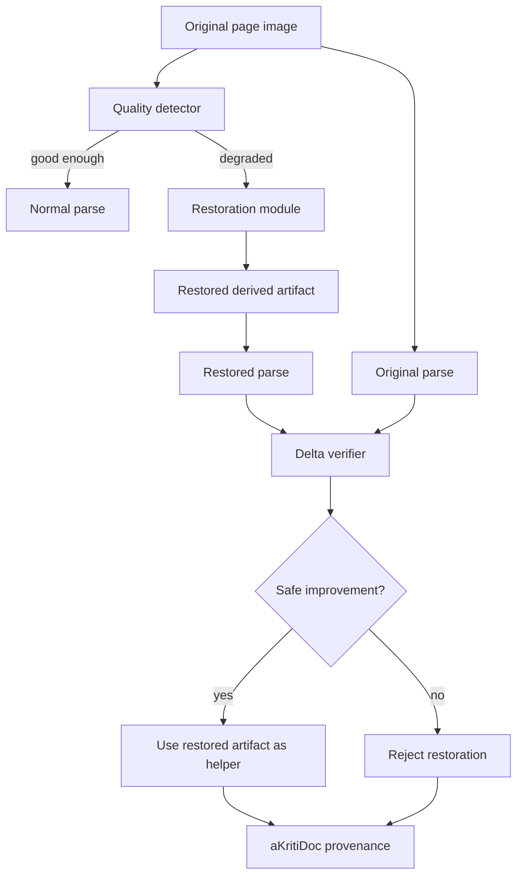

# aKriti Restoration and Diffusion Module

**Status:** Draft implementation spec  
**Date:** 2026-05-20  
**Purpose:** Define the narrow role of diffusion/restoration in aKriti without letting it become the parser, evidence source, or reasoning engine.

## 1. Core decision

Diffusion is allowed in aKriti only as a restoration and enhancement lane.

```text
original document image
        |
        v
quality detector
        |
        +--> good enough -> normal parse
        |
        +--> degraded -> restoration candidate
                         |
                         v
                 parse original + restored
                         |
                         v
              compare and verify deltas
                         |
                         v
           accept derived help or reject
```

It is not:
- the core parser.
- the reasoning model.
- the source of truth.
- allowed to overwrite original evidence.

## 2. Allowed restoration tasks

| Task | Allowed? | Notes |
|---|---:|---|
| deblur | yes | only if text confidence improves and hallucination checks pass |
| denoise | yes | useful for old scans, compression artifacts, photocopies |
| contrast enhancement | yes | deterministic baseline first, learned model later |
| dewarp | yes | especially camera-captured pages |
| shadow removal | yes | common mobile scan issue |
| super-resolution | yes | high risk for invented glyphs; must be verified |
| inpainting missing characters | restricted | never silently trusted |
| generating missing words | no | this is hallucination, not restoration |
| style/artistic generation | no | irrelevant to document intelligence |

## 3. Evidence policy

```text
original page = evidence
restored page = derived artifact
restored text = derived interpretation
final answer = grounded claim with provenance
```

Rules:
- the original source artifact must always remain available.
- restored artifacts must include `derived_from`.
- any answer that depends on restored content must say so internally in provenance.
- legal/court workflows must prefer original citations and mark restored evidence as derived.

## 4. aKritiDoc representation

Restoration must produce derived artifacts, not mutate source blocks.

```json
{
  "artifact_id": "derived_restore_...",
  "kind": "restored_image",
  "source_refs": [
    {
      "page_id": "page_0001",
      "bbox": {
        "x": 0,
        "y": 0,
        "w": 1,
        "h": 1,
        "space": "normalized"
      }
    }
  ],
  "operation_id": "op_restore_...",
  "content": {
    "path": "...",
    "method": "deblur | denoise | dewarp | super_resolution | contrast",
    "parameters": {}
  },
  "confidence": {
    "restoration_quality": 0.82,
    "hallucination_risk": 0.18
  },
  "requires_user_approval": false
}
```

## 5. Verification policy

Restoration is accepted only if it improves measurable reading while preserving evidence.

Checks:
- original OCR/VLM parse.
- restored OCR/VLM parse.
- text delta.
- bbox alignment.
- glyph hallucination risk.
- confidence improvement.
- human review for high-impact pages.

Acceptance rule:

```text
accept restoration as helper only when:
  restored confidence improves
  text delta is explainable
  no suspicious new entities/amounts/dates appear
  source provenance remains intact
```

Reject restoration when:
- new names, amounts, dates, or legal section numbers appear only after restoration.
- restored text conflicts with visible original.
- improvement is cosmetic but text/layout quality does not improve.
- the output cannot be tied to a source region.

## 6. Deterministic baseline first

Before learned restoration, implement deterministic baselines:
- grayscale conversion.
- thresholding.
- adaptive contrast.
- deskew.
- crop cleanup.
- simple denoise.
- morphology for scanned text.

Learned/diffusion restoration is justified only when deterministic baselines fail.

## 7. Learned restoration candidates

Use diffusion/image-to-image ideas as references:
- image-to-image restoration.
- ControlNet-like spatial conditioning.
- inpainting only for non-authoritative visual reconstruction.
- LCM/fast schedulers if local latency matters.

But final aKriti restoration should be trained/evaluated for document fidelity, not visual beauty.

## 8. Metrics

| Metric | Meaning |
|---|---|
| CER delta | restored parse vs original parse |
| WER delta | prose/text improvement |
| layout delta | reading order/block quality change |
| table delta | table cell quality change |
| hallucinated token rate | new unsupported text after restoration |
| entity drift | changed names/dates/amounts/sections |
| runtime cost | added latency and memory |

## 9. User experience

Workbench and LibreOffice should show restoration as a toggle:

```text
Original | Restored | Difference
```

For legal/court workflows:
- show source scan by default.
- allow restored view as assistive overlay.
- require explicit approval before derived text is used in edits.

## 10. Local model tiers

| Tier | Restoration role |
|---|---|
| `aKriti Tiny` | quality detection, route to restore/no-restore |
| `aKriti Small` | lightweight denoise/deblur/dewarp helpers |
| `aKriti Core` | decide whether restored parse improves document understanding |
| `aKriti Pro` | teacher/verifier for difficult damaged pages |

## 11. ASCII module flow

```text
page image
   |
   v
quality detector
   |
   +--> normal parse
   |
   +--> restoration module
              |
              v
        restored artifact
              |
              v
   original parse + restored parse
              |
              v
        verifier compares
              |
              v
      aKritiDoc derived refs
```

## 12. Mermaid module flow




## Research References

This doc is connected to the numbered research bibliography in `docs/akriti-research-reference-index.md`. Those references are engineering anchors for aKriti-owned implementation; they are not product dependencies. Only open weights may enter model lineage, and only with manifest provenance.
