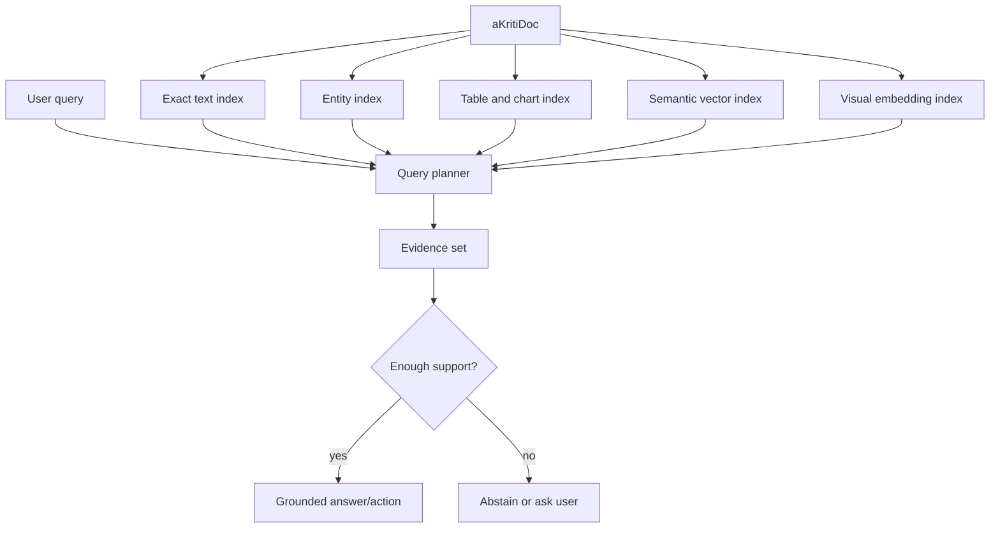

# aKriti Retrieval and Grounding Plan

**Status:** Draft implementation spec  
**Date:** 2026-05-20  
**Purpose:** Define exact search, semantic search, vector storage, and citation grounding for aKriti.

## 1. Retrieval principle

aKriti retrieval is not vector-only RAG.

```text
exact evidence first
semantic expansion second
model synthesis third
provenance always
```

This matters because documents contain names, dates, amounts, clauses, page numbers, exhibit references, table cells, and legal phrases where approximate semantic retrieval can silently fail.

## 2. Retrieval layers

| Layer | Use |
|---|---|
| exact text index | names, amounts, dates, citations, clauses, headings |
| layout index | page, block, bbox, reading order, region proximity |
| entity index | people, organizations, courts, laws, sections, dates, amounts |
| table index | cells, row/column labels, numeric ranges |
| chart index | axes, legends, series, extracted values |
| semantic vector index | paraphrase and conceptual search |
| visual embedding index | thumbnails, figures, chart/diagram similarity |

## 3. Index unit

Index `aKritiDoc` units, not raw chunks only.

```json
{
  "id": "idx_blk_...",
  "doc_id": "doc_...",
  "page_id": "page_0001",
  "block_id": "blk_...",
  "cell_id": null,
  "chart_id": null,
  "text": "...",
  "bbox": {},
  "type": "paragraph | table_cell | chart_axis | caption | heading",
  "language": "hi",
  "script": "Devanagari",
  "metadata": {},
  "embedding_refs": []
}
```

## 4. Embedding strategy

Use local embeddings where possible.

Candidate roles:
- multilingual sentence embeddings for text blocks.
- domain-tuned embeddings for legal/court documents later.
- visual embeddings for thumbnails, figures, charts, and FilterTube.
- separate embeddings for table cells and headings if needed.

Embedding policy:
- keep embeddings derived and reproducible.
- store model name/version.
- never treat vector similarity as evidence by itself.

## 5. FAISS vs Qdrant role

| Tool | aKriti role |
|---|---|
| FAISS | fast local/offline vector index, research, embedded desktop, batch eval |
| Qdrant | richer local/server vector store with metadata filtering and multi-vector records |

Default path:

```text
prototype with FAISS
use Qdrant when metadata filtering and persistent collections matter
keep exact index independent of vector DB
```

## 6. Query planner

```text
user query
    |
    v
query classifier
    |
    +--> exact lookup needed?
    +--> table/chart lookup needed?
    +--> semantic expansion needed?
    +--> visual region needed?
    |
    v
candidate evidence set
    |
    v
grounded answer or abstain
```

Query classes:
- fact lookup.
- summarization.
- table lookup.
- chart question.
- visual question.
- translation/rewrite.
- edit request.
- legal/court evidence search.

## 7. Citation format

Every answer should cite evidence in machine-usable form:

```json
{
  "answer": "...",
  "citations": [
    {
      "doc_id": "doc_...",
      "page_id": "page_0003",
      "block_id": "blk_...",
      "cell_id": null,
      "bbox": {},
      "quote": "...",
      "support": "direct | inferred | derived",
      "confidence": 0.91
    }
  ],
  "unsupported_claims": []
}
```

Legal/high-stakes answers should prefer direct support. If only inferred support exists, say so.

## 8. Abstention rule

The model must abstain when:
- no evidence is retrieved.
- evidence conflicts.
- only weak semantic matches exist.
- a requested claim cannot be grounded.
- OCR/layout confidence is too low.

Abstention is a product feature, not a failure.

## 9. Retrieval evaluation

Metrics:
- exact hit recall.
- semantic recall.
- citation page accuracy.
- bbox overlap accuracy.
- table cell hit accuracy.
- chart evidence hit accuracy.
- false-positive retrieval rate.
- answer abstention accuracy.

## 10. ASCII retrieval flow

```text
aKritiDoc
    |
    +--> exact index
    +--> entity index
    +--> table/chart index
    +--> vector index
    +--> visual index
              |
              v
          query planner
              |
              v
        grounded evidence
              |
              v
       answer / action / abstain
```

## 11. Mermaid retrieval flow




## Research References

This doc is connected to the numbered research bibliography in `docs/akriti-research-reference-index.md`. Those references are engineering anchors for aKriti-owned implementation; they are not product dependencies. Only open weights may enter model lineage, and only with manifest provenance.
