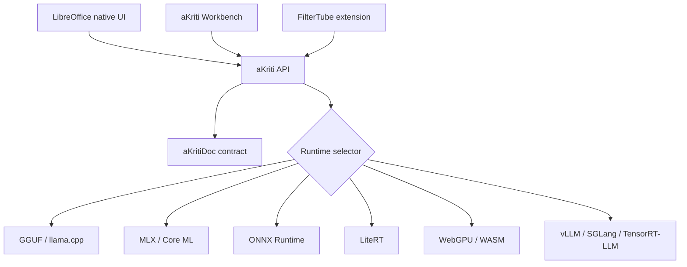

# aKriti Runtime and Deployment Matrix

**Status:** Draft lock for implementation planning  
**Date:** 2026-05-20  
**Purpose:** Define how aKriti models and APIs should run across local apps, LibreOffice, browser, desktop, and cloud.

## 1. Runtime principle

aKriti should be runtime-agnostic at the API layer and runtime-specific at the package layer.

```text
same aKriti API contract
different optimized runtime backend per device
same aKritiDoc output contract
```

## 2. Runtime targets

| Runtime | Main use | Strength | Risk |
|---|---|---|---|
| `llama.cpp/GGUF` | CPU, Apple Silicon, consumer GPUs | broadest local deployment, simple packaging | VLM support and advanced kernels may lag |
| `MLX` | Mac M-series | excellent Apple local prototyping | Apple-only |
| `ONNX Runtime` | cross-platform inference | broad app integration | conversion and dynamic vision paths can be painful |
| `LiteRT` | Android/iOS/edge | mobile/edge path, NPU future | ecosystem still moving for LLM/VLM workloads |
| `Core ML` | macOS/iOS | native Apple packaging | conversion constraints |
| `WebGPU/WASM` | browser/extension | FilterTube and private local web inference | memory limits, browser fragmentation |
| `CUDA/PyTorch` | research and training | fastest iteration | not product-local |
| `vLLM/SGLang/TensorRT-LLM` | server/cloud/workstation | throughput and batching | heavier deployment |

## 3. Model tier to runtime mapping

| Tier | GGUF | MLX | ONNX | LiteRT/Core ML | WebGPU | vLLM/SGLang/TensorRT |
|---|---:|---:|---:|---:|---:|---:|
| `aKriti Tiny` | yes | yes | yes | yes | yes | optional |
| `aKriti Small` | yes | yes | yes | yes | possible | optional |
| `aKriti Core` | yes | yes | possible | selective | hard but watch | yes |
| `aKriti Pro` | limited | limited | possible | no | no | yes |
| `Kriti` action layer | yes | yes | yes | yes | yes | yes |

## 4. LibreOffice native integration

LibreOffice should not directly embed every runtime.

Preferred design:

```text
LibreOffice C++/UNO/sidebar/canvas
        |
        v
local aKriti service or library boundary
        |
        v
runtime backend selected by installed model package
```

Reasons:
- LibreOffice remains stable and upstream-friendly.
- model packages can update independently.
- user compute determines runtime selection.
- document edits still happen through native LibreOffice APIs.

Native edit flow:

```text
selection/page/document -> aKriti request -> aKritiDoc result -> preview patch -> user approval -> UNO/native edit
```

## 5. FilterTube browser path

FilterTube should use the smallest possible local path.

Initial target:
- thumbnail embedding/classification.
- semantic category filtering.
- simple visual captioning only if latency is acceptable.
- WebGPU first, WASM fallback only for tiny models.

Avoid:
- loading a 3B model in the extension as the default.
- cloud-only thumbnail analysis.
- unrestricted page/video scraping without explicit user control.

## 6. Quantization strategy

Use multiple quantized packages, not one universal package.

| Package | Use |
|---|---|
| `Q8` | reference local quality, regression checks |
| `Q6_K` | high-quality local desktop |
| `Q5_K_M` | quality-focused everyday local |
| `Q4_K_M` | default consumer local package |
| `Q3_K_M` | low-memory fallback |
| `INT4/NF4/AWQ/GPTQ/HQQ` | GPU-oriented packaging or training-time experiments |

Calibration should use aKriti document samples, not generic chat text.

Calibration set must include:
- Indic text pages.
- tables.
- charts.
- legal/court-like pages.
- scanned degraded pages.
- dense reports.
- thumbnails/images.

## 7. Memory and latency budgets

Initial product budgets:

| Surface | Target |
|---|---|
| FilterTube thumbnail classification | near-interactive, local, tiny model |
| LibreOffice selection action | under a few seconds for small selections |
| LibreOffice page analysis | acceptable async job with visible progress |
| full PDF parse | async with per-page progress and resumability |
| Workbench review | low-latency region reparse and verification |
| Vinti legal workflows | slower is acceptable if provenance is strong |

## 8. Runtime selection algorithm

```text
if browser extension:
    use WebGPU tiny model, fallback to server/user disabled mode
elif Apple Silicon:
    prefer MLX/Core ML for supported packages, fallback GGUF
elif CPU-only desktop:
    prefer GGUF Q4_K_M or smaller
elif GPU research source GPU local:
    prefer CUDA/vLLM/TensorRT for Pro/Core, GGUF for fallback
elif mobile:
    prefer LiteRT/Core ML package
else:
    use remote/workstation backend only with user consent
```

## 9. ASCII deployment diagram

```text
                      aKriti API
                          |
        +-----------------+------------------+
        |                 |                  |
        v                 v                  v
  LibreOffice        Workbench          FilterTube
  native UI          desktop/web        extension/mobile
        |                 |                  |
        +-----------------+------------------+
                          |
                          v
                    aKriti Runtime
                          |
      +---------+---------+---------+---------+
      |         |         |         |         |
      v         v         v         v         v
    GGUF       MLX      ONNX      LiteRT    WebGPU
```

## 10. Mermaid deployment diagram




## 11. Runtime package manifest handoff

See `docs/akriti-model-package-manifests.md` for the runtime package card fields that every GGUF, MLX, ONNX, LiteRT, Core ML, WebGPU, CUDA, TensorRT, vLLM, or SGLang package must provide before surface approval.

## Research References

This doc is connected to the numbered research bibliography in `docs/akriti-research-reference-index.md`. Those references are engineering anchors for aKriti-owned implementation; they are not product dependencies. Only open weights may enter model lineage, and only with manifest provenance.
