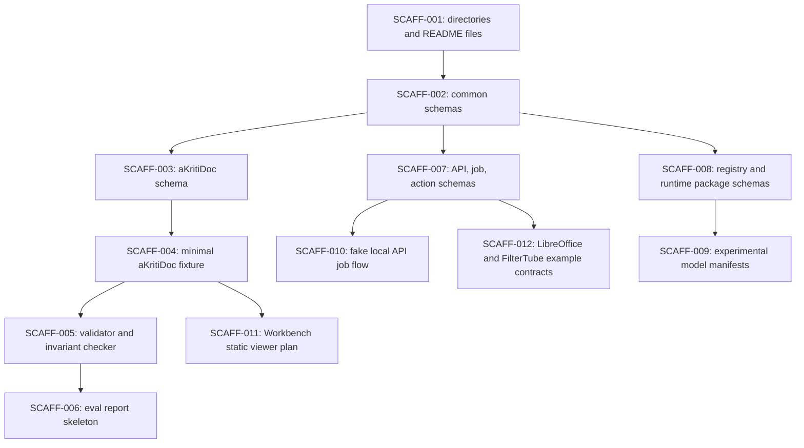

# aKriti Scaffold Implementation Backlog

**Status:** Draft execution backlog, created 2026-05-20  
**Purpose:** Convert the docs/research phase into small implementation tickets that create executable contracts before any model claims, training runs, or product integrations.

This backlog is derived from:

- `docs/akriti-docs-phase-completion-audit.md`
- `docs/akriti-repo-scaffold-blueprint.md`
- `docs/akriti-contract-schema-implementation-spec.md`
- `docs/akriti-fixture-corpus-and-experiment-cards.md`
- `docs/akriti-model-package-manifests.md`
- `docs/akriti-first-milestone-roadmap.md`

## 1. Backlog rule

Do not start with model training.

Start with artifacts that make future model work falsifiable:

```text
schemas -> fixtures -> validators -> eval reports -> registry manifests -> runtime adapter contracts -> API skeleton -> viewer/integration contracts
```

Any model, OCR reference, VLM base, quantization method, or runtime package must enter through this pipeline.

## 2. Dependency diagram

ASCII:

```text
SCAFF-001 directories/readmes
        |
        v
SCAFF-002 common schemas
        |
        +--> SCAFF-003 aKritiDoc schema
        |        |
        |        v
        |   SCAFF-004 minimal fixture
        |        |
        |        v
        |   SCAFF-005 validator/invariant checker
        |        |
        |        v
        |   SCAFF-006 eval report skeleton
        |
        +--> SCAFF-007 API/job/action schemas
        |        |
        |        v
        |   SCAFF-010 fake local API job flow
        |
        +--> SCAFF-008 registry/runtime schemas
                 |
                 v
            SCAFF-009 experimental model manifests
```

Mermaid:



## 3. Ticket format

Every implementation ticket should use this shape:

```markdown
## SCAFF-XXX: {title}

- Goal:
- Inputs:
- Outputs:
- Dependencies:
- Acceptance criteria:
- Must not do:
- Related docs:
```

## 4. Phase A: repository skeleton

### SCAFF-001: Create scaffold directories and README files

- Goal: Create the first repo shape without adding model weights, private data, or large artifacts.
- Inputs: `akriti-repo-scaffold-blueprint.md`.
- Outputs:
  - `schemas/README.md`
  - `fixtures/README.md`
  - `evals/README.md`
  - `registry/README.md`
  - `packages/README.md`
  - `services/README.md`
  - `runtimes/README.md`
  - `apps/README.md`
  - `integrations/README.md`
  - `tools/README.md`
- Dependencies: none.
- Acceptance criteria:
  - Every created directory states allowed artifacts and forbidden artifacts.
  - `fixtures/README.md` says private docs are not allowed without explicit consent.
  - `registry/README.md` says manifests are allowed, weights are not.
  - `integrations/vinti/README.md` states Vinti is downstream and not aKriti v1 implementation scope.
- Must not do:
  - no model downloads.
  - no raw private documents.
  - no runtime-specific code yet.
- Related docs:
  - `akriti-repo-scaffold-blueprint.md`
  - `akriti-security-privacy-local-first.md`

### SCAFF-002: Add shared common schemas

- Goal: Create reusable schema components used by all later contracts.
- Inputs: `akriti-contract-schema-implementation-spec.md`.
- Outputs:
  - `schemas/common/id.schema.json`
  - `schemas/common/timestamp.schema.json`
  - `schemas/common/bbox.schema.json`
  - `schemas/common/source-ref.schema.json`
  - `schemas/common/confidence.schema.json`
  - `schemas/common/provenance.schema.json`
  - `schemas/common/error.schema.json`
  - `schemas/common/privacy.schema.json`
  - `schemas/common/runtime-stats.schema.json`
- Dependencies: SCAFF-001.
- Acceptance criteria:
  - Bbox schema requires `x`, `y`, `w`, `h`, `space`, and `page_id`.
  - Confidence schema supports `overall`, per-task values, `label`, and `reasons`.
  - Provenance schema supports `created_by`, `source_refs`, `method`, and `verification_status`.
  - Privacy schema defaults are documented as local-only, no remote, no training reuse.
- Must not do:
  - no module-specific fields in common schemas.
  - no hidden open-ended source-critical fields outside `metadata`.
- Related docs:
  - `akriti-contract-schema-implementation-spec.md`

## 5. Phase B: aKritiDoc executable contract

### SCAFF-003: Add `aKritiDoc` v0 schema

- Goal: Turn `aKritiDoc` prose into the first executable JSON Schema.
- Inputs:
  - `akriti-akritidoc-schema-v0.md`
  - `akriti-contract-schema-implementation-spec.md`
- Outputs:
  - `schemas/akritidoc/v0.schema.json`
  - `schemas/akritidoc/block.schema.json`
  - `schemas/akritidoc/span.schema.json`
  - `schemas/akritidoc/table.schema.json`
  - `schemas/akritidoc/chart.schema.json`
  - `schemas/akritidoc/visual-artifact.schema.json`
  - `schemas/akritidoc/derived-artifact.schema.json`
  - `schemas/akritidoc/verification.schema.json`
- Dependencies: SCAFF-002.
- Acceptance criteria:
  - Source, pages, blocks, spans, tables, charts, images, derived artifacts, confidence, provenance, and verification are represented.
  - `unknown` block type is allowed.
  - Visual blocks are first-class.
  - Derived artifacts must reference source refs.
  - Source text and derived text are structurally separate.
- Must not do:
  - no free-text-only final output contract.
  - no OCR-only schema that cannot represent charts/tables/images/actions.
- Related docs:
  - `akriti-akritidoc-schema-v0.md`

### SCAFF-004: Add minimal valid `aKritiDoc` fixture

- Goal: Provide one tiny fixture that exercises the core schema.
- Inputs:
  - SCAFF-003 schema.
  - `akriti-fixture-corpus-and-experiment-cards.md`.
- Outputs:
  - `fixtures/akritidoc/expected/minimal-page.akritidoc.json`
  - `fixtures/manifests/fixture-index.jsonl`
  - `fixtures/manifests/dataset-cards/akriti-golden-25.md` as initial card template.
- Dependencies: SCAFF-003.
- Acceptance criteria:
  - Fixture has one source, one page, one heading block, one paragraph block, one visual block, and one low-confidence/review-worthy field.
  - Every block has provenance.
  - Every bbox points to a valid page.
  - Fixture manifest marks source as synthetic or public/local-safe.
- Must not do:
  - no real private document.
  - no model-generated labels pretending to be verified truth.
- Related docs:
  - `akriti-fixture-corpus-and-experiment-cards.md`

### SCAFF-005: Add schema validator and invariant checker skeleton

- Goal: Validate shape and basic cross-reference invariants.
- Inputs:
  - SCAFF-003 schema.
  - SCAFF-004 fixture.
- Outputs:
  - `tools/validators/README.md`
  - validator command skeleton.
  - invariant checker skeleton.
  - invalid examples for missing provenance, invalid bbox, missing source ref, and source overwrite patch.
- Dependencies: SCAFF-004.
- Acceptance criteria:
  - Valid fixture is expected to pass.
  - Invalid examples are expected to fail for named reasons.
  - Cross-reference checks are separated from JSON Schema checks.
- Must not do:
  - no broad test suite yet.
  - no model quality claims.
- Related docs:
  - `akriti-contract-schema-implementation-spec.md`

## 6. Phase C: API, actions, eval, and registry

### SCAFF-006: Add eval report skeleton and first metric definitions

- Goal: Create the first eval shape before comparing any candidate model.
- Inputs:
  - `akriti-evaluation-harness.md`
  - `akriti-fixture-corpus-and-experiment-cards.md`
- Outputs:
  - `evals/reports/experiment-report.schema-or-template.md`
  - `evals/metrics/schema-validity.md`
  - `evals/metrics/text-cer-wer.md`
  - `evals/metrics/bbox-iou.md`
  - `evals/metrics/reading-order.md`
  - `evals/metrics/citation-grounding.md`
  - `evals/failure-taxonomy/README.md`
- Dependencies: SCAFF-005.
- Acceptance criteria:
  - Report template includes quality, provenance, runtime, safety, and decision fields.
  - Metrics distinguish schema validity from model quality.
  - Failure taxonomy starts with OCR, layout, table, chart, translation, confidence, runtime, and provenance categories.
- Must not do:
  - no benchmark leaderboard yet.
  - no unmeasured “better model” claims.
- Related docs:
  - `akriti-evaluation-harness.md`

### SCAFF-007: Add API/job/action/export schemas

- Goal: Make product flows validate before service code exists.
- Inputs:
  - `akriti-api-job-lifecycle-and-errors.md`
  - `akriti-export-conversion-edit-contracts.md`
  - `akriti-owned-module-interface-contracts.md`
- Outputs:
  - `schemas/api/request-envelope.schema.json`
  - `schemas/api/response-envelope.schema.json`
  - `schemas/api/job.schema.json`
  - `schemas/api/progress-event.schema.json`
  - `schemas/api/error.schema.json`
  - `schemas/modules/module-request.schema.json`
  - `schemas/modules/module-response.schema.json`
  - `schemas/modules/akritidoc-patch.schema.json`
  - `schemas/actions/edit-patch.schema.json`
  - `schemas/actions/review-item.schema.json`
  - `schemas/exports/export-request.schema.json`
  - `schemas/exports/export-artifact.schema.json`
- Dependencies: SCAFF-002.
- Acceptance criteria:
  - Jobs can represent queued, running, waiting_for_review, complete, failed, and cancelled.
  - High-risk edit patches require preview and user approval.
  - Module responses can succeed, partially succeed, fail, abstain, or request review.
  - Privacy flags are present in request envelope.
- Must not do:
  - no direct native edit application.
  - no silent cloud fallback.
- Related docs:
  - `akriti-api-job-lifecycle-and-errors.md`

### SCAFF-008: Add registry and runtime package schemas

- Goal: Make model-package claims validate before any model artifact is accepted.
- Inputs:
  - `akriti-model-package-manifests.md`
  - `akriti-model-registry-release-gates.md`
- Outputs:
  - `schemas/registry/model-manifest.schema.json`
  - `schemas/registry/runtime-package.schema.json`
  - `schemas/registry/capability-card.schema.json`
- Dependencies: SCAFF-002.
- Acceptance criteria:
  - Model manifest requires `weights_origin`, lineage, training, capabilities, eval evidence, confidence policy, runtime packages, release status.
  - Runtime package manifest requires runtime, format, quantization, platforms, files/checksums, requirements, measured performance fields.
  - `default-local` is invalid unless eval evidence and runtime package card exist.
- Must not do:
  - no model weights committed.
  - no external OCR/VLM runtime dependency listed as final product dependency.
- Related docs:
  - `akriti-model-package-manifests.md`

### SCAFF-009: Add experimental placeholder model manifests

- Goal: Create honest placeholders for model tiers without implying readiness.
- Inputs: SCAFF-008.
- Outputs:
  - `registry/models/akriti-tiny-router-owned-thumb-v0.json`
  - `registry/models/akriti-small-text-open-derived-indic-v0.json`
  - `registry/models/akriti-core-doc-open-derived-akritidoc-v0.json`
  - `registry/models/akriti-pro-teacher-open-derived-doc-v0.json`
  - `registry/models/kriti-action-owned-lo-v0.json`
- Dependencies: SCAFF-008.
- Acceptance criteria:
  - Every manifest status is `experimental`.
  - Every open-derived placeholder states open-weight lineage is not final ownership.
  - No placeholder is approved for high-stakes legal/Vinti use.
  - No runtime package is claimed unless a package card exists.
- Must not do:
  - no fake eval evidence.
  - no “production ready” wording.
- Related docs:
  - `akriti-model-package-manifests.md`

## 7. Phase D: service and product contract proofs

### SCAFF-010: Add fake local API job flow over fixture

- Goal: Prove parse job lifecycle without any model.
- Inputs:
  - SCAFF-004 fixture.
  - SCAFF-007 schemas.
- Outputs:
  - `services/akriti_api/README.md`
  - fake request/response examples.
  - queued/running/complete job examples.
- Dependencies: SCAFF-004, SCAFF-007.
- Acceptance criteria:
  - Fake job points to fixture `aKritiDoc` artifact.
  - Progress events are representable.
  - Errors use standard error object.
  - Privacy fields are present.
- Must not do:
  - no real parser yet.
  - no network/cloud behavior.
- Related docs:
  - `akriti-api-job-lifecycle-and-errors.md`

### SCAFF-011: Add Workbench static viewer implementation plan

- Goal: Create the first UI build ticket from the fixture contract.
- Inputs:
  - SCAFF-004 fixture.
  - `akriti-workbench-ui-product-spec.md`.
- Outputs:
  - `apps/workbench/README.md`
  - static viewer task list.
  - overlay/review/provenance component boundaries.
- Dependencies: SCAFF-004.
- Acceptance criteria:
  - Viewer consumes `aKritiDoc` fixture, not arbitrary model output.
  - Low-confidence/review items are first-class UI state.
  - Source vs derived content is visually distinguishable.
- Must not do:
  - no AI chat before evidence/provenance display exists.
- Related docs:
  - `akriti-workbench-ui-product-spec.md`

### SCAFF-012: Add LibreOffice and FilterTube example contracts

- Goal: Make integrations contract-first and keep Vinti downstream.
- Inputs:
  - `akriti-libreoffice-native-integration.md`
  - `akriti-filtertube-local-vlm-plan.md`
  - `akriti-vinti-court-downstream-spec.md`
- Outputs:
  - `integrations/libreoffice/request-envelope.example.json`
  - `integrations/libreoffice/edit-patch.example.json`
  - `integrations/filtertube/thumbnail-record.example.json`
  - `integrations/filtertube/filter-decision.example.json`
  - `integrations/vinti/README.md`
- Dependencies: SCAFF-007.
- Acceptance criteria:
  - LibreOffice examples are selection-grounded and preview-only.
  - FilterTube examples support rules-first local decision flow.
  - Vinti README states downstream-only boundary.
- Must not do:
  - no native C++/UNO implementation yet.
  - no WebGPU model package yet.
  - no Vinti product implementation yet.
- Related docs:
  - `akriti-libreoffice-native-integration.md`
  - `akriti-filtertube-local-vlm-plan.md`
  - `akriti-vinti-court-downstream-spec.md`

## 8. First model-related ticket, intentionally delayed

### MODEL-001: Candidate bake-off setup only after scaffold

This ticket is blocked until SCAFF-001 through SCAFF-010 are complete.

- Goal: Compare first candidates under the same aKritiDoc/eval/registry constraints.
- Inputs:
  - fixture corpus.
  - validator/invariant checker.
  - eval report skeleton.
  - registry manifest schema.
- Allowed candidates:
  - deterministic born-digital parser baseline.
  - one open VLM candidate.
  - one OCR/reference baseline if locally available.
  - one tiny embedding/thumbnail baseline.
- Acceptance criteria:
  - every candidate output is converted to `aKritiDoc` or marked failed.
  - every claim has eval evidence.
  - every external system remains baseline/teacher/reference only.

## 9. Backlog acceptance gate

The backlog is ready to execute when:

```text
[ ] docs are committed or intentionally left uncommitted
[ ] SCAFF-001 through SCAFF-012 are accepted as the first implementation batch
[ ] no one starts model training before SCAFF-005 and SCAFF-006 exist
[ ] no model package claim appears before SCAFF-008 and SCAFF-009 exist
[ ] Vinti remains downstream-only
```

## 10. Summary

This backlog turns the research/docs pass into executable work without losing the aKriti direction:

```text
owned modules
VLM-first document intelligence
local-first runtime path
verification-first outputs
honest open-weight lineage
Vinti as downstream long-term project
```

## Research References

This doc is connected to the numbered research bibliography in `docs/akriti-research-reference-index.md`. Those references are engineering anchors for aKriti-owned implementation; they are not product dependencies. Only open weights may enter model lineage, and only with manifest provenance.
