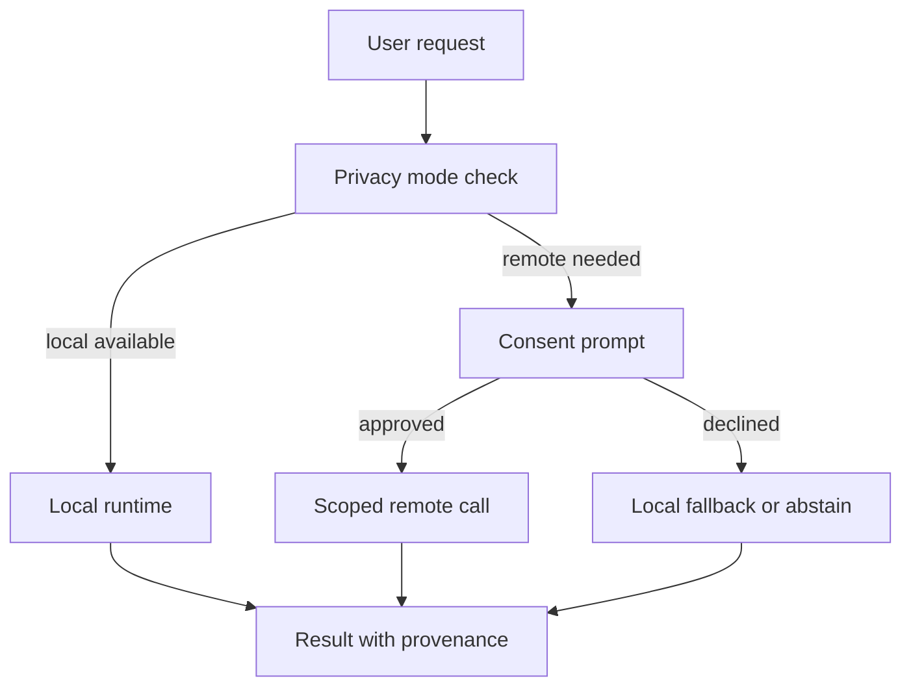

# aKriti Security, Privacy, and Local-First Policy

**Status:** Draft implementation spec  
**Date:** 2026-05-20  
**Purpose:** Define privacy, consent, storage, cloud fallback, and high-stakes document safety rules for aKriti.

## 1. Core principle

aKriti is local-first.

```text
local document
  -> local parse by default
  -> local artifacts by default
  -> no cloud upload without explicit user consent
```

This is essential for LibreOffice, court/legal workflows, personal documents, and Indian-language public access.

## 2. Data handling modes

| Mode | Meaning |
|---|---|
| `local-only` | all parsing/inference/storage local |
| `local-plus-optional-remote` | user may explicitly send selected content to remote model |
| `remote-workstation` | user-controlled server/workstation backend |
| `cloud-teacher` | research/training mode only, explicit consent and dataset rules |

Default product mode:

```text
local-only
```

## 3. Consent boundaries

Explicit consent required for:
- remote model calls.
- storing user documents beyond active session.
- using corrections for training.
- telemetry that includes content or derived text.
- sharing documents across devices.

No consent needed for:
- ephemeral local processing.
- local-only cache.
- local model selection.
- non-content crash logs, if enabled separately.

## 4. Artifact storage

Artifact categories:
- source file.
- rendered page image.
- crops.
- restored images.
- `aKritiDoc`.
- embeddings.
- edit patches.
- exported files.
- correction events.

Storage policy:
- source remains user-owned.
- derived artifacts should be deletable.
- embeddings count as derived sensitive data.
- local caches need clear expiry/deletion controls.

## 5. Privacy metadata

Every job should carry:

```json
{
  "privacy": {
    "mode": "local-only",
    "allow_remote": false,
    "allow_training_reuse": false,
    "retention": "session | local-cache | user-saved",
    "content_telemetry": false
  }
}
```

## 6. High-stakes mode

Enable conservative behavior for:
- legal/court documents.
- financial records.
- medical records.
- identity documents.
- contracts.
- government documents.

High-stakes behavior:
- cite all claims.
- abstain on weak evidence.
- mark restored evidence as derived.
- prefer comments/suggestions over direct edits.
- require user approval for edits.
- show unsupported claims.
- preserve original documents.

## 7. Remote fallback policy

Remote fallback is allowed only when:
- local model cannot perform the task.
- user explicitly enables remote.
- selected content scope is visible.
- user sees which model/service will receive content.
- result provenance marks remote use.

Never silently fall back to remote.

## 8. Model package trust

Model packages should include:
- source/provenance.
- license.
- checksum.
- capabilities.
- known limitations.
- safety mode compatibility.

Reject unknown model packages by default in high-stakes mode.

## 9. FilterTube privacy

FilterTube default:
- no watch history upload.
- no cloud thumbnail analysis.
- local semantic filtering.
- user-controlled rules.
- local explanations.

If remote mode exists later, it must be opt-in per user.

## 10. LibreOffice privacy

LibreOffice default:
- active document stays local.
- selected text/page sent only to local aKriti service.
- remote mode disabled by default.
- sidebar clearly shows runtime mode.

## 11. Training data privacy

User corrections are not training data by default.

Training reuse requires:
- explicit consent.
- redaction option.
- dataset manifest.
- ability to revoke if stored locally before release.

## 12. ASCII policy flow

```text
user request
    |
    v
privacy mode check
    |
    +--> local allowed -> local runtime
    |
    +--> remote needed -> ask explicit consent
                           |
                           +--> yes -> scoped remote call
                           +--> no  -> local-only fallback/abstain
```

## 13. Mermaid policy flow




## Research References

This doc is connected to the numbered research bibliography in `docs/akriti-research-reference-index.md`. Those references are engineering anchors for aKriti-owned implementation; they are not product dependencies. Only open weights may enter model lineage, and only with manifest provenance.
