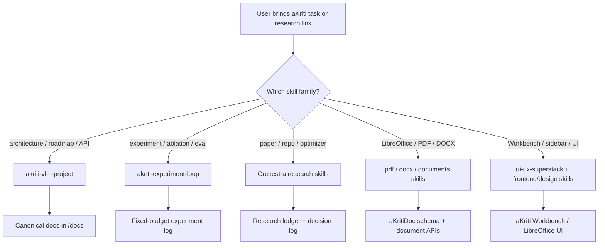

# aKriti Skills Map

This file records the skills/tooling setup for future aKriti Codex sessions.

## Source-of-truth custom skills

Project copies live in:

```text
/Users/devanshvarshney/aKriti/agent-skills/
```

Installed Codex copies live in:

```text
/Users/devanshvarshney/.codex/skills/
```

To sync the project-defined aKriti skills onto another device after cloning the private repo:

```bash
mkdir -p ~/.codex/skills
rsync -a /path/to/aKriti/agent-skills/ ~/.codex/skills/
```

Restart Codex after syncing so the new skill metadata is loaded.

## aKriti-specific skills created

| Skill | Purpose |
|---|---|
| `akriti-vlm-project` | Central project-memory skill for aKriti/Kriti/Vinti/FilterTube/LibreOffice VLM architecture, APIs, model family, runtime, and research decisions. |
| `akriti-experiment-loop` | Controlled research loop for training, fine-tuning, distillation, quantization, OCR/VLM evals, and Karpathy-autoresearch-style ablations. |

## Existing installed skills already useful for aKriti

| Area | Skills |
|---|---|
| Planning/spec work | `planner`, `plan-harder`, `swarm-planner` |
| Documents/PDF/Office | `pdf`, `ag-pdf`, `docx`, `doc`, `documents`, `spreadsheets`, `presentations` |
| UI/UX surfaces | `ui-ux-superstack`, `claude-frontend`, `frontend-design`, `frontend-responsive-design-standards`, `design-system-patterns`, `design-taste-frontend`, `high-end-visual-design`, `redesign-existing-projects`, `accessibility` |
| Codebase understanding | `understand-anything:*`, `read-github`, `context7`, `github:*` |
| OpenAI/API work | `openai-docs`, `openai-docs-skill` |

## Orchestra research skills installed

Installed from [Orchestra-Research/AI-research-SKILLs](https://github.com/Orchestra-Research/AI-research-SKILLs), which lists 98 AI research skills across architecture, tokenization, fine-tuning, optimization, evaluation, inference, RAG, multimodal, and research-artifact categories.

| Area | Installed skills |
|---|---|
| Research orchestration | `0-autoresearch-skill` |
| Model architecture | `litgpt`, `nanogpt`, `torchtitan` |
| Tokenization | `huggingface-tokenizers`, `sentencepiece` |
| Fine-tuning | `peft`, `axolotl`, `unsloth` |
| Data curation | `nemo-curator` |
| Post-training/RL | `trl-fine-tuning`, `grpo-rl-training`, `verl`, `slime` |
| Distributed training | `accelerate`, `pytorch-fsdp2`, `deepspeed` |
| Optimization/quantization | `awq`, `bitsandbytes`, `flash-attention`, `gguf`, `gptq`, `hqq`, `ml-training-recipes` |
| Evaluation | `lm-evaluation-harness` |
| Inference serving | `llama-cpp`, `vllm`, `tensorrt-llm`, `sglang` |
| RAG/retrieval | `faiss`, `sentence-transformers`, `qdrant` |
| Structured generation | `guidance`, `instructor`, `outlines` |
| Multimodal baselines | `clip`, `llava`, `blip-2`, `segment-anything`, `stable-diffusion`, `whisper` |
| Emerging techniques | `knowledge-distillation`, `long-context`, `model-pruning`, `speculative-decoding` |
| Research writing/artifacts | `academic-plotting`, `ml-paper-writing`, `systems-paper-writing`, `brainstorming-research-ideas`, `compiler`, `research-manager`, `rigor-reviewer` |

## Karpathy autoresearch decision

[karpathy/autoresearch](https://github.com/karpathy/autoresearch) is useful as an experiment-management pattern, not as a direct dependency. Its core idea is a small, real training setup with a fixed time budget where an agent proposes code changes, trains briefly, compares one metric, and keeps or discards changes. For aKriti this should become an internal experiment harness around OCR/VLM/document benchmarks rather than an uncontrolled self-modifying training agent.

## Duplicate cleanup

Byte-identical duplicate skills that existed in both `~/.codex/skills` and `~/.agents/skills` were moved out of active discovery into:

```text
/Users/devanshvarshney/.agents/skills-duplicates-backup-20260519/
```

Non-identical same-purpose skills were not removed.

## Mermaid overview


