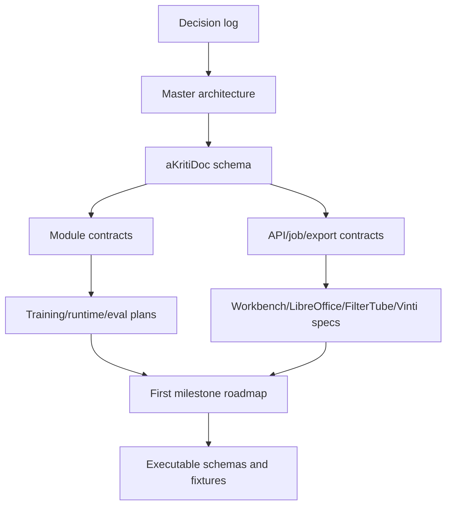

# aKriti Spec Coverage and Traceability

**Status:** Draft audit map  
**Date:** 2026-05-20  
**Purpose:** Provide a single traceability map from aKriti’s locked objectives to the documentation/spec files that support implementation.

## 1. Core objective coverage

| Objective | Evidence/spec files |
|---|---|
| VLM-first, not OCR-first | `akriti-master-architecture.md`, `akriti-decision-log.md`, `akriti-baseline-bakeoff-protocol.md` |
| not a wrapper around external systems | `akriti-decision-log.md`, `akriti-training-and-distillation-plan.md`, `akriti-model-registry-release-gates.md` |
| owned modules and model-family path | `akriti-owned-module-interface-contracts.md`, `akriti-training-and-distillation-plan.md`, `akriti-model-registry-release-gates.md` |
| local-first/offline-first product | `akriti-security-privacy-local-first.md`, `akriti-runtime-deployment-matrix.md`, `akriti-hardware-experiment-plan.md` |
| verification-first document intelligence | `akriti-evaluation-harness.md`, `akriti-confidence-voting-review.md`, `akriti-retrieval-grounding-plan.md` |
| aKritiDoc as canonical representation | `akriti-akritidoc-schema-v0.md`, `akriti-master-architecture.md`, `akriti-api-capability-map.md` |
| LibreOffice native integration | `akriti-libreoffice-native-integration.md`, `akriti-export-conversion-edit-contracts.md`, `akriti-kriti-reasoning-action-module.md` |
| FilterTube local semantic filtering | `akriti-filtertube-local-vlm-plan.md`, `akriti-hardware-experiment-plan.md`, `akriti-runtime-deployment-matrix.md` |
| Vinti/court downstream project | `akriti-vinti-court-downstream-spec.md`, `akriti-security-privacy-local-first.md`, `akriti-retrieval-grounding-plan.md` |
| multilingual/Indic direction | `akriti-multilingual-indic-translation-plan.md`, `akriti-training-and-distillation-plan.md`, `akriti-evaluation-harness.md` |
| diffusion/restoration boundary | `akriti-restoration-diffusion-module.md`, `akriti-decision-log.md`, `akriti-confidence-voting-review.md` |
| Karpathy/autoresearch-style experimentation | `akriti-experiment-loop.md`, `akriti-hardware-experiment-plan.md`, `akriti-baseline-bakeoff-protocol.md` |

## 2. Documentation layers

| Layer | Files |
|---|---|
| north-star architecture | `akriti-master-architecture.md`, `akriti-decision-log.md` |
| APIs and job behavior | `akriti-api-capability-map.md`, `akriti-api-job-lifecycle-and-errors.md` |
| canonical schema | `akriti-akritidoc-schema-v0.md` |
| module contracts | `akriti-owned-module-interface-contracts.md` |
| training/model ownership | `akriti-training-and-distillation-plan.md`, `akriti-model-registry-release-gates.md` |
| runtime/deployment | `akriti-runtime-deployment-matrix.md`, `akriti-hardware-experiment-plan.md` |
| eval/research | `akriti-evaluation-harness.md`, `akriti-experiment-loop.md`, `akriti-baseline-bakeoff-protocol.md` |
| data | `akriti-data-engine-and-synthetic-documents.md` |
| retrieval/grounding | `akriti-retrieval-grounding-plan.md` |
| confidence/review | `akriti-confidence-voting-review.md` |
| restoration | `akriti-restoration-diffusion-module.md` |
| multilingual/translation | `akriti-multilingual-indic-translation-plan.md` |
| product surfaces and downstream projects | `akriti-workbench-ui-product-spec.md`, `akriti-libreoffice-native-integration.md`, `akriti-filtertube-local-vlm-plan.md`, `akriti-vinti-court-downstream-spec.md` |
| action/reasoning | `akriti-kriti-reasoning-action-module.md` |
| security/privacy | `akriti-security-privacy-local-first.md` |
| implementation bridge | `akriti-repository-implementation-map.md`, `akriti-first-milestone-roadmap.md` |
| skills/tooling | `akriti-skills-map.md` |
| research source ledger | `akriti-research-ledger.md` |

## 3. Requirement-to-first-implementation mapping

| Requirement | First implementation artifact |
|---|---|
| validate `aKritiDoc` | JSON Schema/Pydantic schema plus validator CLI |
| run parse job lifecycle | local API fake job runner returning fixture `aKritiDoc` |
| show document overlays | Workbench static fixture viewer |
| expose low confidence | review queue object and overlay highlight |
| exact-first search | exact text/entity/table index over fixture `aKritiDoc` |
| semantic retrieval | local embedding index after exact index exists |
| export table | CSV/HTML export from table object |
| safe LibreOffice edit | request envelope plus preview-only patch |
| FilterTube tiny path | thumbnail/title fixture and baseline scorer |
| restoration lane | deterministic cleanup baseline and delta verifier |
| model registry | registry manifest for dummy/local candidate package |
| bake-off report | candidate result JSON plus failure samples |

## 4. Invariants

These invariants must hold across all future code:

```text
1. No final user-facing output bypasses aKritiDoc.
2. No external OCR/VLM system is product identity.
3. No high-stakes answer ships without provenance.
4. No remote fallback happens silently.
5. No derived text overwrites source text without trace.
6. No low-confidence high-impact region is hidden from the user.
7. No model package becomes default without eval and registry entry.
8. No training reuse of user documents happens without consent.
9. No diffusion/restoration output is treated as original evidence.
10. No native LibreOffice edit applies without safe patch semantics.
```

## 5. Remaining open design gaps

These are not blockers for first code, but need future refinement:

| Gap | When to refine |
|---|---|
| exact JSON Schema details for every `aKritiDoc` field | Milestone 1 |
| concrete Workbench visual design system | before UI implementation |
| exact LibreOffice C++/UNO object mapping | before LibreOffice prototype |
| exact model candidate list after open-weight base-family candidate release | after model card/open weights exist |
| dataset licensing policy for public court/legal data | before Vinti dataset work |
| Vinti repo/product boundary | after aKriti v1 APIs and model packages stabilize |
| mobile LiteRT/Core ML implementation details | after desktop/browser proof |
| full security threat model | before external users |

## 6. Completion readiness for docs phase

The documentation phase is ready to move to code when:

```text
all new docs are committed
agent-skills/ is committed or intentionally excluded
deleted specs/ artifacts are intentional
README index points to all active specs
first milestone roadmap is accepted
```

## 7. ASCII traceability map

```text
locked decisions
      |
      v
architecture + aKritiDoc
      |
      +--> module contracts
      +--> API/job/export contracts
      +--> runtime/training/eval plans
      +--> product surface specs
      |
      v
first milestone roadmap
      |
      v
schemas + fixtures + evals + API skeleton
```

## 8. Mermaid traceability map



## 9. Scaffold blueprint coverage

See `docs/akriti-repo-scaffold-blueprint.md` for the implementation scaffold that connects the documentation phase to executable schemas, fixtures, evals, registry manifests, runtime adapter contracts, Workbench inspection, LibreOffice contracts, and FilterTube contracts.

## 10. Contract schema implementation coverage

See `docs/akriti-contract-schema-implementation-spec.md` for the executable schema plan that turns prose contracts into JSON Schema files, invariant checks, valid/invalid examples, and schema-phase completion criteria.

## 11. Docs-phase audit coverage

See `docs/akriti-docs-phase-completion-audit.md` for the current-state audit that maps the documentation set to the active research/docs objective and identifies the remaining executable scaffold gaps before implementation/model claims.

## Research References

This doc is connected to the numbered research bibliography in `docs/akriti-research-reference-index.md`. Those references are engineering anchors for aKriti-owned implementation; they are not product dependencies. Only open weights may enter model lineage, and only with manifest provenance.
