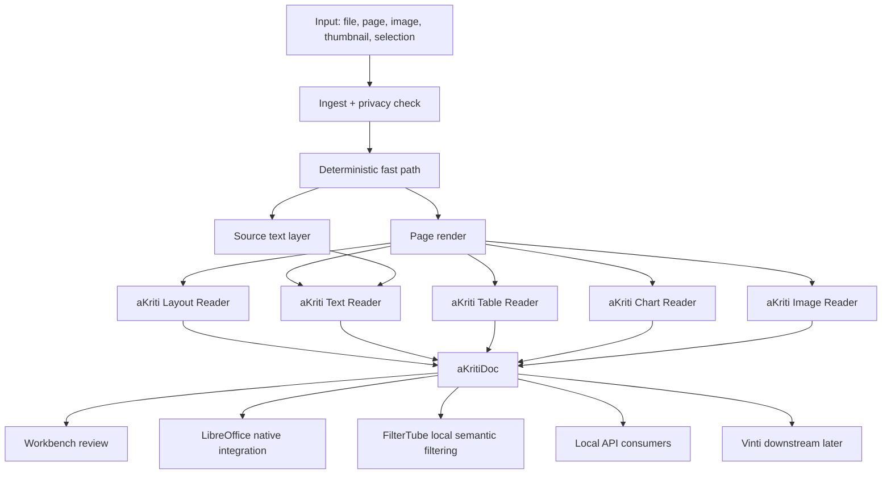
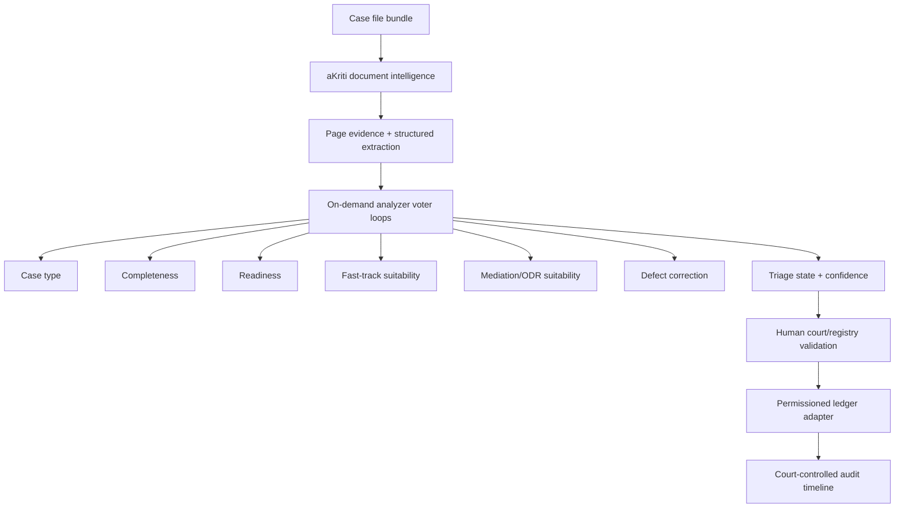

# aKriti System Diagrams and Feature Map

**Status:** Consolidated visual map, created 2026-05-20  
**Purpose:** Provide one readable map of what aKriti can do, how the modules connect, and how Workbench, LibreOffice, FilterTube, and Vinti relate to the core platform.

This file summarizes diagrams spread across the architecture, API, schema, runtime, fixture, and integration specs.

## 1. Product boundary

```text
aKriti
  = local-first document VLM/model-family platform
  = owned schemas + APIs + modules + evals + runtime packaging + product surfaces
  != wrapper around external OCR/VLM tools
  != OCR-only product
  != Vinti itself
```

Vinti boundary:

```text
Vinti is a long-term separate downstream court/legal product based on aKriti.
```

## 2. Capability map

```text
                               aKriti
                                  |
       +--------------------------+---------------------------+
       |                          |                           |
       v                          v                           v
  understand docs            transform docs              act on docs
       |                          |                           |
  +----+----+------+       +------+-------+------+       +----+------+
  |         |      |       |              |      |       |           |
 OCR/text layout images  translate     rewrite export  explain   edit patch
  |         |      |       |              |      |       |           |
 tables   charts figures preserve     summarize convert verify   preview/apply
```

Core capability families:

| Family | Examples |
|---|---|
| Text/OCR | read visible text, Indic OCR, code-mixed text, degraded scans, form fields |
| Layout | blocks, reading order, headings, footers, forms, multi-column pages |
| Tables | detect tables, cells, merged cells, CSV/HTML/ODS export, table QA |
| Charts | chart type, axes, legends, data reconstruction, chart QA, chart creation later |
| Images/Figures | figure extraction, captions as derived artifacts, signatures/stamps, diagrams |
| Restoration | dewarp, denoise, deblur, contrast repair, character restoration with drift checks |
| Translation | layout-preserving Indic/multilingual translation, terminology preservation |
| Retrieval/QA | exact-first search, citations, bbox/page grounding, semantic support layer |
| Edits/Actions | previewable patches, LibreOffice native edits, comments, rewrites, chart/table creation |
| Export/Conversion | PDF, DOCX, ODT, ODS, CSV, HTML, Markdown, JSON, aKritiDoc |

## 3. End-to-end document flow

ASCII:

```text
file / page / image / thumbnail / selection
              |
              v
        ingest + privacy check
              |
              v
      deterministic fast path
              |
      +-------+--------+
      |                |
      v                v
  page render      source text layer
      |                |
      +-------+--------+
              |
              v
        aKriti modules
              |
 +------------+-------------+-------------+-------------+
 |            |             |             |             |
 v            v             v             v             v
Layout      Text          Table         Chart         Image
Reader      Reader        Reader        Reader        Reader
 |            |             |             |             |
 +------------+-------------+-------------+-------------+
              |
              v
          aKritiDoc
              |
 +------------+-------------+-------------+-------------+
 |            |             |             |             |
 v            v             v             v             v
Workbench  LibreOffice   FilterTube    API users     Vinti later
review     native edits  local filter  local apps    court product
```

Mermaid:



## 4. aKritiDoc as the center

```text
                           aKritiDoc
                               |
        +----------------------+----------------------+
        |                      |                      |
        v                      v                      v
    source truth          derived artifacts        operations
        |                      |                      |
 text/spans/bboxes     translation/summary       edit patches
 tables/charts         caption/restoration       review actions
 figures/images        extracted data            export plans
        |                      |                      |
        +----------------------+----------------------+
                               |
                               v
                provenance + confidence + verification
```

Rule:

```text
Generated summaries, captions, translations, corrected OCR, restored text, and rewritten text are derived artifacts. They do not overwrite source truth silently.
```

## 5. Model-family map

```text
                        aKriti model family
                                  |
       +--------------------------+---------------------------+
       |                          |                           |
       v                          v                           v
 aKriti Tiny                aKriti Small                 aKriti Core
 routing/triage             OCR assist/page              ~3B local document
 thumbnails                 understanding                VLM/reasoning
       |                          |                           |
       +--------------------------+---------------------------+
                                  |
                                  v
                            aKriti Pro
                       teacher/verifier/cloud
                                  |
                                  v
                                Kriti
                    typed reasoning/action layer
```

Tier roles:

| Tier | Role | First surfaces |
|---|---|---|
| `aKriti Tiny` | routing, embeddings, thumbnail classification, ambiguity triage | FilterTube, page triage |
| `aKriti Small` | OCR assist, page/image understanding, simple local tasks | Workbench, local desktop, mobile later |
| `aKriti Core` | primary around-3B local document VLM/reasoning | Workbench, LibreOffice, local API |
| `aKriti Pro` | teacher, verifier, data generator, cloud/workstation model | training/eval, hard docs |
| `Kriti` | typed reasoning/action/document command layer | LibreOffice, Workbench, API |

## 6. Runtime deployment map

```text
                          aKriti Runtime Selector
                                      |
        +-----------------------------+------------------------------+
        |                             |                              |
        v                             v                              v
Desktop local                    Browser local                   Server/workstation
        |                             |                              |
 +------+------+                +-----+------+                 +-----+------+
 |             |                |            |                 |            |
 v             v                v            v                 v            v
GGUF          MLX             WebGPU       WASM              vLLM         SGLang
CPU/GPU       Mac             FilterTube   fallback          teacher      batches
        |
        v
ONNX / LiteRT / Core ML as portability and mobile lanes
```

Device intent:

| Device/profile | Intended aKriti role |
|---|---|
| RTX 2060 6GB | quantized local inference, tiny/small experiments, small LoRA/QLoRA, eval harness |
| Mac M4 24GB | MLX/Core ML/local UX/runtime, Apple-local packaging, developer workstation |
| CPU-only user machine | GGUF Tiny/Small/Core low-memory packages where possible |
| Browser/WebGPU | FilterTube tiny path, thumbnail/title semantic filtering |
| H100/H200/Blackwell cloud | teacher generation, serious fine-tuning, distillation, large eval sweeps |

## 7. Verification and confidence loop

```text
candidate output
      |
      v
schema validation
      |
      v
provenance check
      |
      v
confidence scoring
      |
      +------------------+
      |                  |
      v                  v
 high confidence      low/conflicting confidence
      |                  |
      v                  v
 usable result       review item / abstention / voting
      |                  |
      +---------+--------+
                |
                v
         user-visible evidence
```

Low confidence is a product state, not debug noise.

Examples that must surface low confidence:

```text
confusable OCR spans
ambiguous table structure
uncertain chart values
translation entity drift
restoration-created entity changes
unsupported document QA answer
high-risk edit patch
```

## 8. Voting/disagreement path

```text
same source region
      |
      v
multiple passes / candidates
      |
      v
compare candidates
      |
 +----+--------------------+
 |                         |
 v                         v
agreement              disagreement
 |                         |
 v                         v
accept with evidence    create review item
                           |
                           v
                  show alternatives + confidence
```

Voting is allowed only when candidates are grounded. If all candidates are ungrounded, the system should abstain.

## 9. Product surface map

```text
                         aKriti API + aKritiDoc
                                  |
       +--------------------------+--------------------------+
       |                          |                          |
       v                          v                          v
  aKriti Workbench          LibreOffice Native            FilterTube
  review cockpit            sidebar/canvas/edit           local filtering
       |                          |                          |
 overlays                  selection-grounded             thumbnail/title
 review queue              preview patches                tiny classifier
 citations                 comments/edits                 WebGPU/WASM
 exports                   Writer/Calc                    user rules first
       |
       v
   Vinti later
   court/legal product
   exact citations + review + abstention
```

## 10. LibreOffice action flow

```text
user selection in Writer/Calc/Impress
              |
              v
LibreOffice request envelope
              |
              v
local aKriti API / Runtime
              |
              v
aKritiDoc evidence + action proposal
              |
              v
preview patch / comment / suggestion
              |
      +-------+-------+
      |               |
      v               v
 user approves     user rejects
      |               |
      v               v
native UNO edit   no document mutation
```

Rule:

```text
No native LibreOffice edit applies without preview/safe patch semantics.
```

## 11. FilterTube local semantic filtering flow

```text
video title + channel + thumbnail
              |
              v
user rules first
              |
              v
tiny text/vision classifier
              |
      +-------+--------+
      |                |
      v                v
clear decision      ambiguous
      |                |
      v                v
allow/block/downrank  optional tiny VLM / ask user / keep neutral
```

Rule:

```text
Do not default to loading a 3B model in the browser. Use tiny local paths first.
```

## 12. Vinti downstream flow

```text
aKriti core platform stabilizes
        |
        v
aKritiDoc + exact search + provenance + review queues
        |
        v
Vinti court/legal document workflows
        |
        v
chronologies / entity extraction / citation-backed assistance / deadline review
```

Vinti must remain conservative:

```text
assist procedure and structure;
do not judge or issue verdicts.
```

## 13. Training and ownership path

```text
schemas + fixtures + evals
          |
          v
baselines and runtime and behavior comparisons
          |
          v
open-weight base + aKriti adapters
          |
          v
verified distillation data
          |
          v
aKriti Tiny/Small/Core students
          |
          v
owned modules and runtime packages
```

Ownership ladder:

| Level | Meaning |
|---|---|
| L0 | reference systems only |
| L1 | open-weight base candidate |
| L2 | aKriti adapter over open weights |
| L3 | distilled aKriti student |
| L4 | owned aKriti modules |
| L5 | packaged aKriti runtime family |

## 14. Research-to-experiment flow

```text
new research idea
      |
      v
classify: adopt-now / prototype / watch / reject
      |
      v
map to owned module lane
      |
      v
choose fixture + metric + fixed budget
      |
      v
run only after scaffold exists
      |
      v
promote / park / reject
```

Roadmap-changing evidence must be one of:

```text
reproducible benchmark result
new required eval metric
safer product invariant
smaller/faster local runtime package
better owned-module training target
clearer verification workflow
```

## 15. First executable path

```text
SCAFF-001 directories/readmes
        |
        v
SCAFF-002 common schemas
        |
        v
SCAFF-003 aKritiDoc schema
        |
        v
SCAFF-004 minimal fixture
        |
        v
SCAFF-005 validator/invariant checker
        |
        v
SCAFF-006 eval skeleton
        |
        v
MODEL-001 allowed later
```

No model bake-off should happen before the first scaffold path exists.

## External Research Boundary

In every diagram, `aKriti` boxes mean aKriti-owned modules. External OCR/VLM/video/reasoning projects are not boxes in the production system. They belong only in research notes as inspiration, benchmark opponents, or open-weight sources if explicitly adopted.

Detailed named research notes are kept outside the project repo.

## Research References

This doc is connected to the numbered research bibliography in `docs/akriti-research-reference-index.md`. Those references are engineering anchors for aKriti-owned implementation; they are not product dependencies. Only open weights may enter model lineage, and only with manifest provenance.

## 15. Vinti court-logistics and ledger map

Vinti uses aKriti as the document-intelligence layer and adds court-logistics triage plus a permissioned distributed-ledger state layer.

```text
case file
  |
  v
aKriti parse
  |
  v
page evidence + structured extraction + confidence
  |
  v
Vinti analyzer loops
  |
  +--> case type
  +--> file completeness
  +--> procedural readiness
  +--> fast-track suitability
  +--> mediation/ODR suitability
  +--> defect correction
  +--> evidence support
  +--> disagreement/human validation
  |
  v
triage state
  |
  v
human validation
  |
  v
permissioned ledger adapter
  |
  v
court-controlled workflow history
```



## 16. Vinti implementation language split

```text
aKriti training/research: Python + PyTorch/JAX
aKriti local runtime: Rust/C++/runtime-specific exporters
Vinti workbench: TypeScript/React
Vinti orchestration services: Go/Rust/TypeScript/Python depending on deployment
Vinti permissioned-ledger adapter: Go-first for Fabric/NBF-style targets; Kotlin/JVM if Corda-like
```

The ledger layer is an adapter. The product should support a court-controlled permissioned network without tying the core aKriti model or Vinti UI to one ledger runtime.
