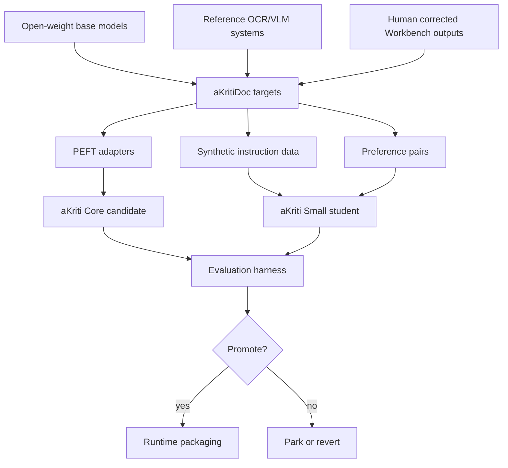

# aKriti Training and Distillation Plan

**Status:** Draft lock for implementation planning  
**Date:** 2026-05-20  
**Purpose:** Convert aKriti from a research direction into a staged model-training and ownership path.

## 1. Training philosophy

aKriti should not begin by training a full VLM from scratch.

The correct order is:

```text
schema -> harness -> baselines -> adapters -> distillation -> owned modules -> optimized runtimes
```

Reason:
- without `aKritiDoc`, training targets are unstable.
- without evals, improvements are vibes.
- without baselines, owned models cannot be judged.
- without distillation, small local models will not inherit enough document behavior.

## 2. Ownership ladder

```text
Level 0: Reference-only systems
  external OCR specialist, external OCR specialist, external OCR specialist, external OCR/layout toolkit, external document-layout reference, open VLM architecture reference-style systems

Level 1: Open-weight base
  open-weight base-family candidate-family or other open VLM/LLM weights used as initialization

Level 2: aKriti adapters
  LoRA/QLoRA/DoRA/adaptive low-rank training reference-style adapters trained on aKritiDoc tasks

Level 3: aKriti distilled student
  Small/Core checkpoints trained from teacher outputs, human corrections, and verified data

Level 4: aKriti owned modules
  Layout/Text/Table/Chart/Image/Translation/Restoration modules trained and evaluated as aKriti components

Level 5: aKriti runtime family
  Tiny/Small/Core/Pro packaged for local, browser, LibreOffice, server, and cloud targets
```

Do not claim a checkpoint is fully owned until its training recipe, data, evals, and artifact provenance justify that claim.

## 3. Model family training lanes

| Tier | Target use | Initial method | Ownership target |
|---|---|---|---|
| `aKriti Tiny` | routing, thumbnail triage, embeddings, quick page decisions | distilled classifiers, embedding heads, tiny VLM heads | fully owned first |
| `aKriti Small` | OCR assist, page/image understanding, low-compute local tasks | PEFT plus distillation, then compact student | owned student |
| `aKriti Core` | around 3B main local document VLM and reasoning model | open-weight base plus adapters, then staged distillation | owned aKriti checkpoint path |
| `aKriti Pro` | teacher, verifier, workstation/cloud model | strongest open base plus tool/harness supervision | teacher/verifier, not default local target |
| `Kriti` | reasoning/action/document-command layer | instruction tuning and constrained tool/action generation | owned behavior layer |

## 4. Data curriculum

Training should follow a document curriculum, not a generic chat-only curriculum.

```text
Stage A: page primitives
  text spans, blocks, coordinates, reading order, image regions

Stage B: structured artifacts
  tables, charts, forms, equations, captions, stamps, signatures

Stage C: transformations
  translate, rewrite, extract, summarize, reformat, export

Stage D: provenance
  every answer linked to page, bbox, cell, chart, paragraph, or source artifact

Stage E: document actions
  safe edits, LibreOffice patches, spreadsheet/chart generation, PDF/DOCX export

Stage F: multilingual and Indic stress
  native-script OCR, code-mixed Hinglish, translation, legal/document terminology
```

## 5. PEFT and adapter strategy

Use parameter-efficient fine-tuning for fast iteration before deeper ownership.

Recommended starting points:
- LoRA rank `8` for quick prototypes.
- LoRA rank `16` for general document behavior.
- LoRA rank `32+` only when a layer/task demonstrably underfits.
- Use QLoRA when GPU memory is the bottleneck.
- Prefer per-module rank growth experiments for document-specialist layers.

Adapter categories:

| Adapter | Scope |
|---|---|
| `layout-adapter` | block detection, reading order, region semantics |
| `ocr-adapter` | text reading from page crops, Indic scripts, degraded scans |
| `table-adapter` | grid/cell extraction, CSV/HTML reconstruction |
| `chart-adapter` | chart type, axes, legend, data-series extraction |
| `translation-adapter` | layout-preserving multilingual conversion |
| `action-adapter` | structured edit/tool calls and LibreOffice commands |

Adapter promotion rule:

```text
No adapter becomes part of default aKriti Core until it improves its target metric without worsening provenance, hallucination, or runtime beyond threshold.
```

## 6. Distillation strategy

Distillation is the bridge between open weights and owned local models.

Teacher sources:
- aKriti Pro runs.
- high-quality open VLM/LLM outputs.
- reference OCR/document systems used only as teachers or baselines.
- human-corrected Workbench reviews.
- deterministic extraction for born-digital PDFs.

Student targets:
- `aKriti Tiny` for classifiers, routing, and thumbnail/semantic filters.
- `aKriti Small` for local OCR assist and fast page understanding.
- `aKriti Core` for general document understanding with local deployment.

Distillation types:

| Type | Use |
|---|---|
| response distillation | teacher generates structured `aKritiDoc` outputs |
| preference distillation | student learns corrected output over plausible wrong output |
| logit distillation | only when teacher/student tokenizers and infra make it practical |
| reverse-KL style distillation | useful for preserving diverse valid generations |
| verifier distillation | train small models to detect bad OCR/layout/grounding outputs |

## 7. Tokenizer plan

Do not change tokenizers inside borrowed pretrained bases in v1.

For owned students:
- test grapheme-aware Unigram tokenizer with byte fallback.
- evaluate native Indic scripts separately from Hinglish.
- treat Hinglish as augmentation/alignment data.
- measure compression, OCR CER, translation quality, and runtime before adoption.

Tokenizer adoption gate:

```text
Adopt custom tokenizer only if it improves measured Indic/document behavior or runtime enough to justify migration cost.
```

## 8. Training loop requirements

Every serious run should record:

```text
run id
base model
adapter or full-finetune method
dataset slice
data provenance
training budget
hardware
loss curves
eval metrics
failure samples
decision: keep | revert | park
```

Use time-based budgets for early exploration so RTX 2060, Mac M4, and cloud runs remain comparable.

## 9. Hardware use

| Hardware | Best role |
|---|---|
| RTX 2060 6GB | tiny models, quantized inference, small LoRA experiments, data/eval harness checks |
| Mac M4 24GB | MLX/Core ML/external research sourcel inference, local UX/runtime checks, small student experiments |
| H100/H200/Blackwell cloud | teacher generation, serious fine-tuning, distillation data, large eval sweeps |
| Browser/WebGPU | FilterTube tiny VLM/classifier, thumbnail semantics, local privacy-preserving inference |

## 10. ASCII training flow

```text
          open weights / teacher models / reference systems
                            |
                            v
                 aKritiDoc training targets
                            |
          +-----------------+------------------+
          |                 |                  |
          v                 v                  v
      adapters        synthetic data       human corrections
          |                 |                  |
          +-----------------+------------------+
                            |
                            v
                  distilled aKriti students
                            |
          +-----------------+------------------+
          |                 |                  |
          v                 v                  v
   Tiny local models   Small/Core local   Pro verifier/teacher
```

## 11. Mermaid training flow




## 12. Package manifest handoff

See `docs/akriti-model-package-manifests.md` for the ownership, lineage, capability, runtime, confidence, and release-evidence fields required before any trained adapter, distilled student, or owned module checkpoint can be promoted.

## External Research Boundary

Distillation in aKriti means distillation from aKriti-owned or open-weight-derived internal mentor models, not from third-party OCR/VLM/PDF systems. External systems can inspire task design, failure taxonomies, and benchmark structure, but their outputs must not be used as ground-truth labels, teacher traces, verifier decisions, or product-runtime dependencies.

Detailed named research notes are kept outside the project repo.

## Research References

This doc is connected to the numbered research bibliography in `docs/akriti-research-reference-index.md`. Those references are engineering anchors for aKriti-owned implementation; they are not product dependencies. Only open weights may enter model lineage, and only with manifest provenance.

## Periodic Low-Rank Merge Training Lane

Status: later prototype for `aKriti Core`, not a v1 blocker. Reference anchor: [24].

The training idea is to run repeated low-rank adaptation cycles:

```text
start from manifest-recorded open-weight base
train low-rank update on aKriti document tasks
merge update into model weights
reset adapter state
repeat on the next task/corpus slice
```

Use this lane when the project has:

- Stable `aKritiDoc` fixtures.
- OCR/layout/table/chart task batches.
- An AdamW or standard adapter baseline.
- Evaluation gates for hallucination, exact text preservation, region grounding, translation quality, and low-confidence abstention.

Expected value:

- Lower memory pressure than full continued pretraining.
- More capacity accumulation than one static adapter.
- Better fit for document-domain adaptation than pure prompt tuning.

Risks:

- Merge/reset cycles can hide regressions if evaluation is weak.
- It is training-only; it does not solve inference/runtime packaging.
- It must not replace the first baseline training recipe.
