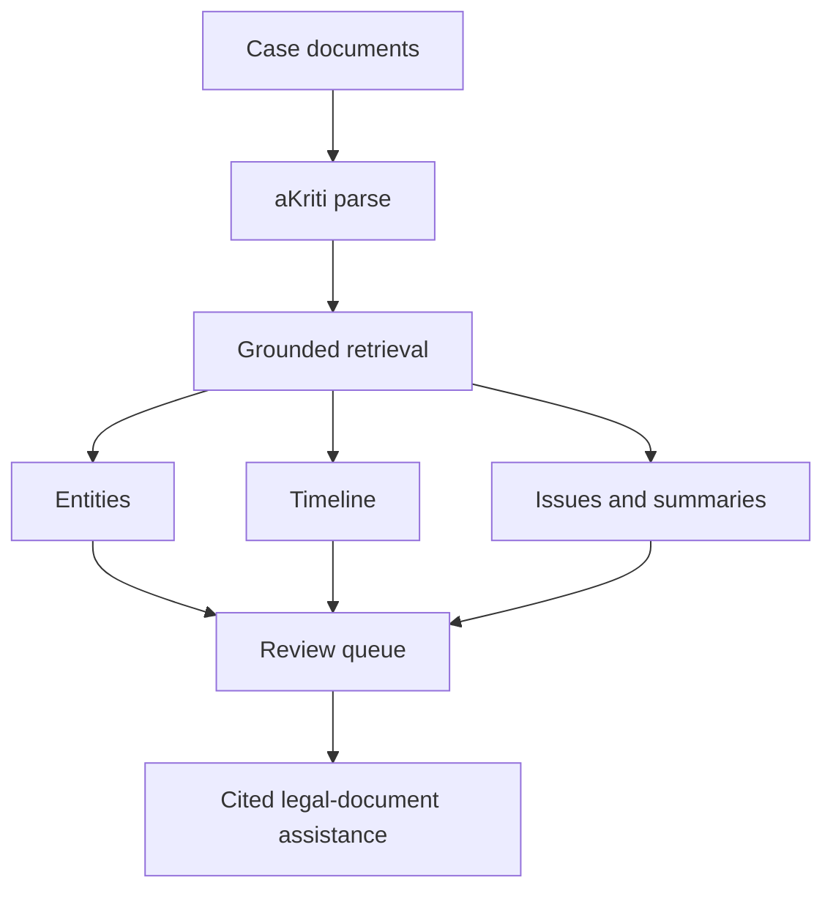

# Vinti Court Downstream Spec

**Status:** Draft downstream product spec  
**Date:** 2026-05-20  
**Purpose:** Define how aKriti can later support a court/legal document assistant without making the core aKriti project court-only.

## 1. Boundary

Vinti is a long-term, separate downstream project based on aKriti.

```text
aKriti = general multilingual document intelligence model/platform
Vinti = separate court/legal workflow product built later on top of aKriti
```

Do not optimize the core aKriti architecture only for courts. Build general document intelligence first. Vinti should become its own product/repo/surface later, with legal workflows and datasets layered on top of stable aKriti APIs, aKritiDoc, retrieval, verification, and model packages.

## 2. Vinti mission

Long term, Vinti should reduce document-handling burden by helping users:
- read court/legal documents.
- extract key facts.
- organize case timelines.
- translate legal documents.
- identify missing/conflicting information.
- summarize with citations.
- prepare structured notes.
- triage repetitive document work.

It must not pretend to be a lawyer or judge.

## 3. Core workflows

| Workflow | Output |
|---|---|
| case document ingestion | structured `aKritiDoc` with evidence |
| party/entity extraction | people, courts, advocates, laws, dates, amounts |
| timeline building | dated event list with citations |
| issue extraction | disputed facts/questions with evidence |
| order/judgment summary | structured summary with citations |
| translation | layout/entity-preserving derived artifact |
| document comparison | differences, contradictions, missing docs |
| evidence packet | cited excerpts with page/bbox references |

## 4. High-stakes safety

Vinti must use the strictest mode:
- exact search first.
- citations required.
- direct quotes preferred.
- abstain on weak evidence.
- low-confidence regions must be shown.
- restored evidence marked as derived.
- no legal advice claims.
- no hallucinated statutes/cases.
- no destructive edits without approval.

## 5. Case object

```json
{
  "case_id": "case_...",
  "documents": [],
  "entities": [],
  "timeline": [],
  "issues": [],
  "notes": [],
  "tasks": [],
  "audit_log": []
}
```

## 6. Legal entity object

```json
{
  "entity_id": "ent_...",
  "type": "person | organization | court | judge | advocate | statute | section | date | amount | place | case_number",
  "value": "...",
  "normalized_value": "...",
  "source_refs": [],
  "confidence": {},
  "needs_review": false
}
```

## 7. Timeline event object

```json
{
  "event_id": "evt_...",
  "date": "YYYY-MM-DD | unknown",
  "description": "...",
  "source_refs": [],
  "confidence": {},
  "conflicts": []
}
```

## 8. Court document QA

Answer requirements:

```json
{
  "answer": "...",
  "citations": [],
  "direct_quotes": [],
  "confidence": {},
  "unsupported_claims": [],
  "needs_review": false,
  "disclaimer": "This is document assistance, not legal advice."
}
```

## 9. Review queues

Vinti review queues should prioritize:
- amounts.
- dates.
- party names.
- case numbers.
- legal sections.
- orders/directions.
- deadlines.
- OCR-confused scans.
- translation ambiguities.

## 10. Data and ethics

Court/legal data handling:
- public data still needs careful use.
- private case documents are local-only by default.
- training reuse requires explicit consent.
- redaction tools should be available.
- audit logs should record generated outputs and user approvals.

## 11. Model specialization path

Vinti specialization should come after core aKriti works:

```text
aKritiDoc + eval harness
        |
        v
legal/court dataset manifests
        |
        v
entity/timeline/QA evals
        |
        v
Vinti adapter or student model
        |
        v
strict high-stakes release gate
```

Vinti-specific adapters, datasets, UX, and legal workflows should not block aKriti v1. They should consume aKriti capabilities once the core platform is stable.

## 12. Metrics

| Metric | Meaning |
|---|---|
| entity F1 | parties, dates, courts, sections, amounts |
| citation accuracy | answer support on correct page/region |
| timeline accuracy | correct event/date/source |
| hallucinated citation rate | invented or unsupported legal references |
| abstention accuracy | refuses when evidence missing |
| translation entity preservation | names/amounts/legal terms preserved |
| user correction rate | how often review changes output |

## 13. ASCII Vinti flow

```text
case documents
    |
    v
aKriti parse and grounding
    |
    v
entities + timeline + issues
    |
    v
review queue
    |
    v
cited summaries / translations / notes
```

## 14. Mermaid Vinti flow



## Research References

This doc is connected to the numbered research bibliography in `docs/akriti-research-reference-index.md`. Those references are engineering anchors for aKriti-owned implementation; they are not product dependencies. Only open weights may enter model lineage, and only with manifest provenance.
