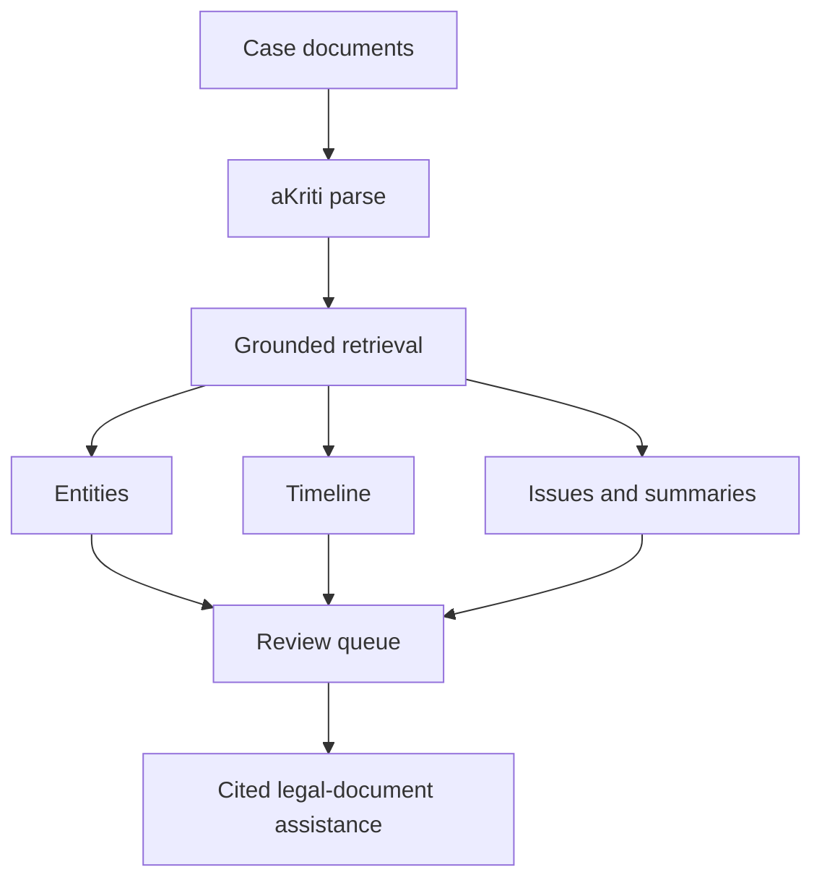

# Vinti Court Downstream Spec

**Status:** Draft downstream product spec  
**Date:** 2026-05-20  
**Purpose:** Define how aKriti can later support a court/legal document assistant without making the core aKriti project court-only.

## 1. Boundary

Vinti is a long-term, separate downstream project based on aKriti.

```text
aKriti = general multilingual document intelligence model/platform
Vinti = separate court/legal workflow product built later on top of aKriti
```

Do not optimize the core aKriti architecture only for courts. Build general document intelligence first. Vinti should become its own product/repo/surface later, with legal workflows and datasets layered on top of stable aKriti APIs, aKritiDoc, retrieval, verification, and model packages.

## 2. Vinti mission

Long term, Vinti should reduce document-handling burden by helping users:
- read court/legal documents.
- extract key facts.
- organize case timelines.
- translate legal documents.
- identify missing/conflicting information.
- summarize with citations.
- prepare structured notes.
- triage repetitive document work.

It must not pretend to be a lawyer or judge.

## 3. Core workflows

| Workflow | Output |
|---|---|
| case document ingestion | structured `aKritiDoc` with evidence |
| party/entity extraction | people, courts, advocates, laws, dates, amounts |
| timeline building | dated event list with citations |
| issue extraction | disputed facts/questions with evidence |
| order/judgment summary | structured summary with citations |
| translation | layout/entity-preserving derived artifact |
| document comparison | differences, contradictions, missing docs |
| evidence packet | cited excerpts with page/bbox references |

## 4. High-stakes safety

Vinti must use the strictest mode:
- exact search first.
- citations required.
- direct quotes preferred.
- abstain on weak evidence.
- low-confidence regions must be shown.
- restored evidence marked as derived.
- no legal advice claims.
- no hallucinated statutes/cases.
- no destructive edits without approval.

## 5. Case object

```json
{
  "case_id": "case_...",
  "documents": [],
  "entities": [],
  "timeline": [],
  "issues": [],
  "notes": [],
  "tasks": [],
  "audit_log": []
}
```

## 6. Legal entity object

```json
{
  "entity_id": "ent_...",
  "type": "person | organization | court | judge | advocate | statute | section | date | amount | place | case_number",
  "value": "...",
  "normalized_value": "...",
  "source_refs": [],
  "confidence": {},
  "needs_review": false
}
```

## 7. Timeline event object

```json
{
  "event_id": "evt_...",
  "date": "YYYY-MM-DD | unknown",
  "description": "...",
  "source_refs": [],
  "confidence": {},
  "conflicts": []
}
```

## 8. Court document QA

Answer requirements:

```json
{
  "answer": "...",
  "citations": [],
  "direct_quotes": [],
  "confidence": {},
  "unsupported_claims": [],
  "needs_review": false,
  "disclaimer": "This is document assistance, not legal advice."
}
```

## 9. Review queues

Vinti review queues should prioritize:
- amounts.
- dates.
- party names.
- case numbers.
- legal sections.
- orders/directions.
- deadlines.
- OCR-confused scans.
- translation ambiguities.

## 10. Data and ethics

Court/legal data handling:
- public data still needs careful use.
- private case documents are local-only by default.
- training reuse requires explicit consent.
- redaction tools should be available.
- audit logs should record generated outputs and user approvals.

## 11. Model specialization path

Vinti specialization should come after core aKriti works:

```text
aKritiDoc + eval harness
        |
        v
legal/court dataset manifests
        |
        v
entity/timeline/QA evals
        |
        v
Vinti adapter or student model
        |
        v
strict high-stakes release gate
```

Vinti-specific adapters, datasets, UX, and legal workflows should not block aKriti v1. They should consume aKriti capabilities once the core platform is stable.

## 12. Metrics

| Metric | Meaning |
|---|---|
| entity F1 | parties, dates, courts, sections, amounts |
| citation accuracy | answer support on correct page/region |
| timeline accuracy | correct event/date/source |
| hallucinated citation rate | invented or unsupported legal references |
| abstention accuracy | refuses when evidence missing |
| translation entity preservation | names/amounts/legal terms preserved |
| user correction rate | how often review changes output |

## 13. ASCII Vinti flow

```text
case documents
    |
    v
aKriti parse and grounding
    |
    v
entities + timeline + issues
    |
    v
review queue
    |
    v
cited summaries / translations / notes
```

## 14. Mermaid Vinti flow



## Research References

This doc is connected to the numbered research bibliography in `docs/akriti-research-reference-index.md`. Those references are engineering anchors for aKriti-owned implementation; they are not product dependencies. Only open weights may enter model lineage, and only with manifest provenance.

## 15. Current Vinti framing: court logistics infrastructure

Vinti should be framed as court logistics infrastructure, not legal reasoning automation.

```text
Vinti = AI triage + court-controlled permissioned ledger for case logistics
```

Vinti does not decide judgments. It helps court staff and judicial officers classify, prioritize, route, monitor, and audit case files before judicial time is spent.

Primary triage questions:

- what kind of case is this?
- is the file complete?
- is it procedurally ready?
- is it simple enough to fast-track?
- should it go to mediation/ODR?
- does it need defect correction?
- which pages support the recommendation?
- which analyzers disagreed?
- which human verified it?

## 16. Vinti architecture with aKriti and ledger boundary

```text
case file bundle
    |
    v
aKriti document intelligence
    - OCR/text/layout
    - Indic and mixed-script reading
    - stamps/signatures
    - tables/charts/forms/annexures
    - page-region evidence
    - confidence and restoration artifacts
    |
    v
Vinti analyzer orchestration
    - case-type analyzer
    - completeness analyzer
    - readiness analyzer
    - fast-track suitability analyzer
    - mediation/ODR suitability analyzer
    - defect-correction analyzer
    - evidence verifier
    - language/OCR dispute resolver
    |
    v
bounded odd-number voting loop
    |
    +--> agreement above threshold -> proposed triage state
    |
    +--> disagreement / low confidence -> reread, restore, critique, or human review
    |
    v
human court/registry validation
    |
    v
permissioned distributed ledger
    - document/page/extraction hashes
    - analyzer vote hashes
    - triage state
    - human validation event
    - party acknowledgement where needed
    - append-only workflow history
```

## 17. Permissioned distributed ledger implementation posture

The ledger layer should be designed as an adapter, not hardwired into aKriti.

Recommended split:

| Layer | Suggested language/tech | Reason |
|---|---|---|
| aKriti research/training | Python + PyTorch/JAX | model training, open-weight adaptation, experiments |
| aKriti local runtime service | Rust or C++ where needed | safety, performance, local deployment |
| Vinti API/orchestration | TypeScript, Go, Rust, or Python depending on service | product orchestration and review workflows |
| Vinti ledger adapter | Go-first for Fabric/NBF-style chaincode; Kotlin/JVM if Corda-like; backend abstracted | permissioned ledger ecosystems vary; product logic should not depend on one ledger runtime |
| Vinti workbench UI | TypeScript/React | split-pane page review, triage queue, ledger state view |

Go is a practical first choice for the permissioned-ledger adapter if the target environment is Hyperledger Fabric-style chaincode or similar government permissioned-ledger infrastructure. If a Corda-like notary model is selected, Kotlin/JVM may be more natural. Vinti should therefore define a ledger interface first and keep backend-specific implementation behind adapters.

```text
VintiLedgerAdapter
    submitCaseBundleHash()
    submitPageHash()
    submitExtractionHash()
    submitAnalyzerVoteHash()
    submitTriageState()
    submitHumanValidation()
    getCaseLedgerTimeline()
    verifyOffchainPayloadHash()
```

The ledger stores hashes and workflow states, not private case files.

## 18. National Blockchain Framework compatibility target

Vinti should be built to respect Indian public-sector permissioned-ledger direction and remain compatible with National Blockchain Framework-style requirements.

Design requirements:

- permissioned network, not public cryptocurrency infrastructure.
- court-controlled or government-controlled validator/notary nodes.
- off-chain encrypted case files and extraction payloads.
- on-chain hashes, state transitions, timestamps, and validation events.
- open API boundary for government integration.
- append-only case workflow history.
- privacy-preserving role-based access.
- audit exports for court/registry/supervisory review.

## 19. Vinti analyzer vote object

Each analyzer vote must be typed, evidence-grounded, and reviewable.

```json
{
  "vote_id": "vote_...",
  "case_id": "case_...",
  "question": "fast_track_suitability",
  "analyzer_role": "readiness_analyzer",
  "verdict": "yes | no | unclear | abstain",
  "confidence": 0.82,
  "evidence_refs": [
    {
      "page_id": "page_0014",
      "block_id": "blk_...",
      "bbox": {}
    }
  ],
  "rationale": "File has complete filing metadata but disputed annexure quality is low.",
  "disagreements": [],
  "requires_human_review": true,
  "created_by": {
    "module": "Vinti Analyzer",
    "model_id": "akriti-core-or-pro-package-id"
  }
}
```

## 20. Bounded loop for dispute resolution

Vinti can run on-demand voter loops for disputed page regions or triage questions.

Loop policy:

```text
1. initial read
2. independent analyzer votes
3. disagreement detection
4. targeted reread of disputed region
5. optional restoration and reread for degraded scans
6. analyzer critique of alternatives
7. final revote
8. accept, abstain, or human-review state
```

Hard limits:

- fixed max iterations per question.
- fixed token/runtime budget per loop.
- no hidden final answer when confidence remains low.
- human review is a valid successful output.
- every loop stores a compact trace for audit.

Decision labels:

```text
accepted
accepted_with_warning
needs_human_review
abstained
restoration_failed
insufficient_evidence
```

## 21. Indian-language and glyph-dispute handling

For confusing Indian-language characters, handwriting, degraded scans, or mixed-script text, aKriti/Vinti should not silently choose one character.

Required behavior:

- preserve original crop.
- produce candidate characters/words.
- run OCR reread and restoration reread separately.
- use diffusion/restoration output only as a derived artifact, never source truth.
- expose alternatives and confidence.
- mark unresolved spans in the page UI.
- route legal/financial/name/date/citation-bearing disputes to human review.

Example field:

```json
{
  "span_id": "span_...",
  "visible_text_candidate": "...",
  "alternatives": [
    { "text": "क", "confidence": 0.54 },
    { "text": "फ", "confidence": 0.31 }
  ],
  "restoration_used": true,
  "restoration_artifact_id": "derived_...",
  "decision": "needs_human_review",
  "reason": "confusable_devanagari_character_in_party_name"
}
```

## 22. Vinti page review UI requirement

The Vinti page UI must behave like a court-grade audit surface, not a chat window.

Page-level view:

```text
left pane: original page image / PDF render
right pane: structured blocks, extracted fields, analyzer votes, triage signals
center overlays: bboxes for paragraphs, stamps, signatures, tables, formulae, low-confidence spans
status bar: ledger verification, current triage state, human validation state
```

Low-confidence/disputed regions must be visible:

- amber glow for low confidence.
- red marker for conflict or possible entity drift.
- green/neutral marker for verified fields.
- hover extraction -> highlight source region.
- hover source region -> show extracted field/votes.
- click disputed span -> show candidates, restoration artifact, analyzer disagreement, and human-review action.

## Research References

Official public-sector context for Vinti includes the National Blockchain Framework and government case-flow/digitization material. Engineering references remain implementation anchors only; they are not product dependencies.
## Analyzer terminology

Reference anchor: [38].

`Vinti analyzer` is acceptable only as shorthand for a domain-specific court-logistics analyzer. The precise term is:

```text
Vinti Analyzer Pack
```

The split is:

```text
aKriti Analyzers
  generic document understanding:
  OCR confidence, language/script ambiguity, layout, grounding, tables, charts, entities, restoration drift, precision stability.

Vinti Analyzer Pack
  court logistics:
  case type, file completeness, readiness, fast-track suitability, ADR/ODR suitability, defect correction, evidence support, human validation, ledger readiness.
```

Rule:

```text
Vinti consumes aKritiDoc and aKriti analyzer outputs.
Vinti does not own OCR, layout, grounding, translation, restoration, or document parsing.
```

For court auditability, every Vinti result must record:

- aKritiDoc version.
- aKriti model/runtime package versions.
- Vinti harness version.
- analyzer versions.
- evidence refs.
- review state.
- ledger readiness state.
