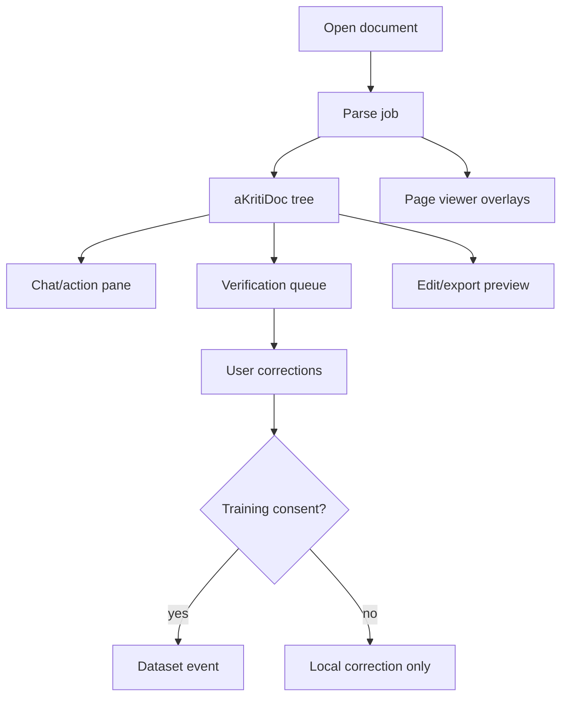

# aKriti Workbench UI Product Spec

**Status:** Draft implementation spec  
**Date:** 2026-05-20  
**Purpose:** Define the aKriti Workbench as the primary review, correction, and experimentation interface for document intelligence.

## 1. Product principle

The Workbench is not a generic chatbot.

It is a document review cockpit:

```text
document view
  + structured extraction
  + evidence overlays
  + chat/action pane
  + verification queue
  + edit/export controls
```

## 2. Primary users

| User | Need |
|---|---|
| document worker | extract, translate, fix, and export documents |
| LibreOffice user | understand and edit active documents |
| researcher/developer | inspect model failures and create training data |
| legal/court user later | evidence-grounded review and triage |
| FilterTube developer | inspect thumbnail/keyframe semantic labels |

## 3. Core layout

Default desktop layout:

```text
+-------------------------------------------------------------+
| top bar: file, model, runtime, privacy, status               |
+--------------------------+----------------------------------+
| document/page viewer     | right panel                       |
|                          | - chat/action                     |
| overlays:                | - extraction tabs                 |
| - text blocks            | - verification queue              |
| - tables/charts          | - provenance/citations            |
| - images/figures         | - edit/export preview             |
+--------------------------+----------------------------------+
| bottom: page strip, job progress, warnings                   |
+-------------------------------------------------------------+
```

Mobile/tablet layout:
- viewer first.
- bottom sheet for actions.
- citation drawer.
- page strip collapses.
- touch targets at least 44px.

## 4. Required modes

| Mode | Purpose |
|---|---|
| parse review | inspect blocks, spans, tables, charts, images |
| ask | grounded document QA |
| translate | layout-preserving translation preview |
| edit | rewrite/apply patch/review changes |
| verify | resolve low-confidence or conflicting regions |
| restore | compare original/restored/diff views |
| train-data | save approved correction as training example |

## 5. Overlay system

Overlay types:
- text block.
- reading order.
- table cells.
- chart region.
- image/figure region.
- low-confidence region.
- citation highlight.
- edit target.
- restored artifact region.

Overlay rules:
- color should encode type, not confidence alone.
- confidence should be visible in details.
- all overlays must map to `aKritiDoc` IDs.
- clicking an overlay opens provenance and actions.

## 6. Chat/action pane

The chat pane must be grounded.

Every answer should show:
- citation chips.
- page references.
- confidence.
- whether restored/derived content was used.
- unsupported claims if any.

Action examples:
- “translate this page to English.”
- “extract this table to CSV.”
- “explain this chart.”
- “rewrite selected paragraph formally.”
- “verify this amount across the document.”
- “turn this image into editable text.”

## 7. Verification queue

Queue items:
- low-confidence OCR.
- layout disagreement.
- table structure conflict.
- chart reconstruction uncertainty.
- restoration entity drift.
- unsupported answer claim.
- edit patch requiring approval.

Each item should show:
- source region.
- candidate output.
- alternative output if available.
- reason for review.
- accept/reject/correct controls.

## 8. Data capture

Workbench corrections are valuable training data only with consent.

Correction event:

```json
{
  "event_id": "corr_...",
  "source_ref": {},
  "old_value": {},
  "new_value": {},
  "reason": "user_correction | verification | edit",
  "consent_for_training": false
}
```

## 9. Accessibility

Minimum:
- keyboard navigation.
- visible focus states.
- screen-reader labels for overlays and citations.
- reduced-motion support.
- high-contrast mode.
- captions/descriptions for visual blocks.
- no color-only confidence encoding.

## 10. Visual direction

aKriti should feel like:
- precise.
- calm.
- evidence-first.
- powerful but not noisy.
- closer to a lab/workbench than a SaaS marketing dashboard.

Avoid:
- purple gradient AI slop.
- centered generic hero pages.
- icon-circle feature grids.
- magical vague copy.

## 11. Workbench to LibreOffice relationship

Workbench is the full review surface.

LibreOffice sidebar is the native in-document action surface.

```text
Workbench: full inspection, correction, batch jobs, eval/debug
LibreOffice: selection-aware editing, translation, explanation, document actions
```

## 12. ASCII flow

```text
upload/open document
        |
        v
parse job
        |
        v
viewer overlays + aKritiDoc tree
        |
        +--> ask/chat with citations
        +--> verify queue
        +--> edit/translate/export
        +--> save corrections as data
```

## 13. Mermaid flow




## Research References

This doc is connected to the numbered research bibliography in `docs/akriti-research-reference-index.md`. Those references are engineering anchors for aKriti-owned implementation; they are not product dependencies. Only open weights may enter model lineage, and only with manifest provenance.
