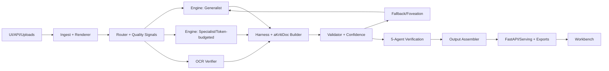

# aKriti VLM Specification — Locked v1

**Version:** `1.0`  
**Date:** `22 Feb 2026`  
**Scope:** aKriti repository only (a standalone VLM + harness + workbench project)

## 1. Purpose and Motto

**Motto:** **Cognition in Every Pixel, Sovereignty in Every Token.**

aKriti is a **document intelligence VLM repository** built around one idea:
every parsed unit must be verifiable, grounded, and editable with confidence.

We are optimizing for:
- robust extraction from diverse scripts and degraded pages,
- strict structure preservation with block-level grounding,
- transparent uncertainty handling,
- clean handoff to UI and APIs.

No court-specific orchestration is part of this repository spec.

## 2. What aKriti Is (and is not)

### aKriti is
- A VLM-first document understanding engine with pluggable open-weight backends.
- A deterministic harness (`aKritiDoc`) that standardizes grounding, confidence, and provenance.
- A verification-first extraction workflow where low-confidence output must be inspectable and correctable.
- A UI/API stack that supports both machine-readable artifacts and human review loops.

### aKriti is not
- A closed black-box transcription API.
- A pure OCR-first pipeline.
- A single fixed-model product where retraining requires rewriting every part.

## 3. Non-Negotiable Principles

1. **aKritiDoc is source-of-truth.**  
   `JSON`, `HTML`, and `Markdown` are views rendered from a canonical representation.

2. **Grounding is mandatory.**  
   Every extracted block must include source image/page location and transform metadata.

3. **Uncertainty must surface.**  
   No silent acceptance path for low-confidence or conflicting output.

4. **Engine swap is first-class.**  
   Backends can change without breaking contracts.

5. **VLM is central, harness is moat.**  
   Core quality comes from verification, structure, validators, and UI, not a single model.

6. **Local-usable design from day one.**  
   Keep artifacts, settings, and provenance serializable and reproducible.

## 4. Canonical Representation: `aKritiDoc`

`aKritiDoc` is our own schema module inside:

```
core/akriti_doc/
```

It is **not** an external dependency.

### 4.1 Top-level fields (minimum)

```json
{
  "akriti_doc_version": "1.0.0",
  "doc_id": "uuid",
  "source": {
    "kind": "pdf | image | images | batch",
    "pages": 12,
    "language_hints": ["hi", "en"],
    "rendered_at": "2026-02-22T12:00:00Z",
    "assets": [{ "asset_id": "string", "uri": "..." }]
  },
  "pages": [ "...page objects..." ],
  "quality": {
    "mode": "fast | balanced | accurate",
    "parse_quality_score": 0.0,
    "uncertain_block_count": 0,
    "warnings": []
  },
  "provenance": {
    "pipeline_version": "akriti-v1",
    "engine": "open-weight-v1",
    "engine_mode": "grounded",
    "prompts": [],
    "verify_version": "v1"
  }
}
```

### 4.2 Page object

- `page_index`: 0-based index.
- `width`, `height`: pixel dims of the render target.
- `rotation`: degrees (0/90/180/270).
- `dpi`: rendering resolution.
- `transform`: pixel-to-model mapping metadata.
- `blocks`: array of block objects.

### 4.3 Block object

- `block_id`: stable unique id.
- `type`: `paragraph`, `heading`, `table`, `table_cell`, `image`, `signature`, `stamp`, `marginalia`, `formula`, `checkbox`, `unknown`.
- `reading_order`: integer.
- `bbox_norm`: `[x1, y1, x2, y2]` in normalized `[0..1]`.
- `bbox_pixels`: optional pixel coordinates.
- `text` or `payload`: extracted text or structured object.
- `table`: optional matrix metadata when `type: table`.
- `confidence`: `0..1`.
- `provenance`: engine + mode + prompt + timestamp.
- `history`: immutable event list (`created`, `edited`, `verified`, `accepted`).

### 4.4 Validation rules (hard failures)

- Missing required page/block fields.
- non-finite/non-normalized bounding boxes.
- duplicate `block_id` within a document.
- invalid reading order values (negative or gaps where strict sequence required).
- blocks referencing out-of-range `page_index`.

## 5. System Architecture (3 Layers)



### Layer 1: Engine Layer
- Replaceable wrappers around one or more open-weight VLMs.
- Optional classic OCR is used as verifier/feature extractor only.
- Engine outputs must include per-element scores and bounding hints where available.

### Layer 2: Harness Layer
- Converts all engine outputs to `aKritiDoc`.
- Deduplicates conflicts.
- Applies schema/geometry validators.
- Computes confidence and uncertainty metadata.
- Triggers verification when needed.

### Layer 3: Workbench/Serving Layer
- Exposes async parse/verify/chat/export endpoints.
- Renders split-pane coordinated read UI.
- Manages correction logs and review queue.

## 6. End-to-End Dataflow

1. Upload one or many files (`pdf`, `jpg`, `png`, `tiff`) in one request.
2. Parse job created with `job_id` and mode defaults.
3. Router decides path:
   - born-digital fast route vs rendered route,
   - complexity-aware engine mode.
4. Initial parse creates draft `aKritiDoc`.
5. Validation + confidence scoring.
6. Uncertain blocks sent to verification queue.
7. Verification produces reconciled blocks and rationale.
8. Final artifacts returned as:
   - `aKritiDoc`,
   - `JSON`,
   - `HTML`,
   - `Markdown`.
9. Human edits are captured as immutable history events.

## 7. Routing, Multi-pass, and Foveation

### Router inputs
- page complexity score (blocks density, text density, color variance),
- OCR-likelihood estimates,
- rendering quality (skew, blur, contrast),
- script hints,
- historical confidence profile.

### Route states
- **fast:** low-risk documents and clear born-digital text-layer PDFs.
- **balanced:** standard documents with typical complexity.
- **accurate:** noisy scans, dense tables, script-heavy content.

### Multi-pass policy
- Pass 1: low-cost full-page extraction.
- Pass 2: crop-and-refine uncertain low-confidence blocks.
- Pass 3 (if required): recursive enhancement + alternate decoding path.

### Restore-first workflow
- Every uncertain or failed block can trigger:
  - full-page restore,
  - region restore,
  - or engine-only reparse.
- Restore artifacts are preserved and traceable.

## 8. Verification Design (External 5-Agent loop v1)

`aKriti` starts with **external evidence generators**, not in-model decoder surgery.

Agent set (v1):
1. **Reread Agent**: deterministic high-res crop rerun.
2. **Alternate Lens Agent**: different prompt or output style.
3. **OCR Agent**: non-generative verifier on enhanced image.
4. **Transform Agent**: reread after deskew/binarize/denoise.
5. **Consistency Agent**: multiple passes and self-consistency scoring.

### Aggregation
- Reject any candidate failing hard validators.
- Weighted score = lexical agreement + validator pass count + confidence + route consistency.
- If unresolved after budgeted retries, emit review item requiring manual action.

## 9. API Contract (v1)

### Core endpoints

`POST /v1/parse`  
Input:
- `files[]` (multiple files supported),
- `mode` (`fast|balanced|accurate`),
- `return_formats` (`blocks|json|html|markdown`),
- optional `parser_settings`.

Output:
- `job_id`,
- `request_check_url`.

`GET /v1/parse/{job_id}`  
Output:
- `status`,
- `progress`,
- `aKritiDoc`,
- exports (`json`, `html`, `markdown`, `blocks`),
- `parse_quality_score`,
- `warnings`,
- `agent_votes` (when verification used),
- `latency_ms`.

`POST /v1/verify-block`  
Input: `job_id`, `page_index`, `block_id`, `recursion_budget`.  
Output: per-agent candidates, final voted text/payload, agreement score, rationale.

`POST /v1/restore`  
Input: `job_id`, optional `page_index`, optional `region`.  
Output: restored artifact id and optional auto-reparse hint.

`POST /v1/translate`  
Input: `job_id`, `block_ids[]`, `source`, `target`.  
Output: translated block-level updates with provenance.

`POST /v1/modify`  
Input: user-intent edits/transform spec (table normalization, spacing correction, heading normalization).  
Output: updated `aKritiDoc` delta.

`POST /v1/ask`  
Input: `job_id`, `message`, optional `context_blocks`.  
Output: grounded reply with block-level references.

`GET /v1/health`  
Output: service/model status and version metadata.

## 10. UI/UX Blueprint (v1)

### Main Workbench (single-document mode)
- Split-pane: left image viewer + right `Blocks` list.
- Bi-directional sync:
  - click block → highlight in image,
  - click overlay → jump to block.
- Color overlays:
  - blue: paragraph/normal text,
  - orange: heading,
  - green: table,
  - purple: image,
  - red: stamp/signature,
  - cyan: marginalia.
- Low-confidence blocks shown with red/orange glow.

### Multi-file mode
- Batch upload sidebar with file cards.
- Parse status at file granularity.
- Shared parser settings across selected files.
- Per-document queue and logs.

### View modes
- **Blocks** (default),
- **JSON**,
- **HTML**,
- **Markdown**,
- **Parser Settings** drawer.

### Post-extraction chat-like panel
- Structured Q&A grounded to block IDs.
- “Modify selected block” and “translate selected block” actions.
- Diff view for agent suggestions.

### Restore UX
- “Restore Image” button for entire page and selected crop.
- Controls: rotate, deskew, denoise, deblur, contrast, threshold, sharpen.
- Restore action auto-runs low-cost confidence rerun option.

## 11. Repo Structure (locked for v1)

```text
aKriti/
├── core/
│   ├── akriti_doc/       # aKritiDoc schemas, validators, migrations
│   ├── engines/          # engine wrappers / adapters
│   ├── routing/          # route policy, quality signals, foveation, restore policy
│   ├── parser/           # parse orchestrator + prompt contracts
├── verification/         # 5-agent orchestration + voting + calibration
├── workbench/            # API, exporters, workbench app modules
├── data/                 # synthetic data + dataset utilities
├── evaluation/           # benchmark suites and metrics
├── specs/                # locked product and technical specs
└── docs/                 # living docs, notes, and changelogs
```

## 12. Learning/Build Roadmap (micro-commit style)

1. **Contract lock:** `aKritiDoc` schema + validators + migration test.
2. **Session & ingest:** async parse request model, job lifecycle.
3. **Engine wrapper v1:** one parser adapter + deterministic output adapter.
4. **Workbench v1 shell:** split-pane with file upload + block list.
5. **Coordination plumbing:** click-sync, highlighting, confidence badges.
6. **Routing + foveation v0:** fast/balanced/accurate mode switch.
7. **5-agent verification v1:** verify endpoint + vote report.
8. **Restore pipeline v1:** page/region restore and reparse.
9. **Export endpoints:** parse outputs as blocks/json/html/markdown.
10. **QA and metrics:** CER/WER + layout order + grounding + review latency dashboards.

Each commit must include:
- one concrete behavior,
- one test,
- one short learn-and-decision note.

## 13. Acceptance Gates (for VLM lock)

- Multi-file parse request supported.
- `aKritiDoc` passes validator for all successful jobs.
- Every low-confidence block either verifies or lands in review queue.
- Block-grounded highlights remain pixel-aligned after re-render.
- Restore → reparse cycle works end-to-end.
- Structured outputs are deterministic for identical input+settings.

## 14. Risks and Mitigations

| Risk | Impact | Mitigation |
|---|---|---|
| False confidence under blur/noise | Wrong grounded output | strict uncertainty threshold + verification + manual review |
| Coordinate drift in overlays | Wrong user edits and citations | explicit page transforms + render metadata + pixel roundtrip tests |
| Model drift across engine updates | incompatible extraction behavior | pinned engine versions in provenance + regression metrics |
| Batch overload | poor UX and timeouts | bounded concurrency + queue backpressure |
| Schema incompatibility | hard parser breaks | strict migration strategy via `akriti_doc_version` |

## 15. Explicit Out of Scope (v1)

- Case/workflow management layer.
- Deployment at large scale and CI/CD autoscaling.
- Domain-specific products layered on top of aKriti (left for downstream applications).

---

This is the **final locked VLM blueprint** for `aKriti` as of now: complete, standalone, and engine-agnostic beyond the public contract.
